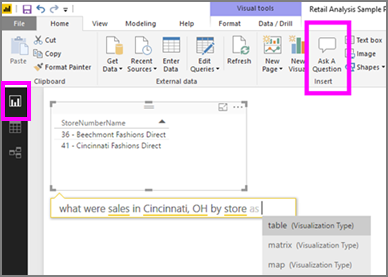

# Q&A in Power BI service and Power BI Desktop
## What is Q&A?
Sometimes the fastest way to get an answer from your data is to ask a question using natural language. For example, "what were total sales last year."  Use Q&A to explore your data using intuitive, natural language capabilities and receive answers in the form of charts and graphs. Q&A is different from a search engine -- Q&A only provides results about the data in Power BI.

This article is the jumping off point for all things Q&A. Select a link below to learn how Q&A works in Power BI service (dashboards and reports), Power BI Desktop (reports), Power BI Embedded, and Power BI mobile.  

> [!NOTE]
> **Power BI Q&A** only supports answering natural language queries asked in English. You can also try out a preview feature for questions asked in Spanish. In **Power BI Desktop**, go to **File**, **Options and settings**, **Options** and look for the **Preview Features** tab. Check the box for **Spanish language support for Q&A**.  
>
>

Asking the question is just the beginning.  Have fun traveling through your data refining or expanding your question, uncovering trust-worthy new information, zeroing in on details and zooming out for a broader view. You’ll be delighted by the insights and discoveries you make.

The experience is truly interactive…and fast! Powered by an in-memory storage, response is almost instantaneous.

##  Q&A for *consumers*
When a colleague shares a dashboard with you, you'll find the Q&A question box on the dashboard in Power BI service (app.powerbi.com), at the bottom of the dashboard in Power BI mobile, and above the visualization in Power BI Embedded. Unless the owner has given you edit permissions, you'll be able to use Q&A to explore data but won't be able to save any visualizations created with Q&A.

## Q&A for *creators*
If you're a *creator* of Power BI reports or have edit permissions to a dataset, you'll find the Q&A question box on the dashboard in Power BI service, and on each report page in Power BI service and Power BI Desktop. Any visualization you create using Q&A can be saved to a dashboard and saved in a report.

In addition to using Q&A to explore their data, creators and dataset owners can improve the Q&A experience for consumers by [modifying their datasets](service-prepare-data-for-q-and-a.md), adding [featured questions](service-q-and-a-create-featured-questions.md), and [enabling and disabling Q&A ](service-q-and-a-direct-query.md) for on-premises live connection datasets. In [Embedded scenarios](developer/qanda.md), developers can choose between 2 modes: **interactive** and **result only**.

## How does Q&A know how to answer questions?
### Which datasets does Q&A use?
How does Q&A know how to answer data-specific questions? It relies on the names of the tables, columns, and calculated fields in the underlying dataset. So what the dataset owner calls things is important! If you're having trouble getting answers to your Q&A questions, talk with the dataset owner to see if she can make the dataset more user-friendly.

Q&A can answer questions that are based on how the dataset is organized. How would this work for data in Salesforce? When you connect to your salesforce.com account, Power BI generates a dashboard automatically.  Before you start asking questions with Q&A, take a look at the data displayed in the dashboard visualizations and also at the data displayed in the Q&A dropdown.

* If the visualizations' axis labels and values include "sales",  "account", "month", and "opportunities", then you can confidently ask questions such as: "Which *account* has the highest *opportunity*, or show *sales* by month as a bar chart."
* If the dropdown includes "salesperson", "state", and "year", then you can confidently ask questions such as: "which *salesperson* had the lowest *sales* in *Florida* in *2013*."

If you have website performance data in Google Analytics, you could ask Q&A about time spent on a web page, number of unique page visits, and user engagement rates. Or, if you’re querying demographic data, you might ask questions about age and household income by location.

### Which visualization does Q&A use?
Q&A picks the best visualization based on the data being displayed. Sometimes data in the underlying dataset(s) is defined as a certain type or category and this helps Q&A know how to display it. For example, if data is defined as a date type, it is more likely to be displayed as a line chart. Data that is categorized as a city is more likely to be displayed as a map.

You can also tell Q&A which visualization to use by adding it to your question. But keep in mind that it may not always be possible for Q&A to display the data in the visualization type you requested.

For information about keywords that Q&A recognizes, see [Tips for asking questions](service-q-and-a-tips.md).

## For more details about Power BI Q&A
[Overview: How to use Q&A in Power BI dashboards and reports](power-bi-tutorial-q-and-a.md):
Step by step instructions for using Q&A and an overview of how it all works.

[Microsoft Power BI mobile app](mobile-apps-ios-qna.md)
For iOS on iPads, iPhones, and iPod Touch devices.

[Microsoft Power BI Embedded](developer/qanda.md)
Incorporate Q&A into an application.

[Tips for asking questions in Q&A](service-q-and-a-tips.md):
Learn how to talk to Q&A to get the best possible results.

[Add featured questions to your datasets](service-q-and-a-create-featured-questions.md)
and Q&A will suggest these questions to your colleagues.

[Enable Q&A for your on-premises datasets](service-q-and-a-direct-query.md)
If you need a gateway to connect to the dataset, use Power BI settings to turn Q&A on and off.

[Tutorial: Use Q&A with the Retail Sales sample in Power BI service](power-bi-visualization-introduction-to-q-and-a.md):
Use Q&A in a realistic industry tutorial.

More questions? [Try the Power BI Community](http://community.powerbi.com/)
