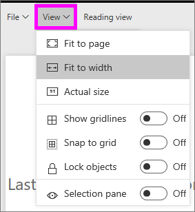
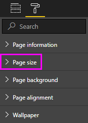

# Page display settings in a Power BI report
We understand it's critical to keep your report layout pixel perfect. Sometimes, it can be challenging, because you and your colleagues may view those reports on screens with different aspect ratios and sizes. 

The default display view is **Fit to page** and the default display size is **16:9**. If you want to lock in a different aspect ratio, or want to fit your report in a different way, there are two tools to help you: ***Page view*** settings and ***Page size*** settings.

<iframe width="560" height="315" src="https://www.youtube.com/embed/5tg-OXzxe2g" frameborder="0" allowfullscreen></iframe>

## Where to find Page view settings in the Power BI service and Power BI Desktop
Page view settings are available in both the Power BI service and Power BI Desktop, but the interface is a little different. The following sections explain where you can find View settings in each Power BI tool.

### In Power BI Desktop
In Report view, select the **View** tab to open Page view settings as well as phone layout settings.

  

### In the Power BI service (app.powerbi.com)
In the Power BI service, open a report and select **View** from the upper left menubar.

Page view settings are available in both [Reading view and Editing view](consumer/end-user-reading-view.md). In Editing view, a report owner can assign page view settings to individual report pages, and those settings are saved with the report. When colleagues open that report in Reading view, they see the report pages display using the owner's settings. In Reading view, colleagues can change *some* of the **Page view** settings, but the changes are not saved when they exit the report.

## Page view settings
The first set of Page view settings controls the display of your report page relative to the browser window. Choose between:

* **Fit to page** (default): Contents are scaled to best fit the page
* **Fit to width**: Contents are scaled to fit within the width of the page
* **Actual size**: Contents are displayed at full size

The second set of Page view settings controls the positioning of objects on the report canvas. Choose between:

* **Show gridlines**: Turn on gridlines to help you position objects on the report canvas.
* **Snap to grid**: Use with **Show gridlines** to precisely position and align objects on the report canvas. 
* **Lock objects**: Lock all objects on the canvas so that they can't be moved or resized.
* **Selection pane**: The **Selection** pane lists all objects on the canvas. You can decide which to show and which to hide.

    

## Page size settings

**Page size** settings are available only for report owners. In the Power BI service (app.powerbi.com), this means being able to open the report in [Editing view](consumer/end-user-reading-view.md). **Page size** settings are in the **Visualizations** pane and control the display ratio and actual size (in pixels) of the report canvas:   

* 4:3 ratio
* 16:9 ratio (default)
* Cortana
* Letter
* Custom (height and width in pixels)

## Next steps
[Report view in Power BI Desktop](desktop-report-view.md)

[Change Page view and Page size settings in your own Power BI reports](consumer/end-user-report-view.md)

Read more about [reports in Power BI](consumer/end-user-reports.md)

[Basic concepts for designers in the Power BI service](service-basic-concepts.md)

More questions? [Try the Power BI Community](http://community.powerbi.com/)

