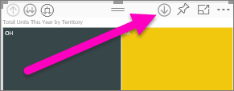
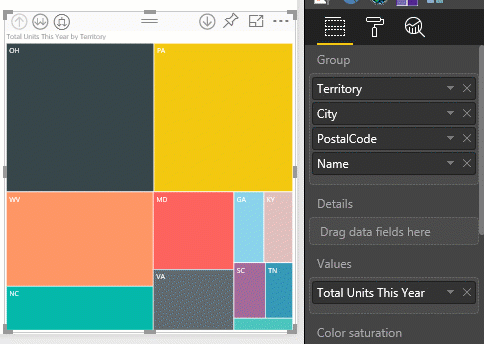
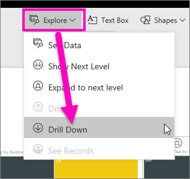
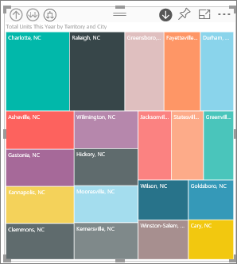
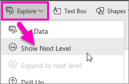
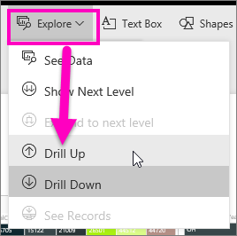

# Drill down in a visualization in Power BI
## Drill down requires a hierarchy
When a visual has a hierarchy, you can drill down to reveal additional details. For example, you might have a visualization that looks at Olympic medal count by a hierarchy made up of sport, discipline, and event. By default, the visualization would show medal count by sport -- gymnastics, skiing, aquatics, etc. But because it has a hierarchy, selecting one of the visual elements (such as a bar, line, or bubble), would display an increasingly more-detailed picture. Select the **aquatics** element to see data for swimming, diving, and water polo.  Select the **diving** element to see details for springboard, platform, and synchronized diving events.

You can add hierarchies to reports you own but not to those shared with you.
Not sure which Power BI visualizations contain a hierarchy?  Hover over a visualization and if you see these drill controls in the top corners, your visualization has a hierarchy.

    
   

Dates are an unique type of hierarchy. When you add a date field to a visualization, Power BI automatically adds a time hierarchy that contains year, quarter, month, and day. For more information see [Visual hierarchies and drill-down behavior](guided-learning/visualizations.yml#step-18) or watch the video below.

  <iframe width="560" height="315" src="https://www.youtube.com/embed/MNAaHw4PxzE?list=PL1N57mwBHtN0JFoKSR0n-tBkUJHeMP2cP" frameborder="0" allowfullscreen></iframe>

> **NOTE**: To learn how to create hierarchies using Power BI Desktop, watch the video [How to create and add hierarchies](https://youtu.be/q8WDUAiTGeU)
> 
> 

## 2 methods to drill down
There are 2 different way to drill down (and up) in your visualization.  Both are described in this article. Both methods accomplish the same thing, so use whichever one you enjoy most.

> [!NOTE]
> To follow along, [open the Retail Analysis sample](sample-datasets.md) in Power BI service and create a treemap that looks at **Total Units This Year** (Values) by **Territory**, **City**, **PostalCode**, and **Name** (Group).  
> 
> 

## Method 1 for drill down
This method uses the drill icons that appear in the top corners of the visualization itself.

1. In Power BI, open a report in [Reading View](powerbi-service-open-a-report-in-reading-view.md) or [Editing View](powerbi-service-go-from-reading-view-to-editing-view.md). Drill requires a visualization with a hierarchy. 
   
   A hierarchy is shown in the animation below.  The visualization has a hierarchy made up of territory, city, postal code, and city name. Each territory has one or more cities, each city has one or more postal codes, etc. By default, the visualization displays only the territory data, because *Territory* appears first in the list.
   
   
2. To enable drill down, select the arrow icon in the top right corner of the visualization. When the icon is dark, drill is enabled. If you don't turn on drill, selecting a visual element (such as a bar or bubble) will cross-filter the other charts on the report page.    
   
   
3. To drill down ***one field at a time***, click one of the elements in your visualization, in a bar chart this means clicking one of the bars and in a treemap, this means clicking one of the *leaves*. Notice that the title changes as you drill down and back up again. In this animation it changes from "Total Units This Year by Territory" to "Total Units This Year by Territory and City" to "Total Units This Year by Territory, City and PostalCode" to "Total Units This Year by Territory, City, PostalCode, and Name". And to drill back up, select the **Drill Up** icon   in the top left corner of the visualization as shown below.
   
   
4. To drill down ***all fields at once***, select the double arrow in the top left corner of the visualization.
   
   
5. To drill back up, select the up arrow in the top left corner of the visualization.
   
   

## Method 2 for drill down
This method uses the **Explore** dropdown from the top Power BI menubar.

1. In Power BI, open a report in [Reading View](powerbi-service-open-a-report-in-reading-view.md) or [Editing View](powerbi-service-go-from-reading-view-to-editing-view.md). Drill requires a visualization with a hierarchy. 
   
   A hierarchy is shown in the image below.  The visualization has a hierarchy made up of territory, city, postal code, and city name. Each territory has one or more cities, each city has one or more postal codes, etc. By default, the visualization displays only the territory data, because *Territory* appears first in the list.
   
   
2. To enable drill down, select a visualization to make it active and from the Power BI top menubar select **Explore** > **Drill Down**. The drill-down icon in the top right corner of the visualization changes to a black background.   
   
   
3. Once enabled, drill down one field at a time by selecting one of the treemap leaves. In this example, I've selected the territory named **NC** to see total units sold this year in North Carolina by city.
   
   
4. To drill down all fields at once, select **Explore** > **Show Next Level**.
   
   
5. To drill back up, select **Explore** > **Drill Up**.
   
   
6. To see the data being used to create the visual, select **See data**. The data is displayed in a pane below the visual. This pane remains as you continue drilling through the visual. For more information, see [Show data used to create the visual](powerbi-service-reports-see-data.md).

## Considerations and limitations
* If adding a date field to a visualization does not create a hierarchy, it may be that the "date" field is not actually saved as a date. If you own the dataset, open it in *Data* view in Power BI Desktop, select the column that contains the date, and in the Modeling tab change the **Data Type** to **Date** or **Date/Time**. If the report has been shared with you, contact the owner to request the change.  
  
  

### See also
[Visualizations in Power BI reports](power-bi-report-visualizations.md)

[Power BI reports](powerbi-service-reports.md)

[Power BI - Basic Concepts](powerbi-service-basic-concepts.md)

More questions? [Try the Power BI Community](http://community.powerbi.com/)

