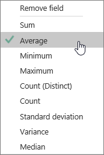
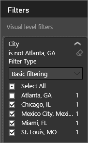

# Export data from visualizations
If you'd like to see the data that is used to create a visualization, you can [display that data in Power BI](service-reports-show-data.md) or export that data to Excel as an .xlsx or .csv file.   

Watch Will export the data from one of the visualizations in his report, save it as an .xlsx file, and open it in Excel. Then follow the step-by-step instructions below the video to try it out yourself.

<iframe width="560" height="315" src="https://www.youtube.com/embed/KjheMTGjDXw" frameborder="0" allowfullscreen></iframe>

## From a visualization on a Power BI dashboard
1. Select the ellipses in the top right corner of the visualization.
   
    
2. Choose the  **Export data** icon.
   
    
3. The data is exported to a .csv file. If the visual is filtered, then the downloaded data will also be filtered.
4. Your browser will prompt you to save the file.  Once saved, open the .csv file in Excel.
   
    

## From a visualization in a report
To follow along, open the [Procurement analysis sample report](sample-procurement.md) in [Editing view](service-reading-view-and-editing-view.md). [Add a new blank report page](power-bi-report-add-page.md). Then follow the steps below to add an aggregation and a visualization-level filter.

1. Create a new column chart.  From the Fields pane, select **Location > City** and **Invoice > Discount Percent**.   
   
    
2. Change the aggregation for **Discount Percent** from **Count** to **Average**. In the Value well, select the arrow to the right of **Discount Percent** (it may say **Count of Discount Percent**), and choose **Average**.
   
    
3. Add a filter to **City** to remove **Atlanta**.
   
   
   
   Now we're ready to try out both options for exporting data.
4. Select the ellipses in the top right corner of the visualization. Choose  **Export data**.
   
   
5. If your visualization has an aggregate (one example would be if you changed **Count** to *average*, **sum** or *minimum*),  you'll have two options: **Summarized data** and **Underlying data**. For help understanding aggregates, see [Aggregates in Power BI](service-aggregates.md).
   
    
6. Select **Summarized data** > **Export** and choose either .xlsx or .csv. Power BI exports the data.  If you have applied filters to the visualization, the exported data will export as filtered. When you select  **Export**, your browser prompts you to save the file. Once saved, open the file in Excel.
   
   **Summarized data**: select this option if you don't have an aggregate or if you do have an aggregate but don't want to see the complete breakdown. For example, if you have a bar chart showing 4 bars, you will get 4 rows of data. Summarized data is available as .xlsx and .csv.
   
   In this example, our Excel export shows one total for each city. Since we filtered out Atlanta, it is not included in the results.  The first row of our spreadsheet shows the filters that were used when extracting the data from Power BI.
   
   
7. Now try selecting **Underlying data** > **Export** and choosing .xlsx. Power BI exports the data. If you had applied filters to the visualization, the exported data will export as filtered. When you select  **Export**, your browser prompts you to save the file. Once saved, open the file in Excel.
   
   > **Warning**: Exporting underlying data allows users to see all the detailed data -- every column in the data. Power BI service administrators can turn this off for their organization. If you are a dataset owner, you can set proprietary columns to "hidden" so that they don't show up in the Field list in Desktop or Power BI service.
   > 
   > 
   
   **Underlying data**: select this option if your visualization does have an aggregate and you'd like to see all the underlying details. Basically, selecting *Underlying data* removes the aggregate. When you select **Export**, the data is exported to an .xlsx file and your browser prompts you to save the file. Once saved, open the file in Excel.
   
   In this example, our Excel export shows one row for every single City row in our dataset, and the discount percent for that single entry. In other words, the data is flattened and not aggregated. The first row of our spreadsheet shows the filters that were used when extracting the data from Power BI.  
   
   

## Limitations and considerations
* The maximum number of rows that can be exported from **Power BI Desktop** to .csv is 30,000.
* The maximum number of rows that can be exported to .xlsx when in the **Power BI service** is 150,000 for Pro users and 30,000 for Free users.
* When using DirectQuery, the maximum amount of data that can be exported is 16 MB. This may result in exporting less than the maximum number of rows, especially if there are many columns, data that is difficult to compress, and other factors that increase file size and decrease number of rows exported.
* Power BI only supports export in visuals that use basic aggregates. Export is not available for visuals using model or report measures.
* Custom visuals, and R visuals, are not currently supported.
* Export data is not available for users outside of your organization who are using a dashboard that has been shared with them. 
* If there is unicode character in the .csv file, the text in Excel may not display properly. Although, opening it in Notepad will work fine. Examples of unicode characters are currency symbols and foreign words. The workaround for this is to import the csv into Excel, instead of opening the csv directly. To do this:
  
  1. Open Excel
  2. From the **Data** tab, select **Get external data** > **From text**.
* Power BI admins have the ability to disable the export of data.

## Next steps
[Dashboards in Power BI](service-dashboards.md)  
[Reports in Power BI](service-reports.md)  
[Power BI - Basic Concepts](service-basic-concepts.md)

More questions? [Try asking the Power BI Community](http://community.powerbi.com/)

