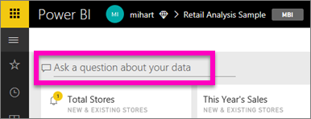
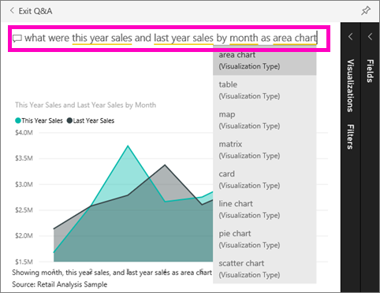

# Get started with Power BI Q&A (Quickstart)
## Use Power BI Q&A with the Retail Analysis sample
Sometimes the fastest way to get an answer from your data is to ask a question using natural language.  In this quickstart we'll look at 2 different ways of creating the same visualization: first, building it in a report and, second, asking a question with Q&A. We'll use Power BI service, but the process is almost identical using Power BI Desktop.

To follow along, you must use a report that you can edit, so we'll use one of the samples available with Power BI.

## Method 1: using the report editor
1. From your Power BI workspace, select **Get Data** \> **Samples** \> **Retail Analysis Sample** > **Connect**.
   
    
2. The dashboard contains an area chart tile for "Last Year Sales and This Year Sales."  Select this tile. 
   
   * If this tile was created with Q&A, selecting the tile will open Q&A. 
   * But this tile was created in a report, so the report opens to the page that contains this visualization.
3. Open the report in Editing View by selecting **Edit Report**.  If you are not an owner of a report, you will not have the option to open the report in Editing view.
   
    
4. Select the area chart and review the settings in the **Fields** pane.  The report creator built this chart by selecting these 3 values (**Time > FiscalMonth**, **Sales > This Year Sales**, **Sales >Last Year Sales >Value**) and organizing them in the **Axis** and **Values** wells.
   
    

## Method 2: using Q&A
How would we go about creating this same line chart using Q&A?

1. Navigate back to the Retail Analysis Sample dashboard.
2. Using natural language, type something like this into the question box:
   
   **what were this year sales and last year sales by month as area chart**
   
   As you type your question, Q&A picks the best visualization to display your answer; and the visualization changes dynamically as you modify the question. Also, Q&A helps you format your question with suggestions, auto-complete, and spelling corrections.
   
   When you finish typing your question, the result is the exact same chart that we saw in the report.  But creating it this way was much faster!
   
   
3. Similar to working with reports, within Q&A you have access to the Visualizations, Filters and Fields panes.  Open these panes to further explore and modify your visual.
4. To pin the chart to your dashboard, select the pin icon .

## Next steps
[Q&A in Power BI](power-bi-q-and-a.md)

[Make your data work well with Q&A in Power BI](service-prepare-data-for-q-and-a.md)

More questions? [Try the Power BI Community](http://community.powerbi.com/)

