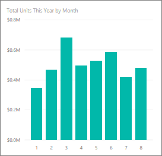
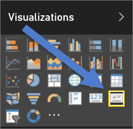
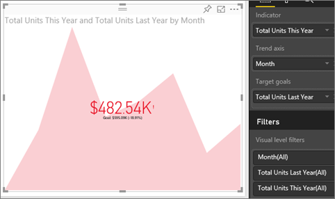

# KPI visuals (Tutorial)
A Key Performance Indicator (KPI) is a visual cue that communicates the amount of progress made toward a measurable goal. For more information about KPIs, see [Microsoft Developer Network](https://msdn.microsoft.com/library/hh272050).

## When to use a KPI
KPIs are a great choice:

* to measure progress (what am I ahead or behind on?)
* to measure distance to a goal (how far ahead or behind am I?)   

## KPI visual requirements
A Key Performance Indicator (KPI) is based on a specific measure and is designed to help you evaluate the current value and status of a metric against a defined target. Therefore, a KPI visual requires a *base* measure that evaluates to a value and a *target* measure or value, and a threshold or goal.

> [!NOTE]
> Currently, a KPI dataset needs to contain goal values for a KPI. If your dataset doesn't contain one, you can create goals by adding an Excel sheet with goals to your data model or PBIX file.
> 
> 

## How to create a KPI
To follow along, sign in to Power BI service and select **Get Data > Samples > Retail Analysis Sample**. We'll create a KPI that measures the progress we've made toward a sales goal.

Or watch Will show you how to create single metric visuals: gauges, cards, and KPIs.

<iframe width="560" height="315" src="https://www.youtube.com/embed/xmja6EpqaO0?list=PL1N57mwBHtN0JFoKSR0n-tBkUJHeMP2cP" frameborder="0" allowfullscreen></iframe>

1. Open the report in [Editing view](service-reading-view-and-editing-view.md) and [add a new page](power-bi-report-add-page.md).    
2. Select **Sales > Total Units This Year**.  This will be the indicator.
3. Add **Time > Month**.  This will be represent the trend.
4. IMPORTANT: Sort the chart by **Month**. Once you convert the visualization to a KPI, there is no option to sort.

    
5. Convert the visual to a KPI by selecting the KPI icon from the Visualization pane.
   
    
6. Add a goal. Add last years sales as the goal. Drag **Total Units Last Year** to the **Target goals** field.
   
    
7. Optionally, format the KPI by selecting the paint roller icon to open the Formatting pane.
   
   * **Indicator** - controls the indicator’s display units and decimal places.
   * **Trend axis** - when set to **On**, the trend axis is displayed as the background of the KPI visual.  
   * **Goals** - when set to **On**, the visual displays the goal and the distance from the goal as a percentage.
   * **Color coding > Direction** - some KPIs are considered *better* for higher values and some are considered *better* for lower values. For example, earnings versus wait time. Typically a higher value of earnings is better versus a higher value of wait time. Select **high is better** and, optionally, change the color settings.

1. When you have the KPI as you want it, [pin it to a dashboard](service-dashboard-pin-tile-from-report.md).

KPIs are also available on your mobile devices – keeping you always connected to your businesses heartbeat.

## Considerations and troubleshooting
* If your KPI doesn't look like the one above, it may be because you need to sort by month. Since KPIs don't have a sort option, you'll need to sort by month *before* you convert your visualization to a KPI.

## Next steps

[Visualizations in Power BI reports](power-bi-report-visualizations.md)

More questions? [Try the Power BI Community](http://community.powerbi.com/)

