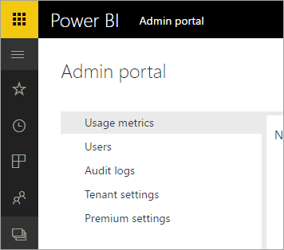

# Power BI for Office 365 is retired
Power BI for Office 365, a previous version of Power BI, has been transitioned to the current version of [Power BI](https://powerbi.microsoft.com). Users who once used **Power BI for Office 365** can use the current version of Power BI. You can [learn more about Power BI](powerbi-service-get-started.md).

## The Admin portal
Access to the **Power BI for Office 365** Admin portal is no longer available. Administrators can use the new [Admin portal](https://app.powerbi.com/admin-portal) to manage their organization's Power BI subscription.

For more information, see [Power BI admin portal](service-admin-portal.md).

## See also
[Get started with Power BI](powerbi-service-get-started.md)

[Getting started with Power BI Desktop](powerbi-desktop-getting-started.md)

[Administering Power BI in your Organization](service-admin-administering-power-bi-in-your-organization.md)

[Power BI Documentation](landing-page.md)

