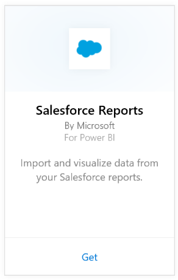
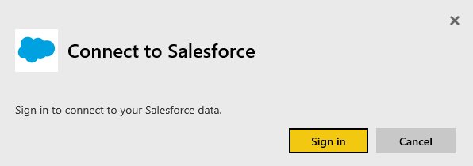

# Connect to Salesforce with Power BI
With Power BI, you can easily connect to your Salesforce.com account. Creating this connection retrieves your data and automatically provides a dashboard and related reports based on your data.

Connect to the [Salesforce content pack](https://app.powerbi.com/getdata/services/salesforce) for Power BI or read more about the [Salesforce integration](https://powerbi.microsoft.com/integrations/salesforce) with Power BI.

## How to Connect
1. Select **Get Data** at the bottom of the left navigation pane.
   
    
2. In the **Services** box, select **Get**.
   
    
3. Click **Salesforce** and select **Get**.  
   
   
4. Select **Sign In** to initiate the login flow.
   
    
5. When prompted, enter your Salesforce credentials. Click **Allow** so Power BI can access your basic Salesforce information and data.
   
   
6. Configure what you'd like to import into Power BI using the dropdown option:
   
   * **Dashboard**
     
     Select a predefined dashboard based on a persona (such as **Sales Manager**). These dashboards bring in a specific set of standard data from Salesforce and will not include custom fields.
     
     
   * **Reports**
     
     Select one or more custom reports from your Salesforce account. These reports will match your views in Salesforce and can include data from custom fields or objects.
     
     
     
     If you don't see any reports, add or create them in your Salesforce account and try connecting again.
7. Click **Connect** to begin the import process. During the import you see a notification showing the import is in progress. When the import is complete, you see a dashboard, report, and dataset for your Salesforce data listed in the navigation pane on the left.
   
   

You can change this dashboard to display your data any way you want. You can ask questions with Q&A -  Or click a tile to [open the underlying report](service-dashboard-tiles.md) and [change the tiles](service-dashboard-edit-tile.md) in the dashboard.

**What Now?**

* Try [asking a question in the Q&A box](powerbi-service-q-and-a.md) at the top of the dashboard
* [Change the tiles](service-dashboard-edit-tile.md) in the dashboard
* [Select a tile](service-dashboard-tiles.md) to open the underlying report
* While your dataset will be schedule to refreshed daily, you can change the refresh schedule or try refreshing it on demand using **Refresh Now**

## System requirements
* Connected with a production Salesforce account that has API access enabled
* Permission granted to the Power BI app during log-in
* The account has sufficient API calls available to pull and refresh the data
* A valid authentication token is required for refresh. Ensure you have 5 or less Salesforce data sets imported, as Salesforce has a limit of 5 authentication tokens per application

## Troubleshooting
If you encounter any errors, please review the requirements above. Also note the ability to login into a custom or sandbox domain is not currently supported.

### See also
[Get Started with Power BI](powerbi-service-get-started.md)

[Get Data](service-get-data.md)

