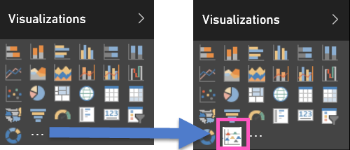
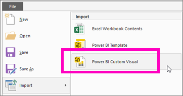

# Add a custom visual to a report (Desktop)
You've [downloaded a custom visual template](service-custom-visuals-office-store.md) and saved it to your computer or another location.  The next step is to import that custo visual template into a report so that it is added, as an option, to your Visualizations pane.

A custom visual template is added to a specific report when imported. If you'd like to use the visual template in another report, you need to import it into that report as well. When a report with a custom visual is saved using the **Save As** option, a copy of the custom visual template is saved with the new report.

1. Open Power BI Desktop and select the report where you want to add the custom visualization.   
2. There are two options to import a custom visual template: from the **File** menu or from the **Visualizations** pane.
   
    **From the Desktop File menu**
   
    On the report **File** menu, choose **Import** &gt; **Power BI Custom Visual**. You must be in the editing view.    
   
      
   
    **From the Visualization pane**
   
    In the **Visualizations** pane, choose **Insert (…)**.    
   
      
   
    Select **Import a custom visual**.  
   
      
3. **Review the warning**.
   
    A custom visual has access to the data in the report, and when you share a report that contains a custom visuals, your colleagues may be able to access that same data. Take care to review the custom visual to ensure it comes from a trustworthy source. Microsoft recommends you work with your IT department if you're not sure whether to use a specific custom visual you obtained from the Office online store, through email, or from some other source.
   
    
4. Navigate to the location where you saved the custom visual .pbiviz file and open it.
5. An icon (also called a *template*) is added to your **Visualizations** pane.
   
    
6. Select the custom visual template to add it to your report as you would with any of the other templates in the Visualizations pane. Add fields and filters and build your visual.
7. Format the custom visual as you would any other visual.  From the **Visualizations** pane, select the paintroller icon. The formatting options available will vary by visual type.

## Considerations and troubleshooting
* In order to enable custom visuals to be supported in [export to PowerPoint](service-publish-to-powerpoint.md), or [displayed in emails received when a customer subscribes to report pages](powerbi-service-subscribe-to-report.md), they need to be defined as *Certified custom visuals* that have passed the Microsoft custom visual certification process.  To see the list of *Certified custom visuals* and to learn more about the certification process, see [Certified custom visuals](power-bi-custom-visuals-certified.md)

## Next steps
[Download and use custom visuals from the Office store](service-custom-visuals-office-store.md)  
[Add a custom visual to a report in the Power BI Service](powerbi-custom-visuals-add-to-report.md)  
[Publish custom visuals to the Office store](powerbi-developer-office-store.md)  
[Custom Visualizations in Power BI](power-bi-custom-visuals.md)  
More questions? [Try the Power BI Community](http://community.powerbi.com/)

