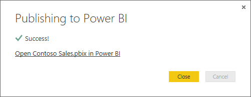

# Publish from Power BI Desktop
When you publish a **Power BI Desktop** file to the **Power BI service**, the data in the model and any reports you created in **Report** view are published to your Power BI workspace. You’ll see a new dataset with the same name, and any reports in your Workspace navigator.

Publishing from **Power BI Desktop** has the same effect as using **Get Data** in Power BI to connect to and upload a **Power BI Desktop** file.

> **Note:** Any changes you make in to the report Power BI, for example, add, delete, or change visualizations in reports, will not be saved to the original **Power BI Desktop** file.
> 
> 

## To publish a Power BI Desktop dataset and reports
1. In Power BI Desktop \> **File** \> **Publish** \> **Publish to Power BI** or click **Publish** on the ribbon.  
   
2. Sign in to Power BI.

When complete, you'll get a link to open your report in your Power BI site.  
    

## Re-publish or replace a dataset published from Power BI Desktop
When you publish a **Power BI Desktop** file, the dataset and any reports you created in **Power BI Desktop** are uploaded to your Power BI site. When you re-publish your **Power BI Desktop** file, the dataset in your Power BI site will be replaced with the updated dataset from the **Power BI Desktop** file.

This is all pretty straight forward, but there are a few things you should know:

* If you already have two or more datasets in Power BI with the same name as the **Power BI Desktop** file, publish could fail. Make sure you have only one dataset in Power BI with the same name. You can also rename the file and publish, creating a new dataset with same name as the file.
* If you rename or delete a column or measure, any visualizations you already have in Power BI with that field could be broken. 
* Power BI ignores some format changes of existing columns. For example, if you change a column’s format  from 0.25 to 25%.
* If you have a refresh schedule configured for your existing dataset in Power BI and you add new data sources to your file and then re-publish, you’ll have to sign into them in *Manage Data Sources* prior to the next scheduled refresh.

