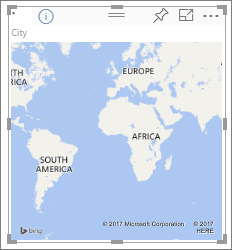
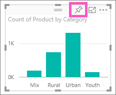

# Part I, Add visualizations to a Power BI report (Tutorial)
This article gives a quick introduction to creating a visualization in a report.  For more-advanced content, please [see Part II](powerbi-service-add-visualizations-to-a-report-ii.md). Watch Amanda demonstrate a few different ways to create, edit, and format visuals on the report canvas. Then try it out yourself using the [Sales and Marketing sample](powerbi-sample-datasets.md) to create your own report.

<iframe width="560" height="315" src="https://www.youtube.com/embed/IkJda4O7oGs" frameborder="0" allowfullscreen></iframe>

## Open a report and add a new page
1. Open a [report in Editing View](powerbi-service-go-from-reading-view-to-editing-view.md). This tutorial uses the [Sales and Marketing sample](powerbi-sample-datasets.md).
2. If the Fields pane isn't visible, select the arrow icon to open it. 
   
   
3. [Add a blank page to the report](powerbi-service-add-a-page-to-a-report.md).

## Add visualizations to the report
1. Create a visualization by selecting a field from the **Fields** pane.  
   
   **Start with a numeric field** like Sales > Sales $: Power BI creates a column chart with a single column.
   
   
   
   **Start with a category field**, such as Name or Product: Power BI creates a Table and adds that field to the **Values** well.
   
   
   
   **Start with a geography field**, such as Geo > City. Power BI and Bing Maps create a map visualization.
   
   
2. Create a visualization and then change its type. Select **Product > Count of Product** and **Product > Category** to add them to the **Values** well.
   
   
3. Change the visualization to a column chart by selecting the column chart icon.
   
   
4. When you create visualizations in your report, you can [pin them to your dashboard](powerbi-service-pin-a-tile-to-a-dashboard-from-a-report.md). To pin the visualization, select the pin icon .
   
   
5. Now you can:
   
   Continue on to [Part 2: Add visualizations to a Power BI report](powerbi-service-add-visualizations-to-a-report-ii.md)
   
   [Interact with the visualizations](powerbi-service-interact-with-a-report-in-reading-view.md) in the report.
   
   [Do even more with visualizations](powerbi-service-visualizations-for-reports.md).
   
   [Save your report](powerbi-service-save-a-report.md).

## Next steps
More about [Visualizations in Power BI reports](powerbi-service-visualizations-for-reports.md).

[Reports in Power BI](powerbi-service-reports.md)

More questions? [Try the Power BI Community](http://community.powerbi.com/)

