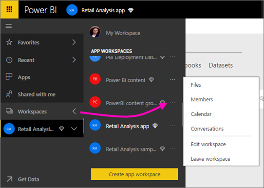

# Connect to files stored in OneDrive for your Power BI app workspace
After you've [created an app workspace in Power BI](powerbi-service-create-apps.md), you can store your Excel, CSV, and Power BI Desktop files on the OneDrive for Business for your Power BI app workspace. You can continue updating the files you store in OneDrive, and those updates are automatically reflected in the Power BI reports and dashboards based on the files. 

Adding files to your app workspace is a two-step process: 

1. First you [upload files to the OneDrive for Business](powerbi-service-connect-to-files-on-your-groups-onedrive-for-business.md#1-upload-files-to-the-onedrive-for-business-for-your-app-workspace) for your app workspace.
2. Then you [connect to those files from Power BI](powerbi-service-connect-to-files-on-your-groups-onedrive-for-business.md#2-import-excel-files-as-datasets-or-as-excel-online-workbooks).

> [!NOTE]
> App workspaces are only available with [Power BI Pro](service-free-vs-pro.md).
> 
> 

## 1 Upload files to the OneDrive for Business for your app workspace
1. In the Power BI service, select the arrow next to Workspaces > select the ellipsis (**…**) next to your workspace name. 
   
   
2. Select **Files** to open the OneDrive for Business for your app workspace on Office 365.
   
   > [!NOTE]
   > If you don't see **Files** on the app workspace menu, select **Members** to open the OneDrive for Business for your app workspace. There, select **Files**. Office 365 sets up a OneDrive storage location for your app's group workspace files. This process may take some time. 
   > 
   > 
3. Here, you can upload your files to the OneDrive for Business for your app workspace. Select **Upload**, and navigate to your files.
   
   

## 2 Import Excel files as datasets or as Excel Online workbooks
Now that your files are in the OneDrive for Business for your app workspace, you have a choice. You can: 

* [Import the data from the Excel workbook as a dataset](powerbi-service-get-data-from-files.md), and use the data to build reports and dashboards you can view in a web browser and on mobile devices.
* Or [connect to a whole Excel workbook in Power BI](powerbi-service-excel-workbook-files.md) and display it exactly as it appears in Excel Online.

### Import or connect to the files in your app workspace
1. In Power BI, switch to the app workspace, so the app workspace name is in the top-left corner. 
2. Select **Get Data** at the bottom of the left navigation pane. 
   
   
3. In the **Files** box, select **Get**.
   
   
4. Select **OneDrive** - *Your App Workspace Name*.
   
    
5. Select the file you want > **Connect**.
   
    This is the point where you decide whether to [import the data from the Excel workbook](powerbi-service-get-data-from-files.md), or [connect to the whole Excel workbooks](powerbi-service-excel-workbook-files.md).
6. Select **Import** or **Connect**.
   
    
7. If you select **Import**, then the workbook appears on the **Datasets** tab. 
   
    
   
    If you select **Connect**, then the workbook is on the **Workbooks** tab.
   
    

## Next steps
* [Create apps and app workspaces in Power BI](powerbi-service-create-apps.md)
* [Import data from Excel workbooks](powerbi-service-get-data-from-files.md)
* [Connect to whole Excel workbooks](powerbi-service-excel-workbook-files.md)
* More questions? [Try the Power BI Community](http://community.powerbi.com/)
* Feedback? Visit [Power BI Ideas](https://ideas.powerbi.com/forums/265200-power-bi)

