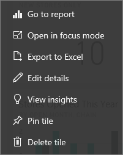

# Dashboard tiles in Power BI
Dashboards and dashboard tiles are a feature of Power BI service, not Power BI Desktop. While dashboards tiles cannot be created or pinned in Power BI mobile, [they can be viewed and shared](powerbi-mobile-tiles-in-the-iphone-app.md). And, in Power BI mobile, you can [add pictures to your dashboard with your iPhone app](powerbi-mobile-iphone-app-get-started.md).

## Dashboard tiles

A tile is a snapshot of your data, pinned to the dashboard. A tile can be created from a report, dataset, dashboard, from the Q&A box, Excel, and from SQL Server Reporting Services (SSRS), and more.  This screenshot shows many different tiles pinned to a dashboard.

Besides pinning, standalone tiles can be created directly on the dashboard using [Add tile](powerbi-service-add-a-widget-to-a-dashboard.md). Standalone tiles include: text boxes, images, videos, streaming data, and web content.

Need help understanding the building blocks that make up Power BI?  See [Power BI - Basic Concepts](powerbi-service-basic-concepts.md).

> [!NOTE]
> If the original visualization used to create the tile changes, the tile doesn't change.  For example, if you pinned a line chart from a report and then you changed the line chart to a bar chart, the dashboard tile continues to show a line chart. The data refreshes, but the visualization type does not.
> 
> 

## Pin a tile from...
There are many different ways to add (pin) a tile to a dashboard. Tiles can be pinned from:

* [Power BI Q&A](powerbi-service-pin-a-tile-to-a-dashboard-from-the-question-box.md)
* [a report](powerbi-service-pin-a-tile-to-a-dashboard-from-a-report.md)
* [another dashboard](powerbi-pin-a-tile-from-one-dashboard-to-another.md)
* [Excel workbook on OneDrive for Business](powerbi-service-pin-a-tile-to-a-dashboard-from-excel.md)
* [Power BI Publisher for Excel](publisher-for-excel.md)
* [Quick Insights](powerbi-service-auto-insights.md)
* [SSRS](https://msdn.microsoft.com/library/mt604784.aspx)

And standalone tiles for images, text boxes, videos, streaming data, and web content can be created directly on the dashboard using [Add tile](powerbi-service-add-a-widget-to-a-dashboard.md).

  

## Interacting with tiles on a dashboard
### Move and resize a tile
Grab a tile and [move it around on the dashboard](powerbi-service-edit-a-tile-in-a-dashboard.md). Hover and select the handle  to resize the tile.

### Hover over a tile to change the appearance and behavior
1. Hover over the tile to display the ellipses.
   
    
2. Select the ellipses to open the tile action menu.
   
    
   
    From here you can:
   
   * [Open the report that was used to create this tile ](powerbi-service-reports.md)   
   
   * [Open the worksheet that was used to create this tile ](powerbi-service-reports.md)   
     
     * [View in focus mode ](powerbi-service-display-dash-in-focus-mode.md)   
     * [Export the data used in the tile](powerbi-service-export-data.md) 
     * [Edit title and subtitle, add a hyperlink, display last refresh time](powerbi-service-edit-a-tile-in-a-dashboard.md) 
     * [Run insights ](powerbi-service-auto-insights.md) 
     * [Pin the tile to another dashboard ](powerbi-pin-a-tile-from-one-dashboard-to-another.md)
       
   * [Remove the tile](powerbi-service-edit-a-tile-in-a-dashboard.md)
     
3. To close the action menu, select a blank area in the canvas.

### Select (click) a tile
When you select a tile, what happens next depends on how the tile was created and if it has a [custom link](powerbi-service-edit-a-tile-in-a-dashboard.md). If it has a custom link, selecting the tile takes you to that link. Otherwise, selecting the tile takes you to the report, Excel Online workbook, SSRS report that is on-premises, or Q&A question that was used to create the tile.

> [!NOTE]
> The exception to this is video tiles created directly on the dashbaord using **Add tile**. Selecting a video tile (that was created this way) causes the video to play right there on the dashboard.   
> 
> 

## Considerations and troubleshooting
* If the report that was used to create the visualization was not saved, then selecting the tile produces no action.
* If the tile was created from a workbook in Excel Online, and you do not have at least Read permissions for that workbook, selecting the tile will not open the workbook in Excel Online.
* For tiles created directly on the dashboard using **Add tile**, if a custom hyperlink has been set, selecting the title, subtitle, and or tile will open that URL.  Otherwise, by default, selecting one of these tiles created directly on the dashboard for an image, web code, or text box produces no action.
* If you don't have permission to the report within SSRS, selecting a tile created from SSRS will produce a page indicating you don't have access (rsAccessDenied).
* If you don't have access to the network where the SSRS server is located, selecting a tile created from SSRS will product a page that will indicate it cannot locate the server (HTTP 404). Your device needs to have network access to the report server to view the report.
* If the original visualization used to create the tile changes, the tile doesn't change.  For example, if you pinned a line chart from a report and then you change the line chart to a bar chart, the dashboard tile continues to show a line chart. The data refreshes, but the visualization type does not.

## Next steps
[Create a big number tile from a report](powerbi-service-create-a-big-number-tile-from-a-power-bi-report.md)

[Create a big number tile from Q&A](powerbi-service-create-a-big-number-tile-for-a-dashboard.md)

[Dashboards in Power BI](powerbi-service-dashboards.md)  

[Data refresh](refresh-data.md)

[Power BI - Basic Concepts](powerbi-service-basic-concepts.md)

[Export a tile to Power Point](http://blogs.msdn.com/b/powerbidev/archive/2015/09/28/integrating-power-bi-tiles-into-office-documents.aspx)

[Pin Reporting Services items to Power BI Dashboards](https://msdn.microsoft.com/library/mt604784.aspx)

More questions? [Try the Power BI Community](http://community.powerbi.com/)

