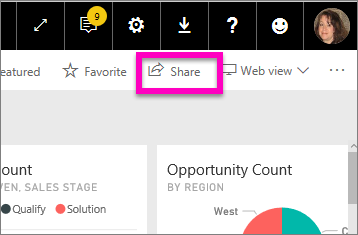
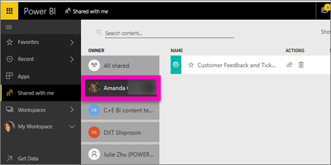

# Display the Power BI dashboards that have been shared with me
## Shared with me

When a colleague shares a dashboard with you, its title is added to your **Shared with me** list. The dashboard is only available from **Shared with me** and not available from a workspace or from **Apps**.

Watch Amanda explain the **Shared with me** content list and demonstrate how to navigate and filter the list. Then follow the step-by-step instructions below the video to try it out yourself. For you to view dashboards shared with you, you need to have a Power BI Pro license. Read [What is Power BI Premium?](powerbi-premium.md) for details.

<iframe width="560" height="315" src="https://www.youtube.com/embed/G26dr2PsEpk" frameborder="0" allowfullscreen></iframe>

You'll have many options for interacting with the dashboard and underlying report, depending on the permissions the owner gives you. These include being able to make copies of the dashboard, open the report [in Reading view](powerbi-service-interact-with-a-report-in-reading-view.md), and re-share with other colleagues.

## Actions available from the **Shared with me** screen
* Select the star icon to [Favorite a dashboard](powerbi-service-favorite-dashboards.md).
* [Remove a dashboard](powerbi-service-delete.md)  
* Some dashboards can be re-shared  
* Additionally, if your lists of dashboards gets long, [use the search field and sorting to find what you need](powerbi-service-navigation-search-filter-sort.md).
  
  > [!NOTE]
  > For information about EGRC classifications, select the classification button or [visit Dashboard data classification ](powerbi-service-data-classification.md).
  > 
  > 
* Select the name of a dashboard to open it and explore. Once you've opened the shared dashboard you can use Q&A to ask questions about the underlying data or select a tile to open and interact with the report in Reading view.

## Filter shared dashboards by owner
The content in the **Shared with me** screen can be further filtered by content owner. For example, if I select **Amanda**, I see only the dashboard that Amanda has shared with me.

## Next steps
[Power BI - Basic Concepts](powerbi-service-basic-concepts.md)  
[Power BI Premium - what is it?](powerbi-premium.md)  

More questions? [Try asking the Power BI Community](http://community.powerbi.com/)

