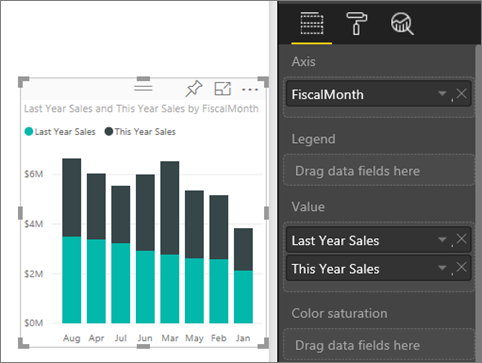
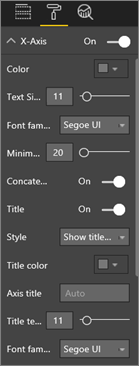
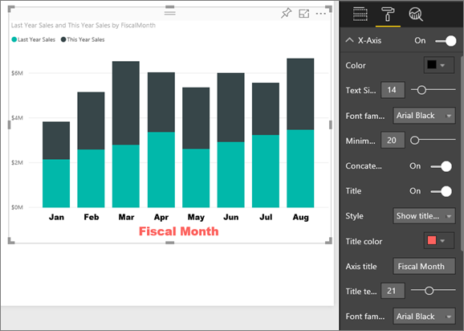
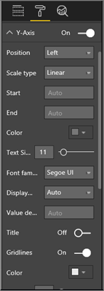
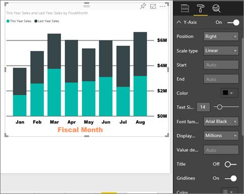
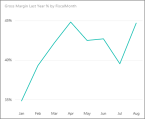
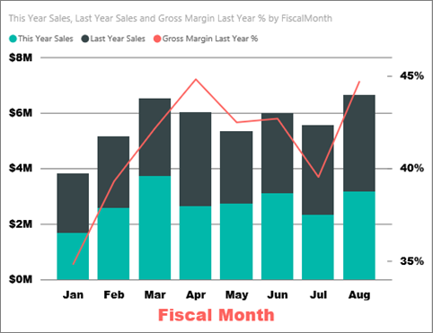
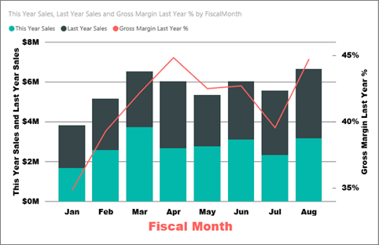

# Customize X-axis and Y-axis properties (Tutorial)
In this tutorial you'll learn many different ways to customize the X-axis and Y-axis of your visuals. Not all visuals have axes or can be customized; Pie charts, for example, don't have axes. And customization options vary from visual to visual, too many options to cover in a single article. So we'll take a look at some of the most-used axes customizations and get you comfortable using the visual formatting tab in the Power BI report canvas.  

> [!NOTE]
> This page applies to both Power BI service and Power BI Desktop. These customizations, which are available when the **Format** (the paint roller icon  ) is selected, are also available in Power BI Desktop.  
> 
> 

Watch Amanda customize her X and Y axes and demonstrate the various ways to control concatenation when using drill-up and drill-down. Then follow the step-by-step instructions below the video to try it out yourself using the Retail Analysis sample.

<iframe width="560" height="315" src="https://www.youtube.com/embed/9DeAKM4SNJM" frameborder="0" allowfullscreen></iframe>

## Customizing visualization X-axes in reports
## Create a stacked chart visualization
Sign in to the Power BI service and open the **Retail Analysis Sample** report in [Editing View](powerbi-service-interact-with-a-report-in-editing-view.md). To follow along, [connect to the Retail Analysis sample](powerbi-sample-datasets.md).

1. Create a new column chart that shows this year's sales and last year's sales value by fiscal month. 
2. Convert it to a Stacked column chart.
   
    

## Customize the X axis
1. In the Visualizations and Filters pane, select **Format** (the paint roller icon  ) to reveal the customization options.
2. Expand the X-Axis options.
   
   
3. Turn the X-axis on and off by selecting the On (or Off) slider. For now, leave it **On**.  One reason you might want to turn off the X-axis is to save space for more data.
   
    
4. Format the text color, size, and font. In this example we've set text **Color** to black, **Text Size** to 14, and **Font** to Arial Black.  
5. Turn the X-axis Title **On** and display the name of the X axis -- in this case, **FiscalMonth**.  
6. Format the title text color, size, and font.  In this example we've set **Title color** to orange, changed **Axis title** to **Fiscal Month**, and set **Title text size** to 21.
7. To sort by FiscalMonth, select the ellipses (...) in the top-right corner of the chart and select **Sort By FiscalMonth**.
   
    After all these customizations, your column chart should look something like this:
   
     

To revert all the X-axis customization you've done so far, select **Revert To Default** at the bottom of the **X-axis** customization pane.

## Customize the Y axis
1. Expand the Y-Axis options.
   
   
2. Turn the Y-axis on and off by selecting the On (or Off) slider. For now, leave it **On**.  One reason you might want to turn off the X-axis is to save space for more data.
   
    
3. Move the Y-Axis **Position** to the right.
4. Format the text color, size, and font. In this example we've set text **Color** to black, **Text Size** to 14, and **Font** to Arial Black.  
5. Keep **Display units** set to Millions and **Value decimal places** to zero.
6. For this visuaization, having a Y-axis title doesn't improve the visual, so leave **Title** turned Off.  
7. Let's make the gridlines stand out by changing the **Color** to a dark grey and increasing **Stroke** to 2.
   
    After all these customizations, your column chart should look something like this:
   
     

## Customizing visualizations with dual Y-axes
First you'll create a Combo chart that looks at the impact store count has on sales.  This is the same chart that is created in the [Combo chart Tutorial](powerbi-service-tutorial-combo-chart-merge-visualizations.md). Then you'll format the dual Y-axes.

### Create a chart with two Y-axes
1. Create a new line chart that tracks **Sales > Gross Margin last year %** by **Time > FiscalMonth**. 
2. Sort the visual by month by selecting the ellipses (...) and choosing **Sort by Month**
   
    
3. In January GM% was 35%, peaked at 45% in April, dropped in July and peaked again in August. Will we see a similar pattern in sales last year and this year?
4. Add **This Year Sales > Value** and **Last Year Sales** to the line chart. The scale of **GM% Last Year** (the blue line running along the 0M% gridline) is much smaller than the scale of **Sales** which makes it difficult to compare. And the Y-Axis label percentages are ridiculous.      
   
   
5. To make the visual easier to read and interpret, convert the line chart to a Line and Stacked Column chart.
   
   
6. Drag **Gross Margin Last Year %** from **Column Values** into **Line Values**. What we havw now is the stacked column chart we created above ***plus*** a line chart.  (Optionally, use what you leared above to format the axes font color and size.)
   
   Power BI creates two axes, thus allowing the datasets to be scaled differently; the left measures dollars and the right measures percentage.
   
   

### Format the secondary Y-axis
1. In the **Visualizations** pane, select the paint roller icon to display the formatting options.
2. Expand the Y-Axis options by selecting the down arrow.
3. Scroll through the list until you find the options for **Show secondary**. Toggle **Show Secondary** from **Off** to **On**.
   
   
   
   
4. (Optional) Customize the two axes. If you switch **Position** for either the column axis or the line axis, then the two axes switch sides.
   
   

### Add titles to both axes
With a visualization this complicated, it helps to add axes titles.  Titles help your colleagues understand the story your visualization is telling.

1. Toggle **Title** to **On** for **Y-Axis (Column)** and the **Y-Axis (Line)**.
2. Set **Style** to **Show title only**.
   
   
3. Your Combo chart now displays dual axes, both with titles.
   
   

For more information, see [Tips and tricks for color formatting, labeling, and axis properties](powerbi-service-tips-and-tricks-for-color-formatting.md).

## Considerations and troubleshooting
If the X-axis is categorized by the report owner as a date type, the **Type** option will display and you can select between continuous or categorical. 

## See also
More about [Visualizations in Power BI reports](powerbi-service-visualizations-for-reports.md)

[Customize t](powerbi-service-tutorial-customize-visualization-title-background-and-legend.md)[itles, backgrounds, and legends](powerbi-service-tutorial-customize-visualization-title-background-and-legend.md)

[Customize colors and axis properties](service-getting-started-with-color-formatting-and-axis-properties.md)

[Power BI - Basic Concepts](powerbi-service-basic-concepts.md)

More questions? [Try the Power BI Community](http://community.powerbi.com/)

