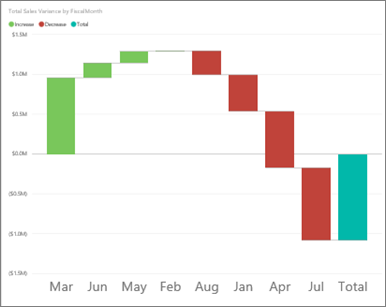
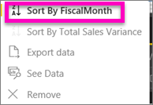
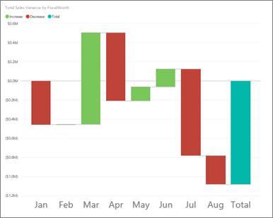
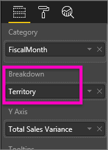
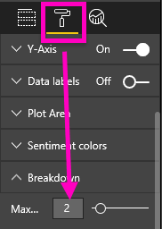
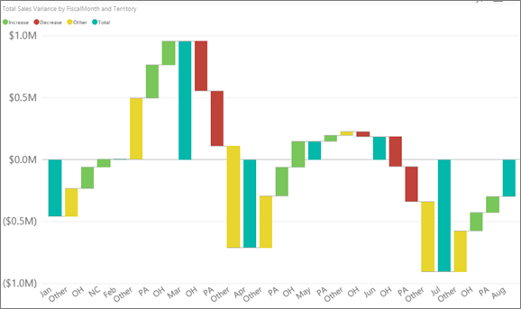
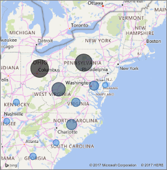

# Waterfall charts in Power BI (Tutorial)
A waterfall chart shows a running total as values are added or subtracted. It's useful for understanding how an initial value (for example, net income) is affected by a series of positive and negative changes.

The columns are color coded so you can quickly tell increases and decreases. The initial and the final value columns often [start on the horizontal axis](https://support.office.com/article/Create-a-waterfall-chart-in-Office-2016-for-Windows-8de1ece4-ff21-4d37-acd7-546f5527f185#BKMK_Float "start on the horizontal axis"), while the intermediate values are floating columns. Because of this "look", waterfall charts are also called bridge charts.

<iframe width="560" height="315" src="https://www.youtube.com/embed/maTzOJSRB3g?list=PL1N57mwBHtN0JFoKSR0n-tBkUJHeMP2cP" frameborder="0" allowfullscreen></iframe>

## When to use a waterfall chart
Waterfall charts are a great choice:

* when you have changes for the measure across time series or different categories
* to audit the major changes contributing to the total value
* to plot your company's annual profit by showing various sources of revenue and arrive at the total profit (or loss).
* to illustrate the beginning and the ending headcount for your company in a year
* to visualize how much money you make and spend each month, and the running balance for your account. 

## Create a waterfall chart
We'll create a waterfall chart that displays sales variance (estimated sales versus actual sales) by month. To follow along, sign in to Power BI and select **Get Data \> Samples \> Retail Analysis Sample**. 

1. Select the **Datasets** tab and scroll to the new "Retail Analysis Sample" dataset.  Select the **Create report** icon to open the dataset in report editing view. 
   
    
2. From the **Fields** pane, select **Sales \> Total Sales Variance**. If **Total Sales Variance** isn't in the **Y Axis** area, drag it there.
3. Convert the chart to a **Waterfall**. 
   
    
4. Select **Time** \> **FiscalMonth** to add it to the **Category** well. 
   
    
5. Sort the waterfall chart chronologically. From the top-right corner of the chart, select the ellipses (...) and choose **FiscalMonth**.
   
    
   
    
6. Dig in a little more to see what's contributing most to the changes month to month. Drag **Store** > **Territory** to the **Breakdown** bucket.
   
    
7. By default, Power BI adds the top 5 contributors to increases or decreases by month. But we're only interested in the top 2 contributors.  In the Formatting pane, select **Breakdown** and set **Maximum** to 2.
   
    
   
    A quick review reveals that the territories of Ohio and Pennsylvania are the biggest contributors to movement, negative and positive, in our waterfall chart. 
   
    
8. This is an interesting finding. Do Ohio and Pennsylvania have such a significant impact because sales in these 2 territories are much higher than the other territories?  We can check that. Create a map that looks at sales by territory.  
   
    
   
    Our map supports our theory.  It shows that these 2 territories had the highest value of sales last year (bubble size) and this year (bubble shading).

## Highlighting and cross-filtering
For information about using the Filters pane, see [Add a filter to a report](power-bi-report-add-filter.md).

Highlighting a column in a waterfall chart cross-filters the other visualizations on the report page... and vice versa. However, the Total column does not trigger highlighting or respond to cross-filtering.

## See also
[Reports in Power BI](powerbi-service-reports.md)

[Visualization types in Power BI](powerbi-service-visualization-types-for-reports-and-q-and-a.md)

[Visualizations in Power BI reports](power-bi-report-visualizations.md)

[Power BI - Basic Concepts](powerbi-service-basic-concepts.md)

More questions? [Try the Power BI Community](http://community.powerbi.com/)

