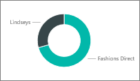
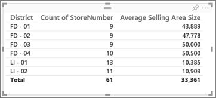

# Visualization types in Power BI
## Power BI visualizations
We'll be adding new visualizations, stay tuned!

And check out the [Office store](https://appsource.microsoft.com/marketplace/apps?product=power-bi-visuals) , where you'll find a growing list of  custom visuals you can download and use in your own dashboards and reports. Feeling creative? [Learn how to create and add your own visuals to the community site](powerbi-developer-office-store.md).  

## List of visualizations available in Power BI
All of these visualizations can be added to Power BI reports, specified in Q&A, and pinned to dashboards.

### Area charts: Basic (Layered) and Stacked

**Tip**: The Basic Area chart is based on the line chart with the area between the axis and line filled in.

For more information, see [Tutorial: Basic Area chart](powerbi-service-tutorial-basic-area-chart.md).

### Bar and column charts
 

 

**Tip**: Bar charts are the standard for looking at a specific value across different categories.

### Cards: Multi row

### Cards: Single number

For more information, see [Create a big number tile for a dashboard](powerbi-service-create-a-big-number-tile-for-a-dashboard.md).

### Combo charts

**Tip**: A Combo chart combines a column chart and a line chart. Choose from *Line and Stacked Column* and *Line and Clustered Column*.

For more information, see [Tutorial: Combo charts in Power BI](powerbi-service-tutorial-combo-chart-merge-visualizations.md).

### Doughnut charts

**Tip**: Doughnut charts are similar to Pie charts.  They show the relationship of parts to a whole.

For more information, see [Tutorial: Doughnut charts in Power BI](powerbi-service-tutorial-doughnut-charts.md).

### Funnel charts

**Tip**: Funnels help visualize a process that has stages and items flow sequentially from one stage to the next.  Use a funnel when there is a sequential flow between stages, such as a sales process that starts with leads and ends with purchase fulfillment.

For more information, see [Tutorial: Funnel Charts in Power BI](powerbi-service-tutorial-funnel-charts.md).

### Gauge charts

**Tip**: Displays current status in the context of a goal.

For more information, see [Tutorial: Gauge Charts in Power BI](powerbi-service-tutorial-radial-gauge-charts.md).

### KPIs

**Tip**: Displays progress toward a measurable goal.

For more information, see [Tutorial: KPIs in Power BI](powerbi-service-tutorial-kpi.md).

### Line charts

**Tip**: emphasize the overall shape of an entire series of values, usually over time.

### Maps: Basic maps

**Tip**: are used to associate both categorical and quantitative information with spatial locations.

For more information, see [Tips and tricks for map visuals](powerbi-service-tips-and-tricks-for-power-bi-map-visualizations.md).

### Maps: ArcGIS maps

For more information, see [Tutorial: ArcGIS maps in Power BI](/powerbi-service-tutorial-arcgis.md).

### Maps: Filled maps (Choropleth)

**Tip**: The more intense the color, the larger the value.

For more information, see [Tutorial: Filled Maps in Power BI](powerbi-service-tutorial-filled-maps-choropleths.md).

### Matrix

### Pie charts

### Scatter and Bubble charts

**Tip**: display relationships between 2 (scatter) or 3 (bubble) quantitative measures -- whether or not, in which order, etc.

For more information, see [Tutorial: Scatter charts in Power BI](powerbi-service-tutorial-scatter.md).

### Slicers

For more information, see [Tutorial: Slicers in Power BI](powerbi-service-tutorial-slicers.md).

### Standalone images

For more information, see [Add an image widget to a dashboard](powerbi-service-add-a-widget-to-a-dashboard.md).

### Tables

**Tip**: work well with quantitative comparisons among items where there are many categories.

For more information, see [Working with tables in Power BI](powerbi-service-tutorial-tables.md).

### Tree Maps

For more information, see [Tutorial: Treemaps in Power BI](powerbi-service-tutorial-treemaps.md).

**Tip**: are charts of colored rectangles, with size representing value.  They can be hierarchical, with rectangles nested within the main rectangles.

### Waterfall charts

**Tip**: Waterfall charts show a running total as values are added or subtracted.

For more information, see [Tutorial Waterfall charts in Power BI](powerbi-service-tutorial-waterfall-charts.md).

## #
## Tell Q&A which visualization to use
When typing natural language queries with Power BI Q&A, you can specify the visualization type in your query.  For example:

"***sales by state as a treemap***"

## See also
[Visualizations in Power BI reports](powerbi-service-visualizations-for-reports.md)    
[The right visual reference from sqlbi.com](http://www.sqlbi.com/wp-content/uploads/videotrainings/dashboarddesign/visuals-reference-may2017-A3.pdf)

[Reports in Power BI](powerbi-service-reports.md)

[Power BI - Basic Concepts](powerbi-service-basic-concepts.md)

More questions? [Try the Power BI Community](http://community.powerbi.com/)

