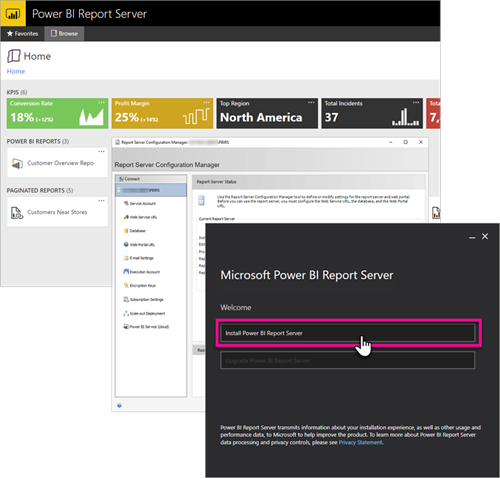

# Administrator handbook overview, Power BI Report Server
Welcome to the administrator handbook for Power BI Report Server, an on-premises location for storing and managing your Power BI, mobile, and paginated reports.

This handbook will help you understand concepts on planning, deploying and managing your Power BI Report Server.

## Installing and migration
You will need to install Power BI Report Server to start using it. We have information that will allow you to handle this task.

Before you start to install, upgrade or migrate to Power BI Report Server, take a look at the [system requirements](reportserver-system-requirements.md) for the report server.

### Installing
If you are deploying a new Power BI Report Server, you use the following documents to help you. A quickstart is available to jump right in. Or, you can look at the install document for full details.

* [Quickstart: Install Power BI Report Server](reportserver-quickstart-install-report-server.md)
* [Install Power BI Report Server](install-report-server.md)

### Migration
There is no in place upgrade for SQL Server Reporting Services. If you have an existing SQL Server Reporting Services instance that you want to make a Power BI Report Server, you will need to migrate it. There are other reasons that you may want to perform a migration as well. Review the migration document for more details.

[Migrate a report server installation](reportserver-migrate-report-server.md)

## Configuring your report server
You have many options when configuing your report server. Will you use SSL? Are you configuring an email server? Do you want to intergrate with the Power BI service to pin visualizations?

The majority of your configuration will occur within the Report Server Configuration Manager. Check out the [configuration manager](https://docs.microsoft.com/sql/reporting-services/install-windows/reporting-services-configuration-manager-native-mode) documentation for more details.

## Security
Security and protection are important to every organization. You can learn about authentication, authorization, roles and permissions over in the [security](https://docs.microsoft.com/sql/reporting-services/security/reporting-services-security-and-protection) documentation.

## Next steps
[Quickstart: Install Power BI Report Server](reportserver-quickstart-install-report-server.md)  
[How to find your report server product key](find-product-key.md)  
[Install Power BI Desktop optimized for Power BI Report Server](reportserver-install-powerbi-desktop.md)  
[Install Report Builder](https://docs.microsoft.com/sql/reporting-services/install-windows/install-report-builder)  
[Download SQL Server Data Tools (SSDT)](http://go.microsoft.com/fwlink/?LinkID=616714)

More questions? [Try asking the Power BI Community](https://community.powerbi.com/)

