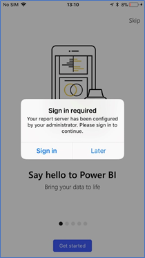
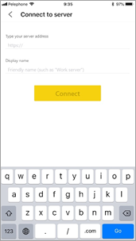
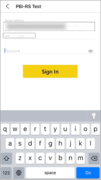

# Configure Power BI iOS mobile app access to report servers remotely

In this article, learn how to use your organization's MDM tool to configure Power BI iOS mobile app access to report servers. To set this up, Power BI administrators create an app configuration policy with the required information to be pushed to the app. 

 Then, Power BI iOS mobile app users can connect to their organization's report server more easily because the report server connection is already configured. 

## Create the app configuration policy in MDM tool 

As admin, these are the steps you follow in Intune to create the app configuration policy. The steps and experience of building the app configuration policy may be different in other MDM tools. 

1. Connect your MDM tool. 
2. Create and name a new app configuration policy. 
3. Choose which users to distribute this app configuration policy to. 
4. Create key-value pairs. 

The following table spells out the pairs.

|Key  |Type  |Description  |
|---------|---------|---------|
| com.microsoft.powerbi.mobile.ServerURL | String | Report Server URL   Should start with http/https |
| com.microsoft.powerbi.mobile.ServerUsername | String | [optional]   The username to use for connecting the server.   If one does not exist, the app prompts the user to type the username for the connection.| 
| com.microsoft.powerbi.mobile.ServerDisplayName | String | [optional]   Default value is “Report server”   A friendly name used in the app to represent the server | 
| com.microsoft.powerbi.mobile.OverrideServerDetails | Boolean | Default value is True   If set to “True” then this overrides any Report Server definition already in the mobile device (existing servers already configured will be deleted).   Override set to True also prevents the user from removing that configuration.   Set to “False” adds the pushed values, leaving any existing settings.   If the same server URL is already configured in the mobile app, then the app leaves that configuration as is and doesn't ask the user to re-authenticate  for the same server. |

## End users connecting to a report server

After you publish the app configuration policy, users and devices that belong to the distribution list defined for that policy have the following experience when they start the Power BI iOS mobile app. 

1. They see a message that their mobile app is configured with a report server, and tap **Sign in**.

    

2.  On the **Connect to server** page, the report server details already filled in. They tap **Connect**.

    

3. They type a password to authenticate, then tap **Sign in**. 

    

Now they can view and interact with KPIs and Power BI reports stored on the report server.

## Next steps
[Administrator overview](admin-handbook-overview.md)  
[Install Power BI Report Server](install-report-server.md)  

More questions? [Try asking the Power BI Community](https://community.powerbi.com/)

