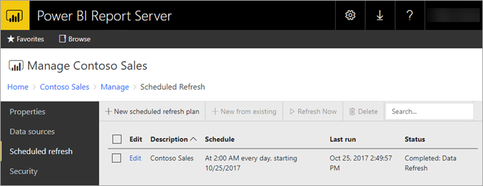
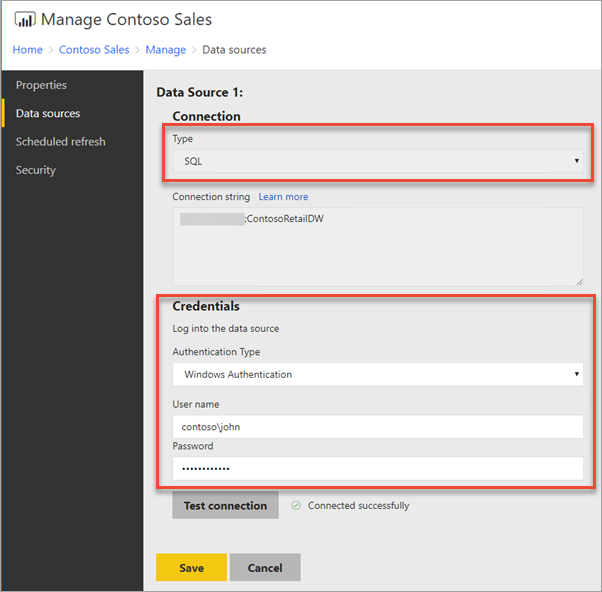
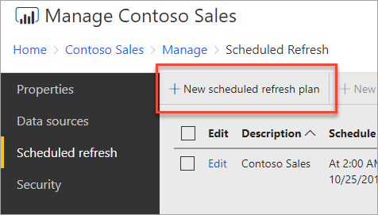
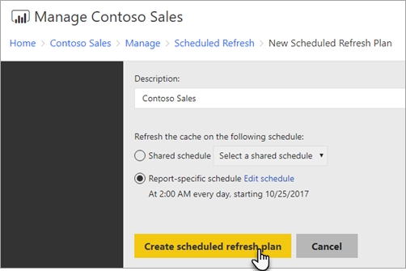
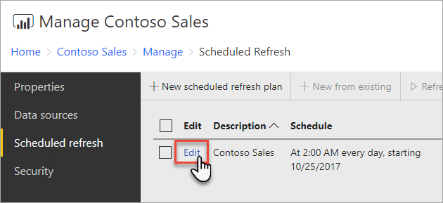
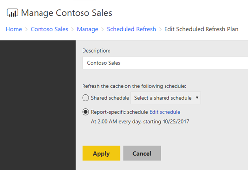

# How to configure Power BI report scheduled refresh
To refresh data in your Power BI report, a scheduled refresh plan must be created. This is done within the *Manage* area of a Power BI report.

## Configure data source credentials
Prior to creating a schedule data refresh plan, you need to set the credentials for **each data source** used in your Power BI report.

1. In the web portal, right-click on the Power BI report and select **Manage**.
   
    
2. In the left menu, select the **Data sources** tab.
3. For each data source that appears, choose the type of authentication to use when connecting to that data source. Enter the appropriate credentials.
   
    

## Creating a Schedule Refresh Plan
Follow these steps to create a scheduled refresh plan.

1. In the web portal, right-click on the Power BI report and select **Manage**.
   
    
2. In the left menu, select the **Scheduled refresh** tab.
3. On the **Scheduled refresh** page, select **New scheduled refresh plan**.
   
    
4. On the **New Scheduled Refresh Plan** page, enter a description and set a schedule for when you want your data model to be refreshed.
5. Select **Create scheduled refresh plan** when done.
   
    

## Modifying a Schedule Refresh Plan
Modifying a scheduled refresh plan is similar to creating one.

1. In the web portal, right-click on the Power BI report and select **Manage**.
   
    
2. In the left menu, select the **Scheduled refresh** tab.
3. On the **Scheduled refresh** page, select **Edit** beside the refresh plan you want to manage.
   
    
4. On the **Edit Scheduled Refresh Plan** page, enter a description and set a schedule for when you want your data model to be refreshed.
5. Select **Apply** when done.
   
    

## Viewing the status of Schedule Refresh Plan
View the status of a schedule refresh plan in the web portal.

1. In the web portal, right-click on the Power BI report and select **Manage**.
   
    
2. In the left menu, select the **Scheduled refresh** tab.
3. On the **Scheduled refresh** page, the right most column displays the status of a plan.
   
   | **Status** | **Description** |
   | --- | --- |
   | New Scheduled Refresh Plan |The plan has been created but has not ran. |
   | Refreshing |The refresh process has started. |
   | Streaming model to Analysis Server |Copying the model from the report server catalog database to the hosted Analysis Services instance. |
   | Refreshing data |Refreshing the data within the model. |
   | Removing credentials from the model |Removed the credentials used to connect to the data source from the model. |
   | Saving model to the catalog |Refreshing of data is complete and the refreshed model is being saved back to the report server catalog database. |
   | Completed: Data Refresh |Refresh is done. |
   | Error: |An error occurred during refresh and is displayed. |

The web page must be refreshed to see the current status. The status will not change automatically.

## Next steps
To learn more about creating and modifying schedules, see [Create, modify, and delete schedules](https://docs.microsoft.com/sql/reporting-services/subscriptions/create-modify-and-delete-schedules).

For information on how to troubleshoot scheduled refresh, see [Troubleshoot scheduled refresh in Power BI Report Server](scheduled-refresh-troubleshoot.md).

More questions? [Try asking the Power BI Community](https://community.powerbi.com/)

