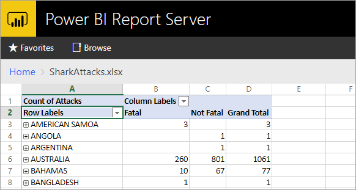
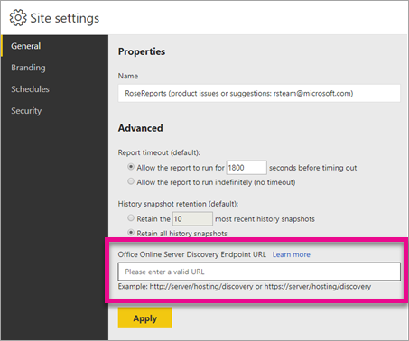

# Configure your report server to host Excel workbooks using Office Online Server (OOS)

In addition to viewing Power BI reports in the web portal, Power BI Report Server can host Excel workbooks by using [Office Online Server](https://docs.microsoft.com/officeonlineserver/office-online-server-overview) (OOS). Your report server becomes a single location to publish and view self-service Microsoft BI content.



## Prepare server to run Office Online Server

Perform these procedures on the server that will run Office Online Server. This server must be Windows Server 2012 R2 or Windows Server 2016. Windows Server 2016 requires Office Online Server April 2017 or later.

### Install prerequisite software for Office Online Server

1. Open the Windows PowerShell prompt as an administrator and run this command to install the required roles and services.

    **Windows Server 2012 R2:**

    ```
    Add-WindowsFeature Web-Server,Web-Mgmt-Tools,Web-Mgmt-Console,Web-WebServer,Web-Common-Http,Web-Default-Doc,Web-Static-Content,Web-Performance,Web-Stat-Compression,Web-Dyn-Compression,Web-Security,Web-Filtering,Web-Windows-Auth,Web-App-Dev,Web-Net-Ext45,Web-Asp-Net45,Web-ISAPI-Ext,Web-ISAPI-Filter,Web-Includes,InkandHandwritingServices,NET-Framework-Features,NET-Framework-Core,NET-HTTP-Activation,NET-Non-HTTP-Activ,NET-WCF-HTTP-Activation45,Windows-Identity-Foundation,Server-Media-Foundation
    ```

    **Windows Server 2016:**

    ```
    Add-WindowsFeature Web-Server,Web-Mgmt-Tools,Web-Mgmt-Console,Web-WebServer,Web-Common-Http,Web-Default-Doc,Web-Static-Content,Web-Performance,Web-Stat-Compression,Web-Dyn-Compression,Web-Security,Web-Filtering,Web-Windows-Auth,Web-App-Dev,Web-Net-Ext45,Web-Asp-Net45,Web-ISAPI-Ext,Web-ISAPI-Filter,Web-Includes,NET-Framework-Features,NET-Framework-45-Features,NET-Framework-Core,NET-Framework-45-Core,NET-HTTP-Activation,NET-Non-HTTP-Activ,NET-WCF-HTTP-Activation45,Windows-Identity-Foundation,Server-Media-Foundation
    ```

    If prompted, restart the server.
2. Install the following software:

   * [.NET Framework 4.5.2](https://go.microsoft.com/fwlink/p/?LinkId=510096)
   * [Visual C++ Redistributable Packages for Visual Studio 2013](https://www.microsoft.com/download/details.aspx?id=40784)
   * [Visual C++ Redistributable for Visual Studio 2015](https://go.microsoft.com/fwlink/p/?LinkId=620071)
   * [Microsoft.IdentityModel.Extention.dll](https://go.microsoft.com/fwlink/p/?LinkId=620072)

### Install Office Online Server

If you plan to use any Excel Online features that utilize external data access (such as Power Pivot), note that Office Online Server must reside in the same Active Directory forest as its users as well as any external data sources that you plan to access using Windows-based authentication.

1. Download Office Online Server from the [Volume Licensing Service Center (VLSC)](http://go.microsoft.com/fwlink/p/?LinkId=256561). The download is located under those Office products on the VLSC portal. For development purposes, you can download OOS from MSDN subscriber downloads.
2. Run Setup.exe.
3. On the **Read the Microsoft Software License Terms** page, select **I accept the terms of this agreement** and select **Continue**.
4. On the **Choose a file location** page, select the folder where you want the Office Online Server files to be installed (for example, C:\Program Files\Microsoft Office Web Apps*) and select **Install Now**. If the folder you specified doesn’t exist, Setup creates it for you.

    We recommend that you install Office Online Server on the system drive.

5. When Setup finishes installing Office Online Server, select **Close**.

### Install language packs for Office Web Apps Server (optional)

Office Online Server Language Packs let users view web-based Office files in multiple languages.

To install the language packs, follow these steps.

1. Download the Office Online Server Language Packs from the [Microsoft Download Center](http://go.microsoft.com/fwlink/p/?LinkId=798136).
2. Run **wacserverlanguagepack.exe**.
3. In the Office Online Server Language Pack Wizard, on the **Read the Microsoft Software License Terms** page, select **I accept the terms of this agreement** and select **Continue**.
4. When Setup finishes installing Office Online Server, select **Close**.

## Deploy Office Online Server

### Create the Office Online Server farm (HTTPS)

Use the New-OfficeWebAppsFarm command to create a new Office Online Server farm that consists of a single server, as shown in the following example.

```
New-OfficeWebAppsFarm -InternalUrl "https://server.contoso.com" -ExternalUrl "https://wacweb01.contoso.com" -CertificateName "OfficeWebApps Certificate"
```

**Parameters**

* **–InternalURL** is the fully qualified domain name (FQDN) of the server that runs Office Online Server, such as `http://servername.contoso.com`.
* **–ExternalURL** is the FQDN that can be accessed on the Internet.
* **–CertificateName** is the friendly name of the certificate.

### Create the Office Online Server farm (HTTP)

Use the New-OfficeWebAppsFarm command to create a new Office Online Server farm that consists of a single server, as shown in the following example.

```
New-OfficeWebAppsFarm -InternalURL "http://servername" -AllowHttp
```

**Parameters**

* **–InternalURL** is the name of the server that runs Office Online Server, such as `http://servername`.
* **–AllowHttp** configures the farm to use HTTP.

### Verify that the Office Online Server farm was created successfully

After the farm is created, details about the farm are displayed in the Windows PowerShell prompt. To verify that Office Online Server is installed and configured correctly, use a web browser to access the Office Online Server discovery URL, as shown in the following example. The discovery URL is the *InternalUrl* parameter you specified when you configured your Office Online Server farm, followed by */hosting/discovery*, for example:

```
<InternalUrl>/hosting/discovery
```

If Office Online Server works as expected, you should see a Web Application Open Platform Interface Protocol (WOPI)-discovery XML file in your web browser. The first few lines of that file should resemble the following example:

```powershell
<?xml version="1.0" encoding="utf-8" ?> 
- <wopi-discovery>
- <net-zone name="internal-http">
- <app name="Excel" favIconUrl="<InternalUrl>/x/_layouts/images/FavIcon_Excel.ico" checkLicense="true">
<action name="view" ext="ods" default="true" urlsrc="<InternalUrl>/x/_layouts/xlviewerinternal.aspx?<ui=UI_LLCC&><rs=DC_LLCC&>" /> 
<action name="view" ext="xls" default="true" urlsrc="<InternalUrl>/x/_layouts/xlviewerinternal.aspx?<ui=UI_LLCC&><rs=DC_LLCC&>" /> 
<action name="view" ext="xlsb" default="true" urlsrc="<InternalUrl>/x/_layouts/xlviewerinternal.aspx?<ui=UI_LLCC&><rs=DC_LLCC&>" /> 
<action name="view" ext="xlsm" default="true" urlsrc="<InternalUrl>/x/_layouts/xlviewerinternal.aspx?<ui=UI_LLCC&><rs=DC_LLCC&>" /> 
```

### Configure Excel workbook maximum size

The maximum file size for all files in Power BI Report Server is 100 MB. To stay in sync with that, you need to manually set this in OOS.

```
Set-OfficeWebAppsFarm -ExcelWorkbookSizeMax 100
```

## Using EffectiveUserName with Analysis Services
To allow for live connections to Analysis Services, for connections within an Excel workbook that make use of EffectiveUserName. For OOS to make use of EffectiveUserName, you will need to add the machine account of the OOS server as an administrator for the Analysis Services instance. Management Studio for SQL Server 2016 or later is needed to do this.

Only embedded Analysis Services connections are currently supported within an Excel workbook. The user's account will need to have permission to connect to Analysis Services as the ability to proxy the user is not available.

Run the following PowerShell commands on the OOS Server.

```
Set-OfficeWebAppsFarm -ExcelUseEffectiveUserName:$true
Set-OfficeWebAppsFarm -ExcelAllowExternalData:$true
Set-OfficeWebAppsFarm -ExcelWarnOnDataRefresh:$false
```

## Configure a Power Pivot instance for data models

Installing an Analysis Services Power Pivot mode instance lets you work with Excel workbooks that are using Power Pivot. Make sure that the instance name is *POWERPIVOT*. Add the machine account of the OOS server as an administrator, for the Analysis Services Power Pivot mode instance. Management Studio for SQL Server 2016 or later is needed to do this.

For OOS to use the Power Pivot mode instance, run the following command.

```
New-OfficeWebAppsExcelBIServer -ServerId <server_name>\POWERPIVOT
```

If you did not already allow external data, from the Analysis Services step above, run the following command.

```
Set-OfficeWebAppsFarm -ExcelAllowExternalData:$true
```

### Firewall considerations

To avoid firewall issues, you may need to open the ports 2382 and 2383. You can also add the *msmdsrv.exe*, for the Power Pivot instance, as an application firewall wall policy.

## Configure Power BI Report Server to use the OOS Server

On the **General** page of **Site settings**, enter the OOS discovery url. The OOS discovery url is the *InternalUrl*, used when deploying the OOS server, followed by */hosting/discovery*. For example, `http://servername/hosting/discovery`, for HTTP. And, `https://server.contoso.com/hosting/discovery` for HTTPS.

To get to **Site settings**, select the **gear icon** in the upper right and select **Site settings**.

Only a user with the **System Administrator** role will see the Office Online Server discovery url setting.



After you enter the discovery url, and select **Apply**, selecting an Excel workbook, within the web portal, should display the workbook within the web portal.

## Limitations and considerations

* You will have read only capability with workbooks.

## Next steps

[Administrator overview](admin-handbook-overview.md)  
[Install Power BI Report Server](install-report-server.md)  
[Install Report Builder](https://docs.microsoft.com/sql/reporting-services/install-windows/install-report-builder)  
[Download SQL Server Data Tools (SSDT)](http://go.microsoft.com/fwlink/?LinkID=616714)

More questions? [Try asking the Power BI Community](https://community.powerbi.com/)