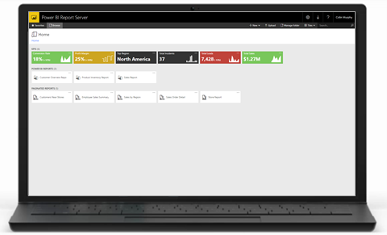
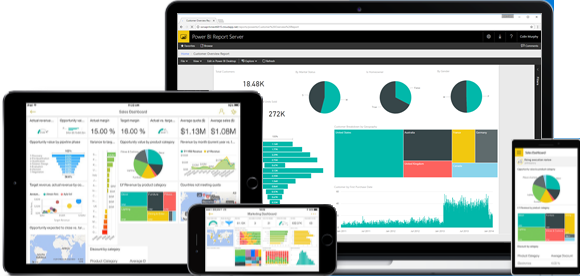

# What is Power BI Report Server?

Power BI Report Server is an on-premises report server with a web portal in which you display and manage reports and KPIs, along with the tools to create Power BI reports, paginated reports, mobile reports, and KPIs. Your users can access those reports in different ways: viewing them in a web browser or mobile device, or as an email in their in-box.

## Comparing Power BI Report Server 
Power BI Report Server is similar to both SQL Server Reporting Services and the Power BI online service, but in different ways. Like the Power BI service, Power BI Report Server hosts Power BI reports (.PBIX) and Excel files. Like Reporting Services, Power BI Report Server is on premises, and hosts paginated reports (.RDL). Power BI Report Server is a superset of Reporting Services: everything you can do in Reporting Services, you can do with Power BI Report Server and more, with the addition of support for Power BI reports. See [Comparing Power BI Report Server and the Power BI service](compare-report-server-service.md) for details.

## Licensing Power BI Report Server
Power BI Report Server is available through two different licenses: [Power BI Premium](../service-premium.md) and [SQL Server Enterprise Edition](https://www.microsoft.com/sql-server/sql-server-2017-editions) with Software Assurance. With a Power BI Premium license, you can create a hybrid deployment mixing cloud and on-premises.  

> [!NOTE]
> For Power BI Premium, Power BI Report Server is only included with P SKUs. It is not included with EM SKUs.

## Web portal
The entry point for Power BI Report Server is a secure web portal you can view in any modern browser. Here, you can access all your reports and KPIs. The content on the web portal is organized in a traditional folder hierarchy. In your folders, content is grouped by type: Power BI reports, mobile reports, paginated reports, KPIs, and Excel workbooks, plus shared datasets and shared data sources to use as building blocks for your reports. You can tag favorites to view them in a single folder. And you can create KPIs right in the web portal. 

Depending on your permissions, you can manage the content in the web portal. You can schedule report processing, access reports on demand, and subscribe to published reports. You can also apply your own custom [branding](https://docs.microsoft.com/sql/reporting-services/branding-the-web-portal) to your web portal. 

More about the [Power BI Report Server web portal](https://docs.microsoft.com/sql/reporting-services/web-portal-ssrs-native-mode).

## Power BI reports
You create Power BI reports (.PBIX) with the version of Power BI Desktop optimized for the report server. Then you publish them to and view them in the web portal in your own environment.

A Power BI report is a multi-perspective view into a data model, with visualizations that represent different findings and insights from that data model.  A report can have a single visualization or pages full of visualizations. Depending on your role, you may read and explore reports, or you may create them for others.

Install [Power BI Desktop optimized for Power BI Report Server](quickstart-create-powerbi-report.md).

## Paginated reports
Paginated reports (.RDL) are document-style reports with visualizations, in which tables expand horizontally and vertically to display all their data, continuing from page to page as needed. Thye're great for generating fixed-layout, pixel-perfect documents optimized for printing, such as PDF and Word files. 

You can create modern-looking reports using [Report Builder](https://docs.microsoft.com/sql/reporting-services/report-builder/report-builder-in-sql-server-2016) or Report Designer in [SQL Server Data Tools (SSDT)](https://docs.microsoft.com/sql/reporting-services/tools/reporting-services-in-sql-server-data-tools-ssdt). 

## Reporting Services mobile reports
Mobile reports connect to on-premises data and have a responsive layout that adapts to different devices and the different ways you hold them. You create them with SQL Server Mobile Report Publisher.

More about [Reporting Services mobile reports](https://docs.microsoft.com/sql/reporting-services/mobile-reports/create-mobile-reports-with-sql-server-mobile-report-publisher). 

## Report Server programming features
Take advantage of Power BI Report Server programming features to extend and customize your reporting functionality, with APIs to integrate or extend data and report processing in custom applications.

More [Report Server developer documentation](https://docs.microsoft.com/sql/reporting-services/reporting-services-developer-documentation).

## Next steps
[Install Power BI Report Server](install-report-server.md)  
[Download Report Builder](https://www.microsoft.com/download/details.aspx?id=53613)  

More questions? [Try asking the Power BI Community](https://community.powerbi.com/)

