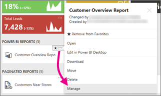
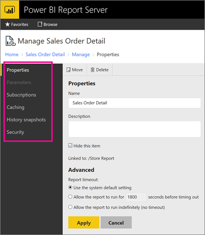

# Manage content in the Power BI Report Server web portal 
The Power BI Report Server web portal is an on-premises location for viewing, storing and managing your Power BI, mobile, and paginated reports, and KPIs.

You can view the web portal in any modern browser. In the web portal, reports and KPIs are organized in folders, and you can mark them as favorites. You can also store Excel workbooks there. From the web portal, you can launch the tools you need to create reports:

* **Power BI reports** created with Power BI Desktop: View them in the web portal and the Power BI mobile apps.
* **Paginated reports** created in Report Builder: Modern-looking, fixed-layout documents optimized for printing.
* **KPIs** created right in the web portal.

In the web portal you can browse the report server folders or search for specific reports. You can view a report, its general properties and past copies of the report that are captured in report history. Depending on your permissions, you might also be able to subscribe to reports for delivery to your e-mail inbox or a shared folder on the file system.

## Web portal tasks
You can use the web portal for a number of tasks, including these:

* View, search, print, and subscribe to reports.
* Create, secure, and maintain the folder hierarchy to organize items on the server.
* Configure report execution properties, report history, and report parameters.
* Create shared schedules and shared data sources to make schedules and data source connections more manageable.
* Create data-driven subscriptions to roll out reports to a large recipient list.
* Create linked reports to reuse and re-purpose an existing report in different ways.
* Download and open common tools such as Power BI Desktop (Report Server), Report Builder, and Mobile Report Publisher.
* [Create KPIs](https://docs.microsoft.com/sql/reporting-services/working-with-kpis-in-reporting-services).
* Send feedback or make feature requests.
* [Branding the web portal](https://docs.microsoft.com/sql/reporting-services/branding-the-web-portal)
* [Working with KPIs](https://docs.microsoft.com/sql/reporting-services/working-with-kpis-in-reporting-services)
* [Working with shared datasets](https://docs.microsoft.com/sql/reporting-services/work-with-shared-datasets-web-portal)

## Web portal roles and permissions
The web portal is a web application that runs in a browser. When you start the web portal, the pages, links, and options you see vary based on the permissions you have on the report server. If you're assigned to a role with full permissions, you have access to the complete set of application menus and pages for managing a report server. If you're assigned to a role with permissions to view and run reports, you only see the menus and pages you need for those activities. You can have different role assignments for different report servers, or even for the various reports and folders on a single report server.

## Start the web portal
1. Open your web browser.
   
    See this list of [supported web browsers and versions](browser-support.md).
2. In the address bar, type the web portal URL.
   
    By default, the URL is *http://[ComputerName]/reports*.
   
    The report server might be configured to use a specific port. For example, *http://[ComputerName]:80/reports* or *http://[ComputerName]:8080/reports*
   
    You see that the web portal groups items into these categories:
   
   * KPIs
   * Mobile reports
   * Paginated reports
   * Power BI Desktop reports
   * Excel workbooks
   * Datasets
   * Data sources
   * Resources

## Manage items in the web portal
Power BI Report Server offers detailed control of the items you store on the web portal. For example, you can set up subscriptions, caching, snapshots, and security on individual paginated reports.

1. Select the ellipsis (...) in the upper-right corner of an item, then select **Manage**.
   
    
2. Choose the property or other feature you want to set.
   
    
3. Select **Apply**.

Read more about [working with subscriptions in the web portal](https://docs.microsoft.com/sql/reporting-services/working-with-subscriptions-web-portal).

## Next steps
[User handbook](user-handbook-overview.md)  
[Quickstart: Paginated reports](quickstart-create-paginated-report.md)  
[Quickstart: Power BI reports](quickstart-create-powerbi-report.md)

More questions? [Try asking the Power BI Community](https://community.powerbi.com/)

