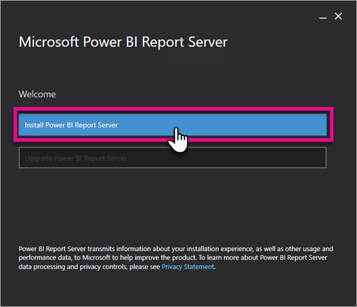
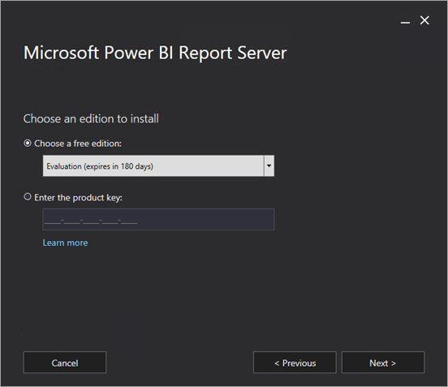
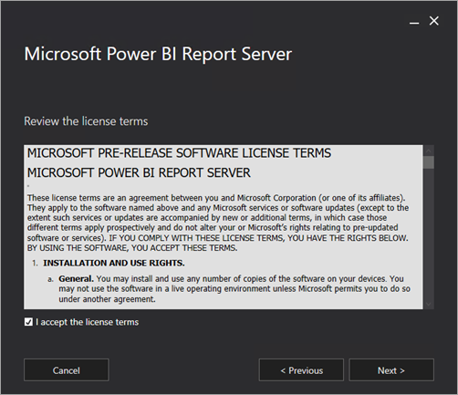
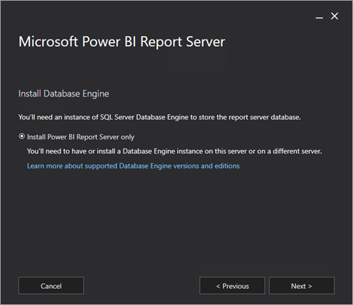
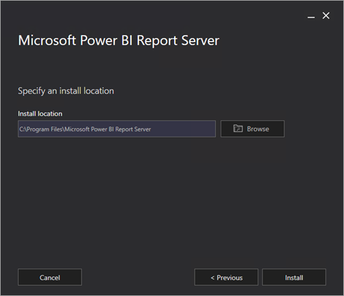
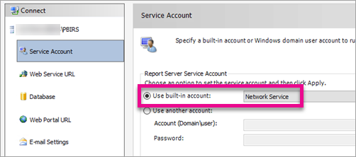
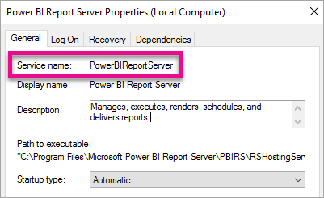

# Install Power BI Report Server

Learn how to install Power BI Report Server.

 **Download** 

To download Power BI Report Server, go to [On-premises reporting with Power BI Report Server](https://powerbi.microsoft.com/report-server/), and select **Download free trial**.

## Before you begin

Before you install Power BI Report Server, we recommend you review the [Hardware and Software Requirements for installing Power BI Report Server](system-requirements.md).

 > [!IMPORTANT]
 > While you can install Power BI Report Server in an environment that has a Read-Only Domain Controller (RODC), Power BI Report Server needs access to a Read-Write Domain Controller to function properly. If Power BI Report Server only has access to a RODC, you may encounter errors when trying to administer the service.

### Power BI Report Server product key

#### Power BI Premium

If you have purchased Power BI Premium, within the **Premium settings** tab of the Power BI admin portal, you have access to your Power BI Report Server product key. This is only available for Global Admins or users assigned the Power BI service administrator role.

<<<<<<< HEAD
<<<<<<< HEAD
<<<<<<< HEAD

=======

>>>>>>> Fix warning for RS install lfile
=======

>>>>>>> corrected install report server file
=======

>>>>>>> 836747f98d78ea3a72a7e3cfbd0233a3a5e0f0c5

Selecting **Power BI Report Server key** displays a dialog contain your product key. You can copy it and use it with the installation.

#### SQL Server Enterprise Software Assurance (SA)

If you have a SQL Server Enterprise SA agreement, you can get your product key from the [Volume Licensing Service Center](https://www.microsoft.com/Licensing/servicecenter/).

## Install your report server

Installing Power BI Report Server is straightforward. There are only a few steps to install the files.

You don't need a SQL Server Database Engine server available at the time of install. You will need one to configure Reporting Services after install.

1. Find the location of PowerBIReportServer.exe and launch the installer.

2. Select **Install Power BI Report Server**.

    
3. Choose an edition to install and then select **Next**.

    

    You can choose either Evaluation or Developer edition from the drop down.

<<<<<<< HEAD
<<<<<<< HEAD
<<<<<<< HEAD
    
=======
    
>>>>>>> Fix warning for RS install lfile
=======
    
>>>>>>> corrected install report server file
=======
    
>>>>>>> 836747f98d78ea3a72a7e3cfbd0233a3a5e0f0c5

    Otherwise, you can enter a product key for the server that you acquired from either the Power BI service or the Volume License Service Center. For more information about how to get your product key, see the [Before you begin](#before-you-begin) section.
4. Read and agree to the license terms and conditions and then select **Next**.

    
5. You need to have a Database Engine available to store the report server database. Select **Next** to install the report server only.

    
6. Specify the install location for the report server. Select **Install** to continue.

    

    The default path is C:\Program Files\Microsoft Power BI Report Server.

7. After a successful setup, select **Configure Report Server** to launch the Reporting Services Configuration Manager.

    

## Configuring your report server

After you select **Configure Report Server** in the setup, you're presented with Reporting Services Configuration Manager. For more information, see [Reporting Services Configuration Manager](https://docs.microsoft.com/sql/reporting-services/install-windows/reporting-services-configuration-manager-native-mode).

You need to [create a report server database](https://docs.microsoft.com/sql/reporting-services/install-windows/ssrs-report-server-create-a-report-server-database) to complete the initial configuration of Reporting Services. A SQL Server Database server is required to complete this step.

### Creating a database on a different server

If you are creating the report server database on a database server on a different machine, you need to change the service account for the report server to a credential that is recognized on the database server. 

By default, the report server uses the virtual service account. If you try to create a database on a different server, you may receive the following error on the Applying connection rights step.

`System.Data.SqlClient.SqlException (0x80131904): Windows NT user or group '(null)' not found. Check the name again.`

To work around the error, you can change the service account to either Network Service or a domain account. Changing the service account to Network Service applies rights in the context of the machine account for the report server.

For more information, see [Configure the report server service account](https://docs.microsoft.com/sql/reporting-services/install-windows/configure-the-report-server-service-account-ssrs-configuration-manager).

## Windows Service

A windows service is created as part of the installation. It is displayed as **Power BI Report Server**. The service name is **PowerBIReportServer**.

## Default URL reservations

URL reservations are composed of a prefix, host name, port, and virtual directory:

| Part | Description |
| --- | --- |
| Prefix |The default prefix is HTTP. If you previously installed a Secure Sockets Layer (SSL) certificate, Setup tries to create URL reservations that use the HTTPS prefix. |
| Host name |The default host name is a strong wildcard (+). It specifies that the report server accepts any HTTP request on the designated port for any host name that resolves to the computer, including `http://<computername>/reportserver`, `http://localhost/reportserver`, or `http://<IPAddress>/reportserver.` |
| Port |The default port is 80. If you use any port other than port 80, you have to explicitly add it to the URL when you open web portal in a browser window. |
| Virtual directory |By default, virtual directories are created in the format of ReportServer for the Report Server Web service and Reports for the web portal. For the Report Server Web service, the default virtual directory is **reportserver**. For the web portal, the default virtual directory is **reports**. |

An example of the complete URL string might be as follows:

* `http://+:80/reportserver`, provides access to the report server.
* `http://+:80/reports`, provides access to the web portal.

## Firewall

If you are accessing the report server from a remote machine, you want to make sure you have configured any firewall rules if there is a firewall present.

You need to open up the TCP port that you have configured for your Web Service URL and Web Portal URL. By default, these are configured on TCP port 80.

## Additional configuration

* To configure integration with the Power BI service so you can pin report items to a Power BI dashboard, see [Integrate with the Power BI service](https://docs.microsoft.com/sql/reporting-services/install-windows/power-bi-report-server-integration-configuration-manager).
* To configure email for subscriptions processing, see [E-Mail settings](https://docs.microsoft.com/sql/reporting-services/install-windows/e-mail-settings-reporting-services-native-mode-configuration-manager) and [E-Mail delivery in a report server](https://docs.microsoft.com/sql/reporting-services/subscriptions/e-mail-delivery-in-reporting-services).
* To configure the web portal so you can access it on a report computer to view and manage reports, see [Configure a firewall for report server access](https://docs.microsoft.com/sql/reporting-services/report-server/configure-a-firewall-for-report-server-access) and [Configure a report server for remote administration](https://docs.microsoft.com/sql/reporting-services/report-server/configure-a-report-server-for-remote-administration).

## Next steps

[Administrator overview](admin-handbook-overview.md)  
[How to find your report server product key](find-product-key.md)  
[Install Power BI Desktop optimized for Power BI Report Server](install-powerbi-desktop.md)  
[Verify a reporting services installation](https://docs.microsoft.com/sql/reporting-services/install-windows/verify-a-reporting-services-installation)  
[Configure the report server service account](https://docs.microsoft.com/sql/reporting-services/install-windows/configure-the-report-server-service-account-ssrs-configuration-manager)  
[Configure report server URLs](https://docs.microsoft.com/sql/reporting-services/install-windows/configure-report-server-urls-ssrs-configuration-manager)  
[Configure a report server database connection](https://docs.microsoft.com/sql/reporting-services/install-windows/configure-a-report-server-database-connection-ssrs-configuration-manager)  
[Initialize a report server](https://docs.microsoft.com/sql/reporting-services/install-windows/ssrs-encryption-keys-initialize-a-report-server)  
[Configure SSL connections on a report server](https://docs.microsoft.com/sql/reporting-services/security/configure-ssl-connections-on-a-native-mode-report-server)  
[Configure windows service accounts and permissions](https://docs.microsoft.com/sql/database-engine/configure-windows/configure-windows-service-accounts-and-permissions)  
[Browser support for Power BI Report Server](browser-support.md)

More questions? [Try asking the Power BI Community](https://community.powerbi.com/)