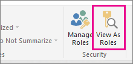
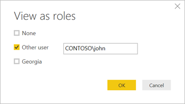
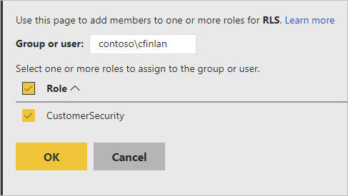
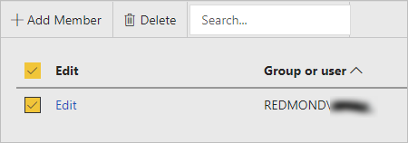

# Row-level security (RLS) in Power BI Report Server

Setting up row-level security (RLS) with Power BI Report Server can restrict data access for given users. Filters restrict data access at the row level, and you can define filters within roles.  If you're using the default permissions in Power BI Report Server, any user with Publisher or Content Manager permissions for the Power BI report can assign members to roles for that report.    

You configure RLS for reports imported into Power BI with Power BI Desktop. You can also configure RLS on reports that use DirectQuery, such as SQL Server.  Keep in mind that RLS isn't respected if your DirectQuery connection is using integrated authentication for users viewing the report. For Analysis Services live connections, you configure row-level security on the on-premises model. The security option doesn't show up for live connection datasets. 

[!INCLUDE [rls-desktop-define-roles](../includes/rls-desktop-define-roles.md)]

## Bidirectional cross-filtering

By default, row-level security filtering uses single-directional filters, regardless of whether the relationships are set to single direction or bidirectional. You can manually enable bidirectional cross-filter with row-level security.

- Select the relationship and check the **Apply security filter in both directions** checkbox. 

    

Check this box when implementing [dynamic row-level security](https://docs.microsoft.com/sql/analysis-services/supplemental-lesson-implement-dynamic-security-by-using-row-filters) based on user name or login ID. 

To learn more, see [Bidirectional cross-filtering using DirectQuery in Power BI Desktop](../desktop-bidirectional-filtering.md) and the [Securing the Tabular BI Semantic Model](http://download.microsoft.com/download/D/2/0/D20E1C5F-72EA-4505-9F26-FEF9550EFD44/Securing%20the%20Tabular%20BI%20Semantic%20Model.docx) technical whitepaper.

## Validate roles within Power BI Desktop 

After you've created your role, test the results of the role within Power BI Desktop.

1. Select **View As Roles**. 

    
 
    In **View as roles**, you see the roles you've created.
 
    

3. Select the role you created > **OK** to apply that role. The report renders the data relevant for that role. 

4. You can also select **Other user** and supply a given user. It is best to supply the Username, as that's what Power BI Report Server uses. 

    

1. Select **OK** and the report renders based on what that user can see. 

Within Power BI Desktop, **Other user** only displays different results if you're using dynamic security based on your DAX expressions. 

## Add members to roles 

After you save your report in Power BI Report Server, you manage security and add or remove members on the server. Only Content Managers of the report have the row-level security option available and not greyed out. If 

 If the report doesn't have the roles it needs, you need to open it in Power BI Desktop, add or modify roles, then save it to Power BI Report Server again. 

1. In Power BI Desktop, save the report to Power BI Report Server. You need to be using the version of Power BI Desktop optimized for Power BI Report Server.
2. In Power BI Report Service, select the ellipsis (**…**) next to the report. 

3. Select **Manage** > **Row-level security**. 

     

    On the **Row-level security** page, you add members to a role you created in Power BI Desktop.

5. To add a member, select **Add Member**.

1. Enter the user or group in the text box in the Username format (DOMAIN\user) and select the roles you wish to assign to them. The member has to be within your organization.   

    

1. Click **OK** to apply.   

8. To remove members, check the box next to their names and select **Delete**.  You can delete multiple members at a time. 

    

## Using the username() or userprincipalname() DAX function 

You can take advantage of the DAX functions username() or userprincipalname() within your dataset. You can use them within expressions in Power BI Desktop. When you publish your model, Power BI Report Server uses those expressions. 

If you're using Windows Authentication in Power BI Desktop OR Power BI Report Server, username() returns a user in the format of DOMAIN\User and userprincipalname() returns a user in the format of user@contoso.com. 

If you're using custom authentication in Power BI Report Server, it returns the username format you’ve set up for users.  

## Limitations 

Here are the current limitations for row-level security on Power BI models. 

You can define RLS only on datasets created with Power BI Desktop. To enable RLS for datasets created with Excel, you must convert your files into Power BI Desktop (PBIX) files first. Learn more about [converting Excel files](../desktop-import-excel-workbooks.md).

Only Extract, Transform, Load (ETL) and DirectQuery connections using stored credentials are supported. Live connections to Analysis Services and DirectQuery connections using integrated authentication are handled in the underlying data source. 

Report authors don't have access to view the report data in Power BI Report Server until they've assigned themselves roles accordingly after uploading the report. 

 

## FAQ 

### Can I create these roles for Analysis Services data sources? 

You can if you imported the data into Power BI Desktop. If you're using a live connection, you can't configure RLS within the Power BI service. RLS is defined within the Analysis Services model on-premises. 

### Can I use RLS to limit the columns or measures accessible by my users? 

No. If a user has access to a particular row of data, they can see all the columns of data for that row. 

### Does RLS let me hide detailed data but give access to data summarized in visuals? 

No, you secure individual rows of data but users can always see either the details or the summarized data. 

### Can I add new roles in Power BI Desktop if I already have existing roles and members assigned? 

Yes, if you already have existing roles defined and members assigned in Power BI Report Server, you can make additional roles and republish your report with no affect on your current assignments. 
 

## Next steps

[What is Power BI Report Server?](get-started.md) 
[Administrator handbook](admin-handbook-overview.md)  

More questions? [Try asking the Power BI Community](https://community.powerbi.com/)