# Tutorial: Explore the Power BI Report Server web portal in a VM
In this tutorial, you create an Azure virtual machine with Power BI Report Server already installed, so you can experience viewing, editing, and managing sample Power BI and paginated reports, and KPIs.

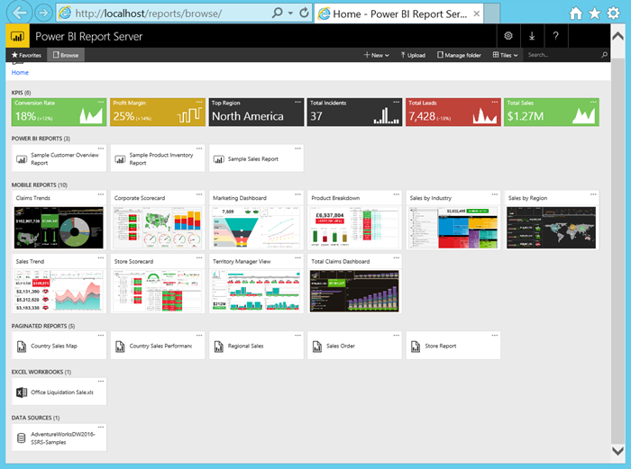

Here are the tasks you'll do in this tutorial:

> [!div class="checklist"]
> * Create and connect to a VM
> * Start and explore the Power BI Report Server web portal
> * Tag a favorite item
> * View and edit a Power BI report
> * View, manage, and edit a paginated report
> * View an Excel workbook in Excel Online

For this tutorial, you need an Azure subscription. If you don’t have one, create a [free account](https://azure.microsoft.com/free/?WT.mc_id=A261C142F) before you begin.

## Create a Power BI Report Server VM

Luckily, the Power BI team has created a VM that comes with Power BI Report Server already installed.

1. In the Azure Marketplace, open [Power BI Report Server](https://azuremarketplace.microsoft.com/marketplace/apps/reportingservices.technical-preview?tab=Overview).  

2. Select **Get it now**.
3. To agree to the provider's terms of use and privacy policy, select **Continue**.

    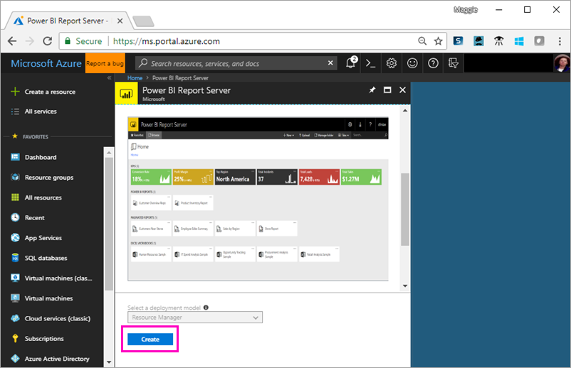

4. **Step 1 Basics**, for **VM Name**, call it **reportservervm**.

5. Create a user name and password.

6. For **Resource group**, keep **Create new**, and call it **reportserverresourcegroup**.

    If you go through the tutorial more than once, you need to get the resource group a different name after the first time. You can't use the same resource group name twice in one subscription. 

7. Keep the other defaults > **OK**.

    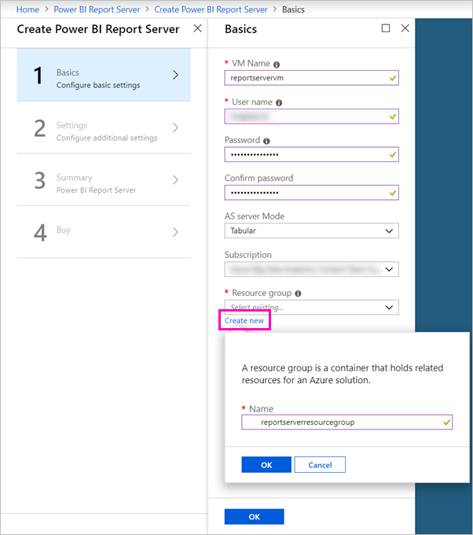

8. **Step 2 Settings**, keep the defaults > **OK**.

9. **Step 3 Summary** > **OK**.

10. **Step 4**, review the Terms of user and privacy policy > **Create**.

    The **Submitting deployment for Power BI Report Server** process takes a several minutes.

## Connect to your virtual machine

1. In the Azure left navigation pane, select **Virtual machines**. 

2. In the **Filter by name** box, type "report". 

3. Select the VM named **REPORTSERVERVM**.

    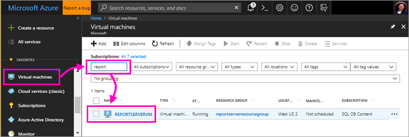

4. Under REPORTSERVERVM Virtual machine, select **Connect**.

    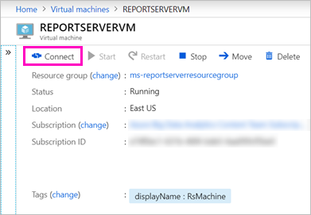

5. In the Remote Desktop Connection dialog box, select **Connect**.

6. Enter the name and password you created for the VM > **OK**.

7. The next dialog box says the identity of the remote computer cannot be identified. Select **Yes**.

   Voila -- your new VM opens.

## Power BI Report Server on the VM

When your VM opens, here are the items you see on the desktop.

|Number  |What it is  |
|---------|---------|
| | Starts SQL Server Data Tools, for creating paginated (.RDL) reports |
| | Sample Power BI (.PBIX) reports  |
| | Links to Power BI Report Server documentation   |
| | Starts Power BI Desktop optimized for Power BI Report Server (March 2018)  |
| | Opens Power BI Report Server web portal in the browser   |

Double-click the **Report Server Web Portal** icon. The browser opens http://localhost/reports/browse. In the web portal, you see various files grouped by type. 

|Number  |What it is  |
|---------|---------|
| | KPIs created in the web portal |
| |  Power BI (.PBIX) reports  |
| | Mobile reports created in SQL Server Mobile Report Publisher  |
| |  Paginated reports created in Report Builder or SQL Server Data Tools  |
| | Excel workbooks   | 
| | Data sources for paginated reports | 

## Tag your favorites
You can tag the reports and KPIs that you want to be favorites. They're easier to find because they're all gathered in a single Favorites folder, both in the web portal and in the Power BI mobile apps. 

1. Select the ellipsis (**…**) in the upper-right corner of the **Profit Margin** KPI > **Add to Favorites**.
   
    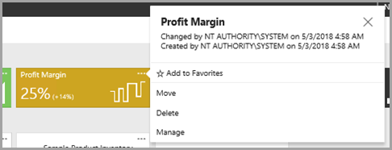
2. Select **Favorites** on the web portal ribbon to see it along with your other favorites on the Favorites page in the web portal.
   
    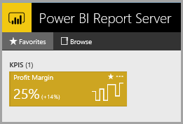

3. Select **Browse** to go back to the web portal.
   
## View items in List view
By default, the web portal displays its contents in Tile view.

You can switch to List view, where it's easy to move or delete multiple items at a time. 

1. Select **Tiles** > **List**.
   
    

2. Go back to Tiles view: Select **List** > **Tiles**.

## Power BI reports

You can view and interact with Power BI reports in the web portal, and start Power BI Desktop right from the web portal.

### View Power BI reports

1. In the web portal under **Power BI reports**, select **Sample Customer Overview Report**. The report opens in the browser.

1. Select the United States block in the tree map to see how it highlights related values in the other visuals.

    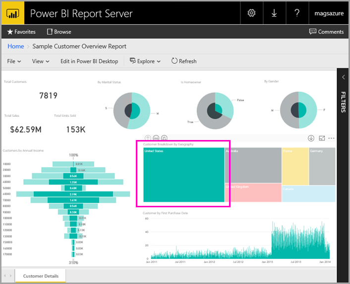

### Edit in Power BI Desktop

1. Select **Edit in Power BI Desktop**.

1. Select **Allow** to allow this web site to open a program on your computer. 

     The report opens in Power BI Desktop. Note the name in the top bar, "Power BI Desktop (March 2018)". That's the version optimized for Power BI Report Server.

    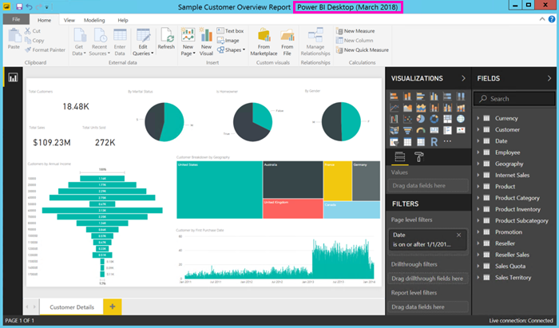

     Use the version of Power BI Desktop that's installed on the VM. You can't go across domains to upload a report.

3. In the Fields pane, expand the Customers table and drag the Occupation field to Report level filters.

    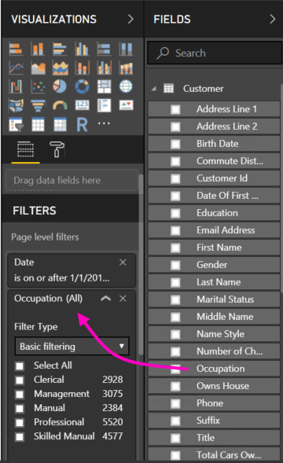

1. Save the report.

1. Go back to the report in the browser and select the browser **Refresh** icon.

    

8. Expand the **Filters** pane on the right to see the **Occupation** filter you added. Select **Professional**.

    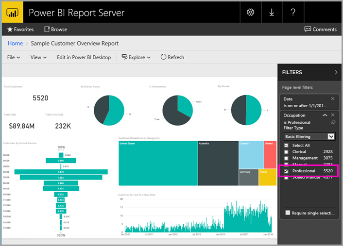

3. Select **Browse** to go back to the web portal.

## Paginated (.RDL) reports

You can view and manage paginated reports, and launch Report Builder, from the web portal.

### Manage a paginated report

1. In the web portal under **Paginated reports**, select the ellipsis (...) next to **Sales Order** > **Manage**.

1. Select **Parameters**, change the default value for **SalesOrderNumber** to **SO50689** > **Apply**.

   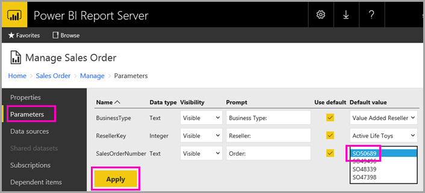

3. Select **Browse** to go back to the web portal.

### View a paginated report

1. Select **Sales Order** in the web portal.
 
3.  You see it opened to the **Order** parameter you set, **SO50689**. 

    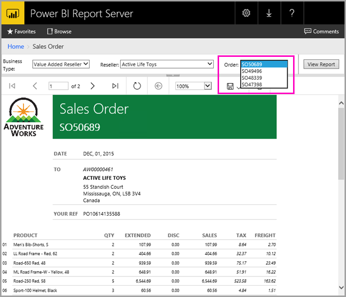

    You can change that parameter here, along with the other parameters, without changing the defaults.

1. Select **Order** **SO48339** > **View Report**.

4. You see that this is page 1 of 2. Select the right arrow to see the second page. The table continues on that page.

    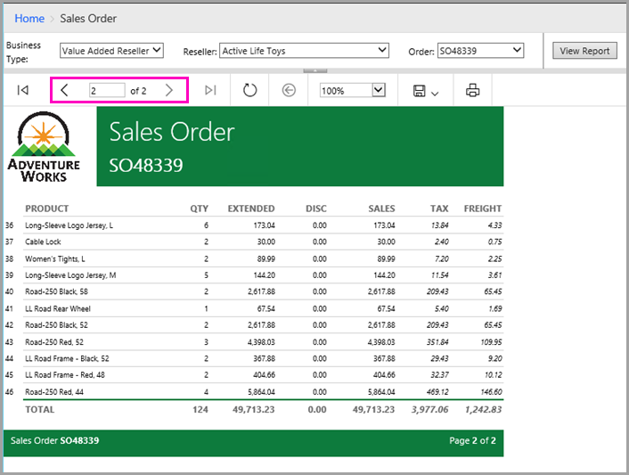

5. Select **Browse** to go back to the web portal.

### Edit a paginated report

You can edit paginated reports in Report Builder, and you can start Report Builder right from the browser.

1. In the web portal, select the ellipsis (...) next to **Sales Order** > **Edit in Report Builder**.

1. Select **Allow** to allow this web site to open a program on your computer.

1. The Sales Order report opens in Design View in Report Builder.

    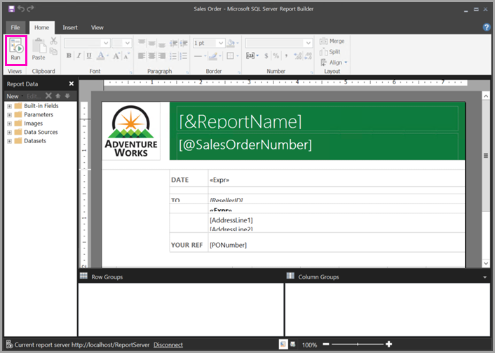

1. Select **Run** to preview the report.

    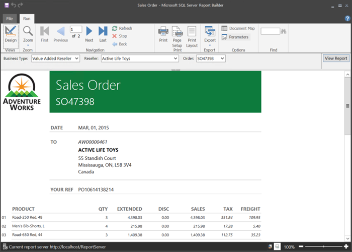

5. Close Report Builder and go back to the browser.

## View Excel workbooks

You can view and interact with Excel workbooks in Excel Online in Power BI Report Server. 

1. Select the Excel workbook **Office Liquidation Sale.xlsx**. It may ask for credentials. Select **Cancel**. 
    It opens in the web portal.
1. Select **Appliance** in the slicer.

    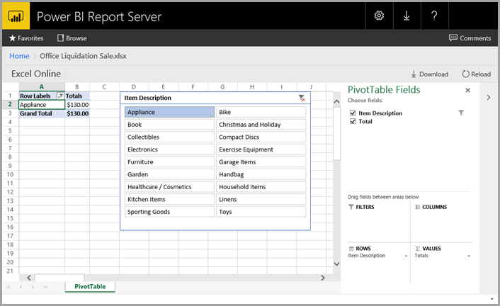

1. Select **Browse** to go back to the web portal.

## Clean up resources

Now that you've finished this tutorial, delete the resource group, virtual machine, and all related resources. 

- To do so, select the resource group for the VM and select **Delete**.

## Next steps

In this tutorial, you've created a VM with Power BI Report Server. You've tried some of the functionality of the web portal, and you've opened a Power BI report and a paginated report in their respective editors. This VM has SQL Server Analysis Services data sources installed, so you can try creating your own Power BI and paginated reports with those same data sources. 

To learn more about creating reports for Power BI Report Server, continue on.

> [!div class="nextstepaction"]
> [Create a Power BI report for Power BI Report Server](./quickstart-create-powerbi-report.md)

