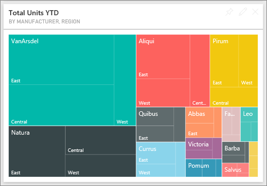
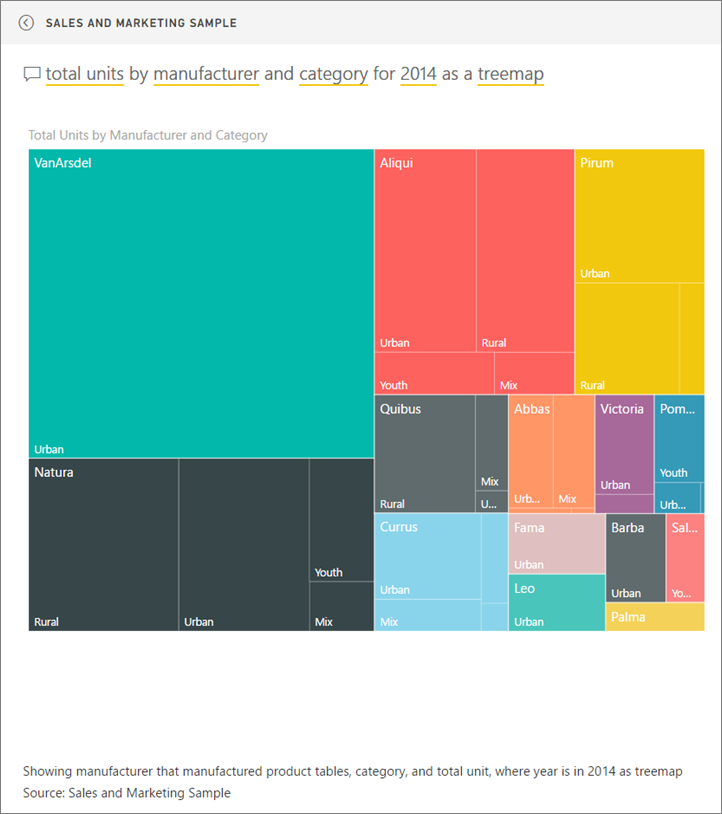
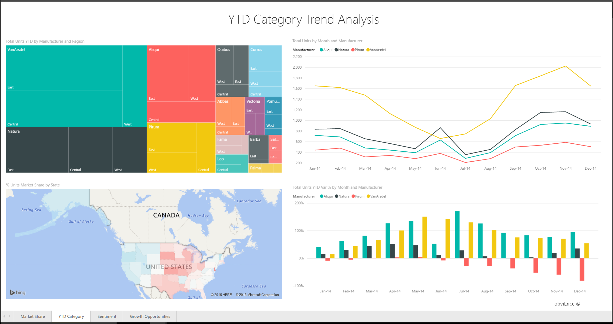

# Sales and Marketing sample for Power BI: Take a tour
The **Sales and Marketing Sample** contains a dashboard and report for a fictitious manufacturing company named VanArsdel Ltd. This dashboard was created by the VanArsdel Chief Marketing Officer (CMO) to keep an eye on the industry and his company’s market share, product volume, sales, and sentiment.

VanArsdel has many competitors but is the market leader in its industry. The CMO wants to increase market share and discover growth opportunities. But, for some reason, VanArsdel’s market share has started to decline, with significant dips in June.

This sample is part of a series that illustrates how you can use Power BI with business-oriented data, reports and dashboards. This is real data from obviEnce (www.obvience.com) that has been anonymized.

[!Note] You can also [download just the dataset (Excel workbook) for this sample](http://go.microsoft.com/fwlink/?LinkId=529785). The workbook contains Power View sheets that you can view and modify. To see the raw data select **Power Pivot > Manage**.

## What is our dashboard telling us?
Let’s start our tour at the dashboard and look at the tiles the CMO has chosen to pin. We see information about our market share, sales, and sentiment. And we see that data broken down by region, time, and competition.

* The number tiles down the left column show industry sales volume this past year (50K), market share (32.86%), sales volume (16K), sentiment score (68), sentiment gap (4), and total units sold (1M).
* The top line chart shows how our market share fluctuates over time. Our market share really drops in June. Also, our R12M (Rolling 12 Months) share which was increasing for a while, is starting to stall.
* Our biggest competitor is Aliqui (evident in the middle column chart tile.)
* Most of our business is in the East and Central regions.
* The line chart at the bottom shows that our dip in June is not seasonal – none of our competitors show the same trend.
* The two “Total Units” tiles show units sold, by segment and by region/manufacturer. The largest market segment for our industry are **Productivity** and **Convenience**.

### Use Q&A to dig a little deeper
#### Which segments drive our sales? Does it match the industry trend?
1. Select the “Total Units Overall by Segment” tile which will open Q&A.
2. Type **for VanArsdel** at the end of the existing query. Q&A interprets the question and displays an updated chart with the answer. Our product volume comes from Convenience and Moderation.
   
   
3. Our share in the **Moderation** and **Convenience** categories is very high; these are the segments where we compete.
4. Navigate back to the dashboard by selecting the dashboard name in the top navbar (breadcrumbs).

#### What does total unit market share look like for category (versus region)?
1. Notice the “Total Units YTD by Manufacturer, Region” tile. I wonder how the total unit market share looks by category? 
   
   
2. In the question box at the top of the dashboard, type the question **total units by manufacturer and category for 2014 as a treemap**. Notice how the visualization updates as you type the question.
   
3. To compare the findings, pin the chart to your dashboard. Very interesting; in 2014 VanArsdel only sold products that fall into the **Urban** category.
4. Navigate back to the dashboard.

Dashboards are also an entry point into reports.  If a tile was created from an underlying report, clicking that tile opens the report. 

On our dashboard, the R12M (Rolling 12 Months) line shows that our market share is no longer increasing over time, it’s even declining a bit. And why do we have a big market share dip in June? To investigate further, click this visualization to open the underlying report.

### Our report has 4 pages
#### Page 1 of our report focuses on VanArsdel’s market share.

1. Look at the “Total Units by Month and isVanArsdel” column chart at the bottom. The black column represents VanArsdel (our products) and green is our competition. The drop in June 2014 that VanArsdel experienced is not experienced by the competition.
2. The “Total Category Volume by Segment” bar chart in the middle on the right, is filtered to show VanArsdel’s top 2 segments. Take a look at how this filter was created:  
   
   a.  Expand the Filters pane on the right.  
   b.  Click to select the visualization.  
   c.  Under Visual Level Filters, notice that **Segment** is filtered to include only **Convenience** and **Moderation**.  
   d.  Modify the filter by selecting Segment to expand that section and then checking **Productivity** to add that segment as well.  
3. In “Total Units by Month and isVanArsdel”, select the black “Yes” in the legend to cross-filter the page by VanArsdel. Notice that we don’t compete in the Productivity segment.
4. Select the black “Yes” again to remove the filter.
5. Take a look at the line chart. It shows our monthly market share and 12 month rolling market shares. Rolling 12 months data help in smoothing out monthly fluctuations and shows the long term trends. Select Convenience and then Moderation in the bar chart to see how much fluctuation in market share there is for each segment. The Moderation segment shows much more fluctuation in market share than the Convenience segment.

We’re still looking to find out why our market share dipped so low in June. Let’s check Sentiment.

#### Page 3 of our report focuses on Sentiment.

Tweets, Facebook, blogs, articles, etc. contribute to sentiment which is shown in the two line charts. The sentiment chart in the top left shows that sentiment for our products were pretty much neutral up until February. Then a big drop started in February and bottomed out in June. What happened to cause this drop in sentiment? We need to look at external sources. In February, several articles and blog posts rated VanArsdel’s customer service the worst in the industry. This bad press had a direct correlation to customer sentiment and sales. VanArsdel worked hard to improve customer service and customers and the industry took note. In July positive sentiment started to rise and then reached an all-time high in the 60s. This uptick in sentiment can be seen reflected in “Total Units by Month” on pages 1 and 3. Perhaps this partially explains our market share dips for June?

Sentiment gap would be another area to explore: which districts have the highest sentiment gap, how can management capitalize on this, and discover ways to replicate it in other districts.

#### Page 2 of our report focuses on YTD Category Trend

* Of all the companies in this category, VanArsdel is the largest and our biggest competitors are Natura, Aliqui, and Pirium. We’ll keep our eyes on them.
* Aliqui is growing, but product volume compared to us is still low.
* The treemap shows VanArsdel in green. In the East, customers prefer our competition, in Central we’re doing OK, and our share in the East is our lowest.
* Geography has an impact on units sold. East is the dominant region for most manufacturers and VanArsdel has a strong presence in the Central region as well.
* On the chart “Total Units YTD Var % by Month and Manufacturer” in the bottom right– we have positive variance and that is a good sign, we are doing better than last year but so is another competitor, Aliqui.

#### Page 4 of our report focuses on competitive product analysis.

* The bottom left chart shows all the category segments except for VanArsdel’s two strongest segments. Filtering by category by clicking on the bars helps identify potential expansion areas for VanArsdel. The **Extreme** and **Productivity** segments are growing faster than others.
* But we don’t compete in these segments. If we want to move into these areas, we can use our data to see which segments are popular in which regions. We can further investigate questions like which region is growing faster and who would be our biggest competitor in that segment.
* Remember our market share dip in June? June is a huge month for the Productivity segment – a segment we don’t compete in at all. This could help explain our market share dip in June.

By filtering the visualizations by VanArsdel, by segment, by month, and by region, we can discover growth opportunities for VanArsdel.

This is a safe environment to play in. You can always choose not to save your changes. But if you do save them, you can always go to **Get Data** for a new copy of this sample.

## Next steps: Connect to your data
We hope this tour has shown how Power BI dashboards, Q&A, and reports can provide insights into sales and marketing data. Now it’s your turn — connect to your own data. With Power BI you can connect to a wide variety of data sources. Learn more about [getting started with Power BI](service-get-started.md).  

