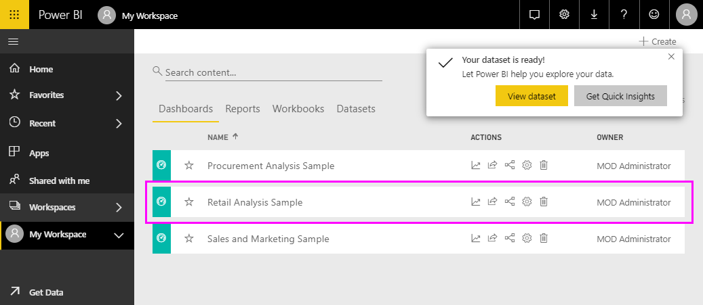
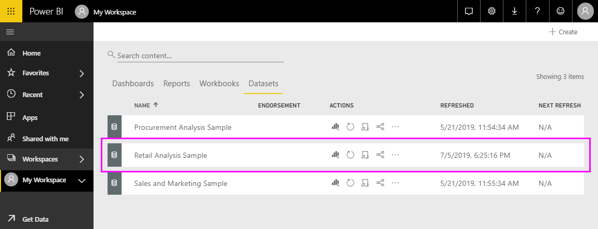
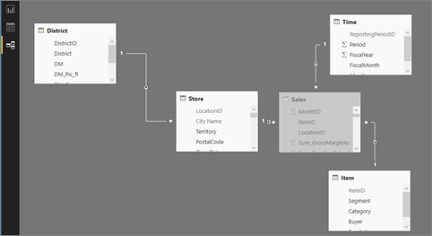

#  Connect to the samples in the Power BI service

This tutorial teaches how to: 
- Import a sample content pack, add it to Power BI service, and open the contents. A *content pack* is a type of sample where the dataset is bundled with a dashboard and report. 
- Open a sample .pbix file in Power BI Desktop.

If you'd like more background first, we recommend starting with the article [Sample datasets for Power BI](sample-datasets.md). In that article you'll learn all about the samples; how to get them, where to save them, how to use them, and some of the stories each sample can tell. Then, when you have a grasp of the basics, come back to this Tutorial.   

## Prerequisites
The samples are available for Power BI service and Power BI Desktop. To follow along, we'll be using the Retail analysis sample.

The *Retail Analysis* sample content pack used in this tutorial consists of a dashboard, report, and dataset.
To familiarize yourself with this particular content pack and its scenario, you may want to
 [take a tour of the Retail Analysis sample](sample-retail-analysis.md) before you begin.

## Samples and Power BI service

1. Open and sign in to Power BI Service (app.powerbi.com).
2. Select **Get Data** at the bottom of the left navigation pane. If you don't see **Get Data**, expand the nav pane by selecting .
   
   
5. Select **Samples**.  
   
   
6. Select the *Retail Analysis Sample*, and choose **Connect**.   
   
   

## What exactly was imported?
With the sample content packs, when you select **Connect**, Power BI is actually bringing in a copy of that content pack and storing it for you in the cloud. Because the person who created the content pack included a dataset, a report, and a dashboard -- that's what you get when you click **Connect**. 

1. Power BI creates the new dashboard and lists it on your **Dashboards** tab. The yellow asterisk lets you know it's new.
   
   
2. Open the **Reports** tab.  Here you'll see a new report named *Retail Analysis Sample*.
   
   
   
   And check out the **Datasets** tab.  There's a new dataset as well.
   
   

## Explore your new content
Now explore the dashboard, dataset, and report on your own. There are many different ways to navigate to your dashboards, reports, and datasets, and just one of those many ways is described below.  

> [!TIP]
> Want a little hand-holding first?  Try the [Tour of the Retail Analysis sample](sample-retail-analysis.md) for a step-by-step walkthrough of this sample.
> 
> 

1. Navigate back to your **Dashboards** tab and select the *Retail Analysis Sample* dashboard to open it.    
   
   
2. The dashboard opens.  It has a variety of visualization tiles.
   
   
3. Select one of the tiles to open the underlying report.  In this example, we'll select the area chart (outlined in pink in the previous image). The report opens to the page that contains that area chart.
   
    
   
   > [!NOTE]
   > If the tile had been created using [Power BI Q&A](consumer/end-user-q-and-a.md), the Q&A page would've opened instead. If the tile was [pinned from Excel](service-dashboard-pin-tile-from-excel.md), Excel Online would've opened inside of Power BI.
   > 
   > 
1. Back on your **Datasets** tab, you have several options for exploring your dataset.  You won't be able to open it and see all the rows and columns (as you can in Power BI Desktop or Excel).  When someone shares a content pack with colleagues, they typically want to share the insights, not give their colleagues direct access to the data. But that doesn't mean you can't explore the dataset.  
   
   
   
   * One way of exploring the dataset is by creating your own visualizations and reports from scratch.  Select the chart icon  to open the dataset in report editing mode.
     
       
   * Another way of exploring the dataset is to run [Quick Insights](consumer/end-user-insights.md). Select the ellipses (...) and choose **Get insights**. When the insights are ready, select **View insights**.
     
       

## Samples and Power BI Desktop 
When you first open the sample PBIX file, is displays in Report view where you can explore, create, and modify any number of report pages with visualizations. Report view provides pretty much the same design experience as a report’s Editing view in the Power BI service. You can move visualizations around, copy and paste, merge, etc.

The difference between them is when using Power BI Desktop, you can work with your queries and model your data to make sure your data supports the best insights in your reports. You can then save your Power BI Desktop file wherever you like, whether it's your local drive or to the cloud.

1. Open the [Retail Analysis sample .pbix file](http://download.microsoft.com/download/9/6/D/96DDC2FF-2568-491D-AAFA-AFDD6F763AE3/Retail%20Analysis%20Sample%20PBIX.pbix) in Power BI Desktop. 

    

1. The file opens in Report view. Notice the 4 tabs at the bottom of the report editor? That means that there are 4 pages in this report, and the "New Stores" page is currently selected. 

    .

3. For a deep dive into the report editor, see [Take a tour of the report editor](service-the-report-editor-take-a-tour.md)

## What exactly was imported?
When you open the sample PBIX file in Desktop, Power BI is actually bringing in a copy of that data and storing it for you in the cloud. From Desktop you have access to the report ***and the underlying dataset***. When the data is loaded, Power BI Desktop will attempt to find and create relationships for you.  

1. Switch to [Data view](desktop-data-view.md) by selecting the table icon  .
 
    

    Data View helps you inspect, explore, and understand data in your Power BI Desktop model. It's different from how you view tables, columns, and data in Query Editor. With Data View, you’re looking at your data after it has been loaded into the model.

    When you’re modeling your data, sometimes you want to see what’s actually in a table or column without creating a visual on the report canvas, often right down to the row level. This is especially true when you’re creating measures and calculated columns, or you need to identify a data type or data category.

1. Switch to [Relationships view](desktop-relationship-view.md) by selecting the icon  .
 
    

    Relationship view shows all of the tables, columns, and relationships in your model. From here you can view, change, and create relationships.

## Explore your new content
Now explore the dataset, relationships, and report on your own. For help getting started, visit the [Desktop Getting Started Guide](desktop-getting-started.md).    

## Next steps
[Power BI basic concepts](consumer/end-user-basic-concepts.md)

[Samples for Power BI service](sample-datasets.md)

[Data sources for Power BI](service-get-data.md)

More questions? [Try the Power BI Community](http://community.powerbi.com/)

