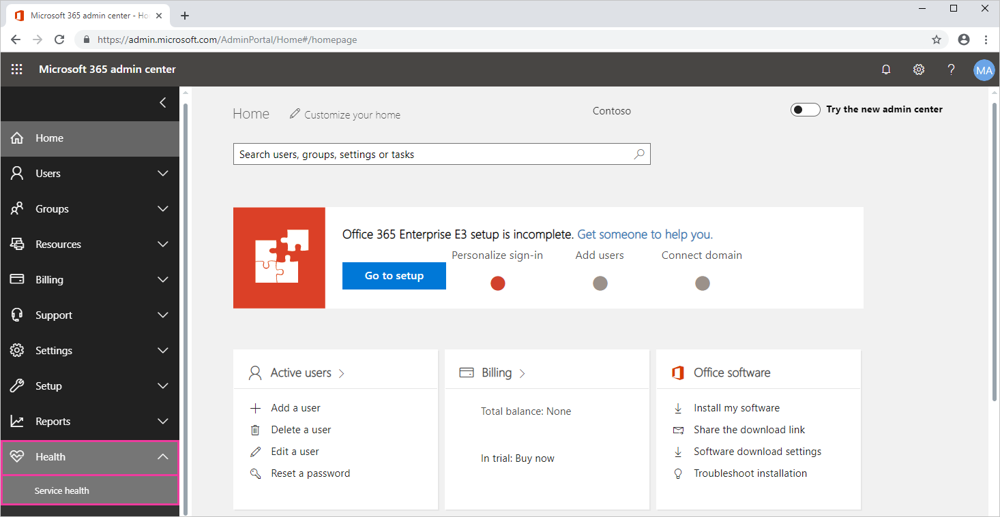

# Track Power BI service health in Office 365

The Office 365 admin center provides important tools for Power BI administrators, including current and historical information about service health. To access this information, you must be in one of the following roles: Power BI Service Administrator or Office 365 Global Administrator. For more information about roles, see [Administrator roles related to Power BI](service-admin-administering-power-bi-in-your-organization.md#administrator-roles-related-to-power-bi).

1. Sign in to the [Office 365 admin center](https://portal.office.com/adminportal).

1. Select the **Service health** tile.

    

1. In the current list select **N advisories** or **N incidents**, and review the results. In the graphic below, you see one of three active advisories.

    

1. To see more information, select **Show details** for an item. In the graphic below, you see additional details, including recent status updates.

    

    Scroll down to see more info, then close the pane when you're finished.

1. To see historical information across all services, in the upper right of the main list select **View history**. Then select **Last 7 days** or **Last 30 days**. To return to current service health, select **View current status**.