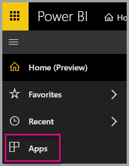
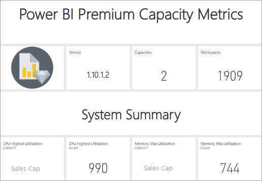

# Monitor Power BI Premium and Power BI Embedded capacities

This article provides an overview of monitoring the metrics for your Power BI Premium capacities. Monitoring capacity usage enables you to take an informed approach to managing your capacities.

You can monitor capacity with the Power BI Premium Capacity Metrics app or in the admin portal. We recommend the app, because it provides much more detail, but this article covers both options.

<iframe width="560" height="315" src="https://www.youtube.com/embed/UgsjMbhi_Bk?rel=0&amp;showinfo=0" frameborder="0" allowfullscreen></iframe>

## Install the Premium Capacity Metrics app

You can go straight to the [Premium Capacity Metrics app](https://app.powerbi.com/groups/me/getapps/services/capacitymetrics) or install it like you do other apps in Power BI.

1. In Power BI, click **Apps**.

    

2. On the right side, click **Get apps**.

3. In the **Apps** category, search for **Power BI Premium Capacity Metrics app**.

4. Subscribe to install the app.

Now that you've installed the app, you can see metrics about the capacities in your organization. Let's take a look at some of the key metrics that are available.

## Use the metrics app

When you open the app, it first shows a dashboard with a summary of all the capacities for which you have admin rights.

The report has three tabs, which we describe in more detail in the following sections.

* **Filters applied to all pages**: enables you to filter the other pages in the report to a specific capacity.
* **Datasets**: provides detailed metrics on the health of the datasets within your capacities.
* **System**: gives overall capacity metrics including memory and CPU high utilization. 

### Filters applied to all pages tab

The **Filters applied to all pages** tab enables you to select a capacity, a dataset, and a date range within the past seven days. Filters are then applied to all the relevant pages and tiles in the report. If no filters are selected, the report defaults to show the past week’s metrics on every capacity you own.

### Datasets tab

The **Datasets** tab provides the bulk of the metrics in the app. Use the buttons at the top of the tab to navigate to different areas: **Summary**, **Refreshes**, **Query Durations**, **Query Waits**, and **Datasets**.

#### Summary area

The **Summary** area shows a view of your capacities based on entities, system resources, and dataset workloads.

| | **Metrics** |
| --- | --- |
| **Entities** | * The number of capacities you own  * The distinct number of datasets in your capacity  * The distinct number of workspaces in your capacity |
| **System** | * The average memory usage in GB over the past seven days  * Highest memory consumption in GB in the past seven days and the local time it occurred  * The number of times CPU exceeded 80% of the thresholds in the past seven days, split into three minute buckets  * Most times the CPU exceeded 80% in the past seven days, split into one hour buckets, and the local time it occurred  * The number of times Direct query/Live connections exceeded 80% of the thresholds in the past seven days, split into three minute buckets  * Most times the Direct query/Live connections exceeded 80% in the past seven days, split into one hour buckets, and the local time it occurred |
| **Dataset Workloads** | * Total number of refreshes in the past seven days  * Total number of successful refreshes in the past seven days  * Total number of failed refreshes in the past seven days  * Total number of failed refreshes due to out of memory  * Average refresh duration is measured in minutes, the time taken to complete the operation  * Average refresh wait-time is measured in minutes, the average lag between the scheduled time and start of the operation  * Total number of queries run in the past seven days  * Total number of successful queries in the past seven days  * Total number of failed queries in the past seven days  * Average query duration is measured in minutes, the time taken to complete the operation  * Total number of models evicted due to memory pressure |
|  |  |

#### Refreshes area

The **Refreshes** area lists out the complete refreshes, success measures, average/max refresh wait-time and average/max refresh duration sliced by datasets in the past seven days. The bottom two charts show the refreshes vs. memory consumption in GB and average wait-times split into one hour buckets, reported in local time. The top bar charts list the top five datasets by the average time it took to complete the dataset to refresh (refresh duration), and average refresh waits time. Multiple high refresh wait-time spikes are indicative of the capacity running hot.

#### Query Durations area

The **Query Durations** area lists out the total number of queries run, and the average/max duration in milliseconds. This data is sliced by datasets, workspace, and hourly buckets in the past seven days. The bottom chart shows the query counts and average duration (in milliseconds) vs. memory consumption in GB, split into one hour buckets reported in local time.

The upper right chart shows the query duration distribution histogram. The histogram is bucketed by query durations reported in milliseconds into the following categories: <= 30ms, 30-100ms, 100-300ms, 300ms-1sec, 1sec-3sec, 3sec-10sec, 10sec-30sec, and > 30 seconds intervals.

The lower right chart lists the top five datasets by the average query duration it took to complete the queries.

Long query durations and long wait times are indicative of the capacity running hot. It may also mean that a single dataset is causing problems and further investigation is needed.

#### Query Waits area

The **Query Waits** area lists out the total number of queries run, total number of queries wait count for Live query/Direct query, and average/max wait time reported in milliseconds. This data is sliced by datasets, workspace, and hourly buckets in the past seven days. The bottom chart shows the query wait counts and average wait time (in milliseconds) vs. memory consumption in GB, split into one hour buckets reported in local time.

The upper right chart shows the query wait time distribution histogram. The histogram is bucketed by query durations reported in milliseconds into the following categories: <= 50ms , 50-100ms , 100-200ms , 200-400ms 400ms-1sec , 1 sec-5 sec and > 5 seconds intervals.

The lower right chart lists the top five datasets by the average wait time it took to start the queries.

#### Datasets area

The **Datasets** area shows complete datasets evicted due to memory pressure by the hour.

### System tab

The **System** tab shows times of high CPU utilization (number of times exceeded 80% utilization), high direct query/live connections utilization, and memory consumption.

## Monitor Power BI Embedded capacity

You can also use the Power BI Premium Capacity Metrics app to monitor *A SKU* capacities in Power BI Embedded. Those capacities will show up in the report as long as you are an admin of the capacity. However, refresh of the report fails unless you grant certain permissions to Power BI on your A SKUs:

1. Open your capacity in the Azure portal.
1. Click **Access control (IAM)**, and add the “Power BI Premium” app to the reader role. If you are unable to find the app by name, you can also add it by its client Id: cb4dc29f-0bf4-402a-8b30-7511498ed654.

    

> [!NOTE]
> You can monitor Power BI Embedded capacity usage in the app or the Azure portal, but not in the Power BI admin portal.

## Basic monitoring in the admin portal

The **Capacity settings** area of the admin portal provides four gauges that indicate the loads placed and the resources utilized by your capacity for the past seven days. These four tiles work on an hourly time window that indicates how many hours in the past seven days the corresponding metric was above 80%. This metric indicates a potential degradation for the end-user experience.

| **Metric** | **Description** |
| --- | --- |
| CPU |Number of times CPU exceeded 80% utilization. |
| Memory Thrashing |Represents the memory pressure on your backend cores. Specifically, this is a metric of how many times datasets are evicted from memory due to memory pressure from the usage of multiple datasets. |
| Memory Usage |Average memory usage, represented in gigabytes (GB). |
| DQ/s | Number of times Direct Query and Live Connections count exceeded 80% of the limit.   * We limit the total number of DirectQuery and live connection queries per second.* The limits are 30/s for P1, 60/s for P2 and 120/s for P3. * Direct Query and live connection queries count add to the above throttle. For example, if you have 15 DirectQueries and 15 live connections in a second, you hit your throttle * This applies equally to on-premises and cloud connections. |
|  |  |

Metrics reflect utilization over the past week.  If you'd like to see a more detailed view of the metrics, you can do so by clicking any of the summary tiles.  This will take you to detailed charts for each of the metrics for your premium capacity. The following chart shows details for the CPU metric.

These charts are summarized on an hourly basis for the past week, and can help isolate when you may have had specific performance-related events in your premium capacity.

You may also export the underlying data for any of the metrics to a csv file.  This export will give you detailed information in three minute intervals for each day of the past week.

## Next steps

Now that you understand how to monitor Power BI Premium capacities, learn more about optimizing capacities.

> [!div class="nextstepaction"]
> [Power BI Premium capacity resource management and optimization](service-premium-understand-how-it-works.md)
