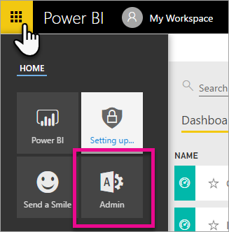
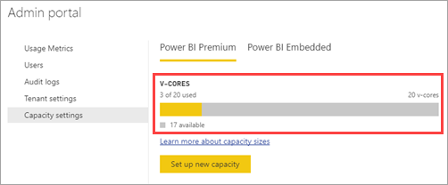

# How to purchase Power BI Premium

This article describes how to purchase Power BI Premium capacity for your organization. You purchase Power BI Premium capacity in the Office 365 Admin center, and you [manage your capacities](service-admin-premium-manage.md) in the Power BI admin portal.

<iframe width="640" height="360" src="https://www.youtube.com/embed/NkvYs5Qp4iA?rel=0&amp;showinfo=0" frameborder="0" allowfullscreen></iframe>

For more information about Power BI Premium, see [What is Power BI Premium?](service-premium.md). For current pricing and planning information, see the [Power BI pricing page](https://powerbi.microsoft.com/pricing/) and the [Power BI Premium calculator](https://powerbi.microsoft.com/calculator/).

> [!IMPORTANT]
> Authors of content still need a Power BI Pro license, even if your organization uses Power BI Premium. Ensure you purchase at least one Power BI Pro license for your organization.
>
>If a Premium subscription expires, you have 30 days of full access to your capacity. After that, your content reverts to a shared capacity. Models that are > 1 GB will are not supported in shared capacity.

## Create a new tenant with Power BI Premium P1

If you don't have an existing tenant and want to create one, you can purchase Power BI Premium at the same time. The following link walks you through the process of creating a new tenant and enables you to purchase Power BI Premium: [Power BI Premium P1 offer](https://signup.microsoft.com/Signup?OfferId=b3ec5615-cc11-48de-967d-8d79f7cb0af1).

When you create your tenant, you will automatically be assigned to the Office 365 Global Administrator role for that tenant.

## Purchase a Power BI Premium capacity for an existing organization

If you have an existing organization, you must be in the Office 365 Global Administrator role or Billing Administrator role to purchase subscriptions and licenses. For more information, see [About Office 365 admin roles](https://support.office.com/article/About-Office-365-admin-roles-da585eea-f576-4f55-a1e0-87090b6aaa9d).

To purchase a Premium capacity, follow these steps.

1. From within the Power BI service, select the Office 365 app picker then **Admin**.

    

    Alternatively, you can browse to the Office 365 Admin center. You can get there by going to https://portal.office.com and selecting **Admin**.

1. Select **Billing** > **Purchase services**.

1. Under **Other plans**, look for Power BI Premium offerings. This will list as P1 through P3, EM3 and P1 (month to month).

1. Hover over the ellipsis (**. . .**) and then select **Buy now**.

    

1. Follow the steps to complete the purchase.

You can also select one of the following links to take you directly to the purchase page for that SKU. For more information about these SKUs, see [What is Power BI Premium?](service-premium.md#premium-capacity-nodes).

> [!IMPORTANT]
> Selecting any of the links below produces an error if you are not in the Office 365 Global Administrator role or Billing Administrator role.

| Direct purchase links |
| --- |
| [EM3 (month-to-month) SKU](https://portal.office.com/commerce/completeorder.aspx?OfferId=4004702D-749C-4F74-BF47-3048F1833780&adminportal=1) |
| [P1 SKU](https://portal.office.com/commerce/completeorder.aspx?OfferId=b3ec5615-cc11-48de-967d-8d79f7cb0af1&adminportal=1) |
| [P1 (month-to-month) SKU](https://portal.office.com/commerce/completeorder.aspx?OfferId=E4C8EDD3-74A1-4D42-A738-C647972FBE81&adminportal=1) |
| [P2 SKU](https://portal.office.com/commerce/completeorder.aspx?OfferId=062F2AA7-B4BC-4B0E-980F-2072102D8605&adminportal=1) |
| [P3 SKU](https://portal.office.com/commerce/completeorder.aspx?OfferId=40c7d673-375c-42a1-84ca-f993a524fed0&adminportal=1) |

After you have completed the purchase, the **Purchase services** page shows that the item is purchased and active.

## Purchase additional capacities

Now that you have a capacity, you can add more as your needs grow. You can use any combination of Premium capacity SKUs (P1 through P3) within your organization. The different SKUs provide different resource capabilities.

1. In the Office 365 Admin center, select **Billing** > **Purchase services**.

1. Find the Power BI Premium item you want to purchase more of under **Other plans**.

1. Hover over the **ellipsis (...)** and then select **Change license quantity**.

    

1. Change the number of instances that you want to have for this item. Then select **Submit** when finished.

   > [!IMPORTANT]
   > Selecting **Submit** charges the credit card on file.

The **Purchase services** page will then indicate the number of instances you have. Within the Power BI admin portal, under **Capacity settings**, the available v-cores reflects the new capacity purchased.

## Cancel your subscription

You can cancel your subscription from within the Office 365 admin center. To cancel your Premium subscription, do the following.

1. Browse to the Office 365 admin center.

1. Select **Billing** > **Subscriptions**.

1. Select your Power BI Premium subscription from the list.

1. In the **More actions** dropdown, select **Cancel subscription**.

    

1. The **Cancel subscription** page will indicate whether or not you are responsible for an [early termination fee](https://support.office.com/article/early-termination-fees-6487d4de-401a-466f-8bc3-c0beb5cc40d3). This page will also let you know when the data will be deleted for the subscription.

1. Read through the information, and if you want to proceed, select **Cancel subscription**.

## Next steps

[Power BI pricing page](https://powerbi.microsoft.com/pricing/)
[Power BI Premium calculator](https://powerbi.microsoft.com/calculator/)
[What is Power BI Premium?](service-premium.md)
[Power BI Premium FAQ](service-premium-faq.md)
[Microsoft Power BI Premium whitepaper](https://aka.ms/pbipremiumwhitepaper)
[Planning a Power BI Enterprise Deployment whitepaper](https://aka.ms/pbienterprisedeploy)

More questions? [Try asking the Power BI Community](http://community.powerbi.com/)