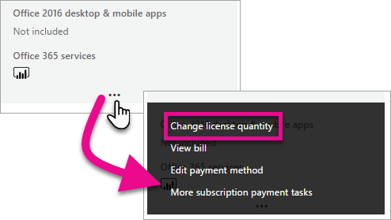
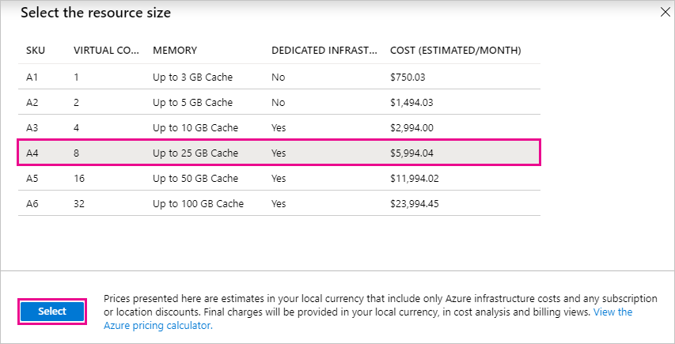
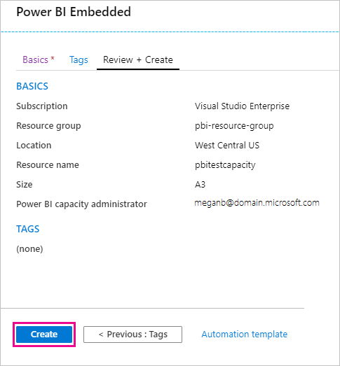

# How to purchase Power BI Premium

This article describes how to purchase Power BI Premium capacity for your organization. The article covers two scenarios:

- Use P SKUs for typical production scenarios. P SKUs require a monthly or yearly commitment, and are billed monthly. You purchase P SKUs in the [Microsoft 365 admin center](https://admmin.microsoft.com).

- Use A SKUs for testing scenarios, and for cases where you don't have the Office 365 billing admin permissions necessary to purchase P SKUs (Microsoft 365 Global Administrator role or Billing Administrator role). A SKUs require no time commitment, and are billed hourly. You purchase A SKUs in the [Azure portal](https://portal.azure.com).

For more information about Power BI Premium, see [What is Power BI Premium?](service-premium-what-is.md). For current pricing and planning information, see the [Power BI pricing page](https://powerbi.microsoft.com/pricing/) and the [Power BI Premium calculator](https://powerbi.microsoft.com/calculator/). Content creators still need a [Power BI Pro license](service-admin-purchasing-power-bi-pro.md), even if your organization uses Power BI Premium. Ensure you purchase at least one Power BI Pro license for your organization. With A SKUs, _all users_ who consume content also require Pro licenses.

> [!NOTE]
> If a Premium subscription expires, you have 30 days of full access to your capacity. After that, your content reverts to a shared capacity. Models that are greater than 1 GB are not supported in shared capacity.

## Purchase P SKUs for typical production scenarios

You can create a new tenant with a Power BI Premium P1 SKU configured, or you can purchase a Power BI Premium capacity for an existing organization. In both cases, you can then add capacity if you need it.

### Create a new tenant with Power BI Premium P1

If you don't have an existing tenant and want to create one, you can purchase Power BI Premium at the same time. The following link walks you through the process of creating a new tenant and enables you to purchase Power BI Premium: [Power BI Premium P1 offer](https://signup.microsoft.com/Signup?OfferId=b3ec5615-cc11-48de-967d-8d79f7cb0af1). When you create your tenant, you will automatically be assigned to the Microsoft 365 Global Administrator role for that tenant.

After you purchase capacity, learn how to [manage capacities](service-admin-premium-manage.md#manage-capacity) and [assign workspaces](service-admin-premium-manage.md#assign-a-workspace-to-a-capacity) to a capacity.

### Purchase a Power BI Premium capacity for an existing organization

If you have an existing organization (tenant), you must be in the Microsoft 365 Global Administrator role or Billing Administrator role to purchase subscriptions and licenses. For more information, see [About Microsoft 365 admin roles](https://support.office.com/article/About-Office-365-admin-roles-da585eea-f576-4f55-a1e0-87090b6aaa9d).

To purchase Premium capacity, follow these steps.

1. From within the Power BI service, select the Microsoft 365 app picker then **Admin**.

    

    Alternatively, you can browse to the Microsoft 365 admin center.

1. Select **Billing** > **Purchase services**.

1. Under **Other plans**, look for Power BI Premium offerings. This will list as P1 through P3, EM3 and P1 (month to month).

1. Hover over the ellipsis (**. . .**) and then select **Buy now**.

    

1. Follow the steps to complete the purchase.

After you have completed the purchase, the **Purchase services** page shows that the item is purchased and active.

After you purchase capacity, learn how to [manage capacities](service-admin-premium-manage.md#manage-capacity) and [assign workspaces](service-admin-premium-manage.md#assign-a-workspace-to-a-capacity) to a capacity.

### Purchase additional capacities

Now that you have a capacity, you can add more as your needs grow. You can use any combination of Premium capacity SKUs (P1 through P3) within your organization. The different SKUs provide different resource capabilities.

1. In the Microsoft 365 admin center, select **Billing** > **Purchase services**.

1. Find the Power BI Premium item you want to purchase more of under **Other plans**.

1. Hover over **More options** (...) and then select **Change license quantity**.

    

1. Change the number of instances that you want to have for this item. Then select **Submit** when finished.

   > [!IMPORTANT]
   > Selecting **Submit** charges the credit card on file.

The **Purchase services** page will then indicate the number of instances you have. Within the Power BI admin portal, under **Capacity settings**, the available v-cores reflects the new capacity purchased.

### Cancel your subscription

You can cancel your subscription from within the Microsoft 365 admin center. To cancel your Premium subscription, do the following.

1. Browse to the Microsoft 365 admin center.

1. Select **Billing** > **Subscriptions**.

1. Select your Power BI Premium subscription from the list.

1. Select **More actions** > **Cancel subscription**.

1. The **Cancel subscription** page will indicate whether or not you are responsible for an [early termination fee](https://support.office.com/article/early-termination-fees-6487d4de-401a-466f-8bc3-c0beb5cc40d3). This page will also let you know when the data will be deleted for the subscription.

1. Read through the information, and if you want to proceed, select **Cancel subscription**.

#### When canceling or your license expires

When you cancel your Premium subscription, or your capacity license expires, you can continue to access your Premium capacities for a period of 30 days from the date of cancellation or license expiration. After 30 days, you will no longer be able to access your Premium capacities or workspaces in them.

## Purchase A SKUs for testing and other scenarios

A SKUs are made available through the Azure Power BI Embedded service. You can use A SKUs in the following ways:

- Enable embedding of Power BI in third party applications. For more information, see [Power BI Embedded](developer/azure-pbie-what-is-power-bi-embedded.md).

- Test Premium functionality before you buy a P SKU.

- Create development and test environments alongside a production environment that uses P SKUs.

- Purchase Power BI Premium even though you're not a Microsoft 365 Global Administrator role or Billing Administrator role.

> [!NOTE]
> If you purchase an A4 or higher SKU, you can take advantage of all Premium features except for unlimited sharing of content. With A SKUs, _all users_ who consume content require Pro licenses.

Follow these steps to purchase A SKUs in the Azure portal:

1. Sign in to the [Azure portal](https://portal.azure.com) with an account that has at least capacity admin permissions in Power BI.

1. Search for _Power BI Embedded_ and select the service in the search results.

    

1. Select **Create Power BI Embedded**.

    

1. On the **Power BI Embedded** create screen, specify the following information:

    - The **Subscription** in which to create the Power BI Embedded service.

    - The physical **Location** in which to create the resource group that contains the service. For better performance, this location should be close to the location of your Azure Active Directory tenant for Power BI.

    - The existing **Resource group** to use, or create a new one as shown in the example.

    - The **Power BI capacity administrator**. The capacity admin must be a member user or a service principal in your Azure AD tenant.

    

1. If you want to use all features of Power BI Premium (except unlimited sharing), you need at at least an A4 SKU. Select **Change size**.

    

1. Select a capacity size of A4, A5, or A6, which correspond to P1, P2, and P3.

    

1. Select **Review + Create**, review the options you chose, then select **Create**.

    

1. It can take a few minutes to complete the deployment. When it's ready, select **Go to resource**.

    

1. On the management screen, review the options you have for managing the service, including pausing the service when you're not using it.

    

After you purchase capacity, learn how to [manage capacities](service-admin-premium-manage.md#manage-capacity) and [assign workspaces](service-admin-premium-manage.md#assign-a-workspace-to-a-capacity) to a capacity.

## Next steps

[Configure and manage capacities in Power BI Premium](service-admin-premium-manage.md)\
[Power BI pricing page](https://powerbi.microsoft.com/pricing/)\
[Power BI Premium calculator](https://powerbi.microsoft.com/calculator/)\
[Power BI Premium FAQ](service-premium-faq.md)\
[Planning a Power BI Enterprise Deployment whitepaper](https://aka.ms/pbienterprisedeploy)

More questions? [Try asking the Power BI Community](https://community.powerbi.com/)
