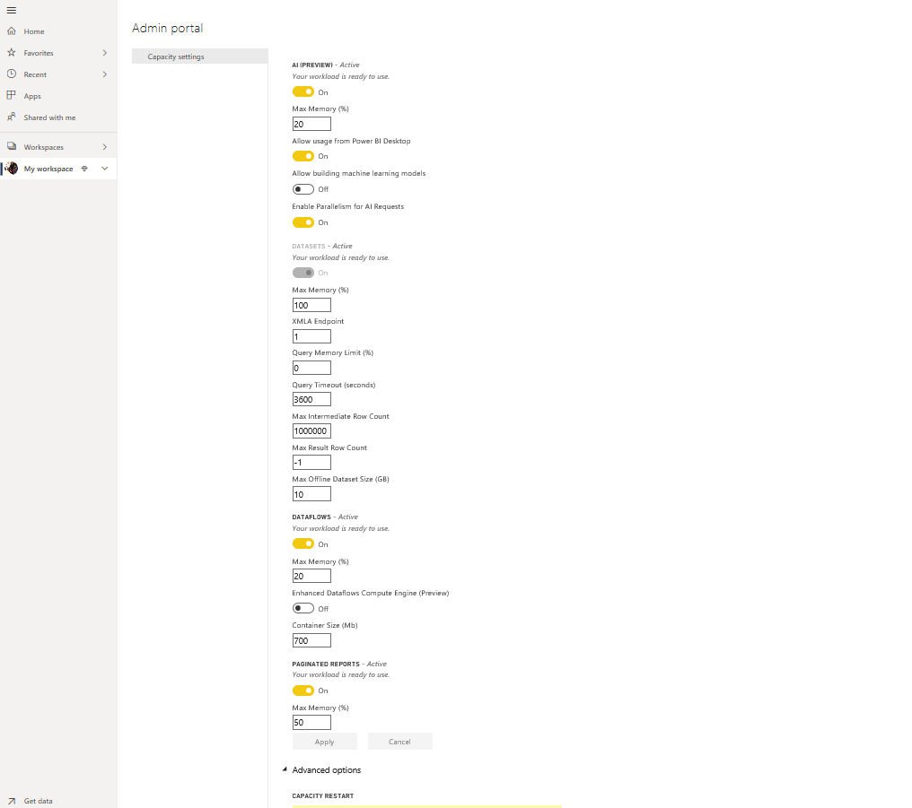

# Configure workloads in a Premium capacity

This article describes enabling and configuring workloads for Power BI Premium capacities. By default, capacities support only the workload associated with running Power BI queries. Query workloads are optimized for and limited by resources determined by your Premium capacity SKU. Premium capacities also support additional workloads that can use capacity resources.

## Configure workloads

You can enable and configure additional workloads for [Dataflows](service-dataflows-overview.md#dataflow-capabilities-on-power-bi-premium) and [Paginated reports](paginated-reports-save-to-power-bi-dervice.md). Default memory values for these workloads are based on the capacity nodes available for your SKU. Max memory settings are not cumulative. Memory up to the max value specified is dynamically allocated for dataflows, but is statically allocated for paginated reports. 

### To configure workloads in the Power BI admin portal

1. In **Capacity settings** > **PREMIUM CAPACITIES**, select a capacity.

1. Under **MORE OPTIONS**, expand **Workloads**.

1. Enable one or more workloads, and set a value for **Max Memory**.   

    
    

1. Click **Apply**.

> [!NOTE]
> If enabling the paginated reports workload, paginated reports allow you to run your own code when rendering a report (such as dynamically changing text color based on content). Power BI Premium runs paginated reports in a contained space within the capacity. The maximum memory you specify to this space is used whether or not the workload is active. If you use Power BI reports or dataflows in the same capacity, make sure you set memory low enough for paginated reports that it doesn't negatively affect the other workloads. In rare circumstances, the paginated reports workload can become unavailable. In this case, the workload shows an error state in the admin portal, and users see timeouts for report rendering. To mitigate this issue, disable the workload then enable it again.

### REST API

Workloads can be enabled and assigned to a capacity by using the [Capacities](https://docs.microsoft.com/rest/api/power-bi/capacities) REST APIs.

## Next steps

[Power BI Premium capacity resource management and optimization](service-premium-understand-how-it-works.md)   
[Self-service data prep in Power BI with Dataflows](service-dataflows-overview.md)   
[What are paginated reports in Power BI Premium?](paginated-reports-report-builder-power-bi.md)   

More questions? [Ask the Power BI Community](http://community.powerbi.com/)