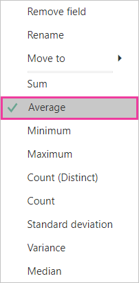
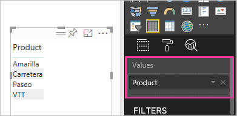
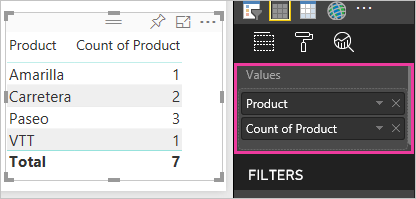

# Aggregates in Power BI visualizations
## What is an aggregate?
Sometimes you want to mathematically combine values in your data. The mathematical operation could be sum, average, maximum, count, etc. When you combine values in your data, it is called *aggregating*. The result of that mathematical operation is an *aggregate*. 

When Power BI service and Power BI Desktop create visualizations, they may aggregate your data. Often the aggregate is just what you need, but other times you may want to aggregate the values in a different way.  For example, a sum versus an average. There are several different ways to manage and change the aggregate being used in a visualization.

First, let's take a look at data *types* because the type of data determines how, and if, it can be aggregated.

## Types of data
Most datasets have more than one type of data. At the most basic level, the data is either numeric or it is not. Numeric data can be aggregated using a sum, average, count, minimum, variance, and much more. Even textual data, often called *categorical* data, can be aggregated. If you try to aggregate a categorical fields (by placing it in a numeric only bucket like **Values** or **Tooltips**), Power BI will count the occurrences of each category or count the distinct occurrences of each category. And special types of data, like dates, have a few of their own aggregate options: earliest, latest, first, and last. 

In the example below:
- **Units Sold** and **Manufacturing Price** are columns that contains numeric data
-  **Segment**, **Country**, **Product**, **Month**, and **Month Name** contain categorical data

   

When creating a visualization in Power BI, numeric fields will be aggregated (the default is *sum*) over some categorical field.  For example, "Units Sold ***by Product***, "Units Sold ***by Month***" and "Manufacturing Price ***by Segment***. Some numeric fields are referred to as **measures**. It's easy to identify measaures in the Power BI report editor -- measures are shown with the ∑ symbol in the Fields list. For more information see [The report editor... take a tour](service-the-report-editor-take-a-tour.md).

## Why don't aggregates work the way I want them to?
Working with aggregates in Power BI service can be confusing; maybe you have a numeric field and Power BI won't let you change the aggregation. Or maybe you have a field, like a year, and you don't want to aggregate it, you just want to count the number of occurrences.

Most often, the source of the problem is how the field was defined in the dataset. Maybe the field is defined as text and that explains why it can't be summed or averaged. Unfortunately, [only the dataset owner can change the way a field is categorized](desktop-measures.md). So if you have owner permissions to the dataset, either in Desktop or the program that was used to create the dataset (e.g., Excel), you can fix this problem. Otherwise, you'll need to contact the dataset owner for help.  

To help you navigate the confusion we have a special section at the end of this article called **Considerations and troubleshooting**.  If you don't find your answer there, post your question on the [Power BI Community forum](http://community.powerbi.com) for a quick response directly from the Power BI team.

## Change how a numeric field is aggregated
Say you have a chart that sums the units sold for different products, but you'd rather have the average. 

1. Create a chart that uses a category and a measure. In this example we're using Units Sold by Product.  By default, Power BI creates a chart that sums the units sold (measure in the Value well) for each product (category in the Axis well).

   

2. In the Visualizations pane, right-click the measure, and select the aggregate type you need. In this case, we're selecting Average. If you don't see the aggregation you need, see "Considerations and troubleshooting" below.  
   
   
   
   > [!NOTE]
   > The options available in the dropdown will vary depending on 1) the field selected and 2) the way that field was categorized by the dataset owner.
   > 
3. Your visualization is now using aggregated by average.

   

##    Ways to aggregate your data

Some of the options that may be available for aggregating a field:

* **Do Not Summarize**. With this option chosen, each value in that field is treated separately and not summarized. This is often used if you have a numeric ID column that shouldn't be summed.
* **Sum**. This adds all the values in that field up.
* **Average**. Takes an arithmetic mean of the values.
* **Minimum**. Shows the smallest value.
* **Maximum**. Shows the largest value.
* **Count (Not Blanks).** This counts the number of values in that field that are not blank.
* **Count (Distinct).** This counts the number of different values in that field.
* **Standard deviation.**
* **Variance**.
* **Median**.  Shows the median (middle) value. This is the value that has the same number of items above and below.  If there are 2 medians, Power BI averages them.

For example, this data:

| Country | Amount |
|:--- |:--- |
| USA |100 |
| UK |150 |
| Canada |100 |
| Germany |125 |
| France | |
| Japan |125 |
| Australia |150 |

Would give the following results:

* **Do Not Summarize**: Each value is shown separately
* **Sum**: 750
* **Average**: 125
* **Maximum**:  150
* **Minimum**: 100
* **Count (Not Blanks):** 6
* **Count (Distinct):** 4
* **Standard deviation:** 20.4124145...
* **Variance:** 416.666...
* **Median:** 125

## Create an aggregate using a category (text) field
You can also aggregate a non-numeric field. For example, if you have a product name field, you can add it as a value and then set it to **Count**, **Distinct count**, **First**, or **Last**. 

1. In this example, we've dragged the **Product** field into the Values well. The Values well is typically used for numeric fields. Power BI recognizes that this is a text field, sets the aggregate to **Do not summarize**, and presents us with a single-column table.
   
   
2. If we change the aggregation from the default **Do not summarize** to **Count (Distinct)**, Power BI counts the number of different products. In this case, there are 4.
   
   
3. And if we change the aggregation to **Count**, Power BI counts the total number. In this case, there are 7 entries for **Product**. 
   
   

4. By dragging the same field (in this case **Product**) into the Values well, and leaving the default aggregation **Do not summarize**, Power BI breaks down the count by product.

   

## Considerations and Troubleshooting
Q:  Why don't I have a **Do not summarize** option?

A:  The field you've selected is likely a calculated measure or advanced measure created in Excel or [Power BI Desktop](desktop-measures.md). Each calculated measure has its own hard-coded formula. You can’t change the aggregation being used.  For example, if it’s a sum, it can only be a sum. In the Fields list, *calculated measures* are shown with the calculator symbol.

Q:  My field **is** numeric, why are my only choices **Count** and **Distinct count**?

A1:  The likely explanation is that the dataset owner has, accidentally or intentionally, *not* classified the field as a number. For example, if a dataset has a **year** field, the dataset owner may categorize that as text because it is more likely that the **year** field will be counted (i.e., number of people born in 1974) and not that it will be summed or averaged. If you are the owner, you can open the dataset in Power BI Desktop and use the **Modeling** tab to change the data type.  

A2: If the field has a calculator icon, that means it's a *calculated measure* and each calculated measure has its own hard-coded formula that can only be changed by a dataset owner. The calculation being used may be a simple aggregation like an average or sum, but it may also be something more complicated like a "percent of contribution to parent category" or "running total since start of the year". Power BI isn't going to sum or average the results but will instead just re-calculate (using the hard-coded formula) for each data point.

A3:  Another possibility is that you've dropped the field into a *bucket* that only allows categorical values.  In that case, your only options will be count and distinct count.

A4:  And a third possibility is that you're using the field for an axis. On a bar chart axis, for example, Power BI shows one bar for each distinct value -- it doesn't aggregate the field values at all. 

>[!NOTE]
>The exception to this rule is scatter charts, which *require* aggregated values for the X and Y axes.

Q:  Why can't I aggregate text fields for SSAS data sources?

A:  Live connections to SSAS MD do not allow for any client-side aggregations. This includes first, last, avg, min, max, and sum.

Q:  I have a scatter chart and I want my field to *not* aggregate.  How do I do this?

A:  Add the field to the **Details** bucket and not to the X or Y axes buckets.

Q:  When I add a numeric field to a visualization, most of them default to sum but some default to average or count or some other aggregation.  Why isn't the default aggregation always the same?

A:  Dataset owners have the option to set the default summarization for each field. If you are a dataset owner, change the default summarization in the **Modeling** tab of Power BI Desktop.

Q:  I'm a dataset owner and I want to ensure that a field is never aggregated.

A:  In Power BI Desktop, in the **Modeling** tab, set **Data type** to **Text**.

Q:  I do not see **Do not summarize** as an option in my dropdown.

A:  Try removing the field and adding it back in.

More questions? [Try the Power BI Community](http://community.powerbi.com/)

