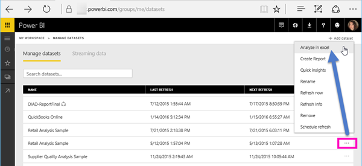
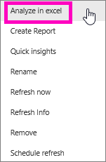
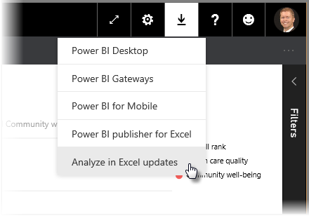
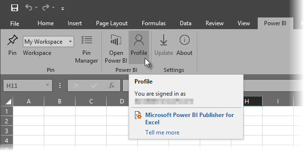
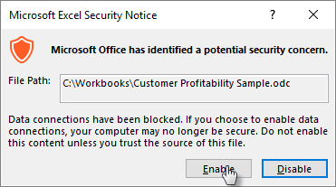

# Analyze in Excel
There are times when you may want to use Excel to view and interact with a dataset that you have Power BI. With **Analyze in Excel**, you can do just that, and access PivotTable, chart, and slicer features in Excel based on the dataset that exists in Power BI.

## Requirements
There are a few requirements for using **Analyze in Excel**:

* **Analyze in Excel** is supported for Microsoft Excel 2010 SP1 and later.
* Excel PivotTables do not support drag-and-drop aggregation of numeric fields. Your dataset in Power BI *must have pre-defined measures*.
* Some organizations may have Group Policy rules that prevent installing the required **Analyze in Excel** updates to Excel. If you’re unable to install the updates, check with your administrator.
* **Analyze in Excel** requires a Pro license. To learn more about the differences in functionality between license types, take a look at [Power BI features by license type](features-license-type.md). 

## How does it work?
When you select **Analyze in Excel** from the ellipses menu (the ...) associated with a dataset or report in **Power BI**, Power BI creates an .ODC file and downloads it from the browser to your computer.

When you open the file in Excel, an empty **PivotTable** and **Fields** list appears with the tables, fields, and measures from the Power BI dataset. You can create PivotTables, charts, and analyze that dataset just as you would work with a local dataset in Excel.

The .ODC file has an MSOLAP connection string that connects to your dataset in Power BI. When you analyze or work with the data, Excel queries that dataset in Power BI and returns the results to Excel. If that dataset connects to a live data source using DirectQuery, Power BI queries the data source and returns the result to Excel.

**Analyze in Excel** is very useful for datasets and reports that connect to *Analysis Services Tabular* or *Multidimensional* databases, or from Power BI Desktop files or Excel workbooks with data models that have model measures created using Data Analysis Expressions (DAX).

## Get started with Analyze in Excel
In Power BI, select the ellipses menu beside a report or dataset (the ... beside the report or dataset name), and from the menu that appears, select **Analyze in Excel**.

### Install Excel updates
When you first use **Analyze in Excel**, you need to install updates to the Excel libraries. You’ll be prompted to download and run Excel updates (this initiates installation of the *SQL_AS_OLEDDB.msi* Windows installer package). This package installs **Microsoft AS OLE DB Provider for SQL Server 2016 RC0 (Preview)**.

> [!NOTE]
> Be sure to check **Don’t show this again** in the **Install Excel updates** dialog. You only need to install the update once.
> 
> 

If you do need to install the Excel updates for **Analyze in Excel** again, you can download the update from the **Download** icon in Power BI, as shown in the following image.

### Sign in to Power BI
Although you’re signed in to Power BI in your browser, the first time you open a new .ODC file in Excel you may be asked to sign in to Power BI with your Power BI account. This authenticates the connection from Excel to Power BI.

### Users with multiple Power BI accounts
Some users have multiple Power BI accounts, and those users may encounter a situation where they're logged into Power BI with one account, but the account that has access to the dataset being used in Analyze in Excel is a different account. In those situations, you may get a **Forbidden** error or a sign-in failure when attempting to access a dataset that's being used in an Analyze in Excel workbook.

You'll be provided an opportunity to sign in again, at which time you can sign in with the Power BI account that has access to the dataset being accessed by Analyze in Excel. You can also select **Profile** from the **Power BI** ribbon tab in Excel, which identifies which account you're currently logged in with, and provides a link that lets you sign out (and subsequently, sign in with a different account).

### Enable data connections
In order to analyze your Power BI data in Excel, you are prompted to verify the file name and path for the .odc file, and then select **Enable**.

> [!NOTE]
> Administrators for Power BI tenants can use the *Power BI Admin Portal* to disable the use of **Analyze in Excel** with on-premises datasets housed in Analysis Services (AS) databases. When that option is disabled, **Analyze in Excel** is disabled for AS databases, but continues to be available for use with other datasets.
> 
> 

## Analyze away
Now that Excel has opened and you have an empty PivotTable, you're ready to do all sorts of analysis with your Power BI dataset. Just as with other local workbooks, with Analyze with Excel you can create PivotTables, charts, add data from other sources, and so on. And of course, you can create different worksheets with all sorts of views into your data.

> [!NOTE]
> It's important to know that using **Analyze in Excel** exposes all detail-level data to any users with permission to the dataset.
> 
> 

## Save
You can save this Power BI dataset connected workbook just like any other workbook. However, you cannot publish or import the workbook back into Power BI because you can only publish or import workbooks into Power BI that have data in tables, or that have a data model. Since the new workbook simply has a connection to the dataset in Power BI, publishing or importing it into Power BI would be going in circles!

## Share
Once your workbook is saved, you can share it with other Power BI users in your organization.

When a user with whom you’ve shared your workbook opens the workbook, they’ll see your PivotTables and data as they appeared when the workbook was last saved, which may not be the latest version of the data. To get the latest data, users must use the **Refresh** button on the **Data** ribbon. And since the workbook is connecting to a dataset in Power BI, users attempting to refresh the workbook must sign into Power BI and install the Excel updates the first time they attempt to update using this method.

Since users will need to refresh the dataset, and refresh for external connections is not supported in Excel Online, it’s recommended that users open the workbook in the desktop version of Excel on their computer.

## Troubleshooting
There may be times when using Analyze in Excel that you get an unexpected result, or the feature doesn't work as you expected. [This page provides solutions for common issues when using Analyze in Excel](desktop-troubleshooting-analyze-in-excel.md)