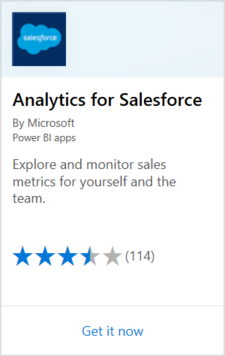
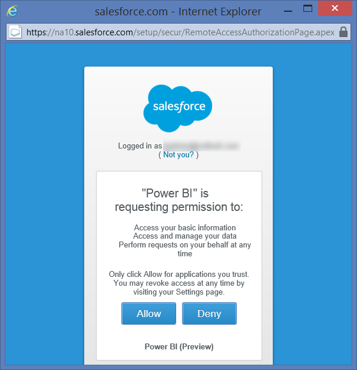
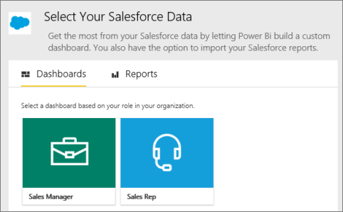

# Connect to Salesforce with Power BI
With Power BI, you can easily connect to your Salesforce.com account. With this connection, you can retrieve your Salesforce data and have a dashboard and reports automatically provided.

Read more about the [Salesforce integration](https://powerbi.microsoft.com/integrations/salesforce) with Power BI.

## How to connect
1. In Power BI, select **Get Data** at the bottom of the left navigation pane.
   
    
2. In the **Services** box, select **Get**.
   
    
3. Select **Analytics for Salesforce** and select **Get**.  
   
   
4. Select **Sign In** to start the sign in flow.
   
    
5. When prompted, enter your Salesforce credentials. Select **Allow** and let Power BI access your basic Salesforce information and data.
   
   
6. Configure what you'd like to import into Power BI using the drop-down option:
   
   * **Dashboard**
     
     Select a predefined dashboard based on a persona (such as **Sales Manager**). These dashboards retrieve a specific set of Salesforce standard data, which doesn't include custom fields.
     
     
   * **Reports**
     
     Select one or more custom reports from your Salesforce account. These reports match your views in Salesforce and can include data from custom fields or objects.
     
     
     
     If you don't see any reports, add or create them in your Salesforce account and try connecting again.

7. Select **Connect** to begin the import process. During the import, you see a notification showing the import is in progress. When the import is complete, you see a dashboard, report, and dataset for your Salesforce data listed in the left navigation pane.
   
   

You can change the dashboard to display your data how you'd like. You can ask questions with Q&A or [select a tile](consumer/end-user-tiles.md) to open the underlying report and [edit or remove dashboard tiles](service-dashboard-edit-tile.md).

**What now?**

* Try [asking a question in the Q&A box](consumer/end-user-q-and-a.md) at the top of the dashboard
* [Edit or remove a tile](service-dashboard-edit-tile.md) in the dashboard
* [Select a tile](service-dashboard-tiles.md) to open the underlying report
* While your dataset is scheduled to refresh daily, you can change the refresh schedule or try refreshing it on demand using **Refresh Now**

## System requirements and considerations

- Connected with a production Salesforce account that has API access enabled

- Permission granted to the Power BI app during sign in

- The account has sufficient API calls available to pull and refresh the data

- A valid authentication token is required for refresh. Salesforce has a limit of five authentication tokens per application so make sure you've five or less Salesforce data sets imported.

- The Salesforce Reports API has a restriction that supports up to 2,000 rows of data.

## Troubleshooting

If you come across any errors, review the requirements above. 

Signing in to a custom or sandbox domain isn't currently supported.

### "Unable to connect to the remote server" message

If you get an "Unable to connect to the remote server" message when trying to connect to your Salesforce account, see this solution on the following forum: [Salesforce Connector sign in Error Message: Unable to connect to the remote server](https://www.outsystems.com/forums/Forum_TopicView.aspx?TopicId=17674&TopicName=log-in-error-message-unable-to-connect-to-the-remote-server&)

## Next steps
[What is Power BI?](fundamentals/power-bi-overview.md)

[Data sources for the Power BI service](service-get-data.md)

