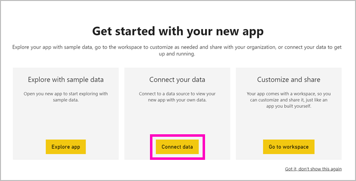
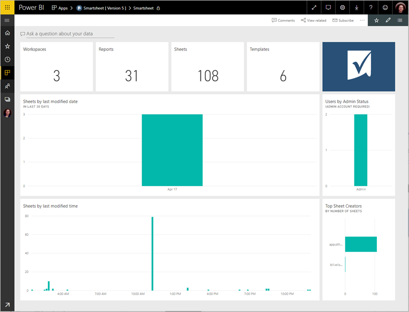
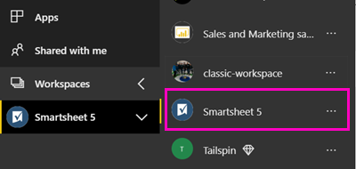
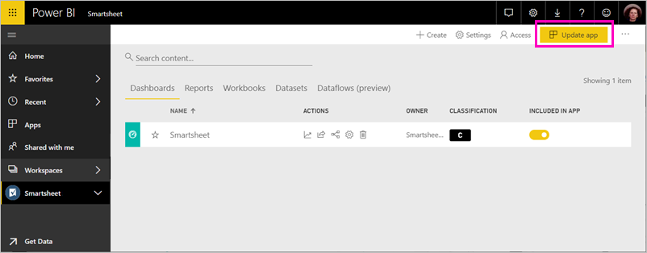

# Connect to Smartsheet with Power BI
This article walks you through pulling your data from your Smartsheet account with a Power BI template app. Smartsheet offers an easy platform for collaboration and file sharing. The Smartsheet template app for Power BI provides a dashboard, reports, and dataset that show an overview of your Smartsheet account. You can also use [Power BI Desktop](desktop-connect-to-data.md) to connect directly to individual sheets in your account. 

After you've installed the template app, you can change the dashboard and report. Then you can distribute it as an app to colleagues in your organization.

Connect to the [Smartsheet template app](https://app.powerbi.com/groups/me/getdata/services/smartsheet) for Power BI.

>[!NOTE]
>A Smartsheet admin account is preferred for connecting and loading the Power BI template app as it has additional access.

## How to connect

[!INCLUDE [powerbi-service-apps-get-more-apps](./includes/powerbi-service-apps-get-more-apps.md)]

3. Select **Smartsheet** \> **Get it now**.
4. In **Install this Power BI App?** select **Install**.
4. In the **Apps** pane, select the **Smartsheet** tile.

    

6. In **Get started with your new app**, select **Connect data**.

    

4. For Authentication Method, select **oAuth2 \> Sign In**.
   
   When prompted, enter your Smartsheet credentials and follow the authentication process.
   
   
   
   

5. After Power BI imports the data, the Smartsheet dashboard opens.
   
   

## Modify and distribute your app

You've installed the Smartsheet template app. That means you've also created the Smartsheet app workspace. In the workspace, you can change the report and dashboard, and then distribute it as an *app* to colleagues in your organization. 

1. To view all the contents of your new Smartsheet workspace, in the left navigation bar, select **Workspaces** > **Smartsheet**. 

    

    This view is the content list for the workspace. In the upper-right corner, you see **Update app**. When you're ready to distribute your app to your colleagues, that's where you'll start. 

    

2. Select **Reports** and **Datasets** to see the other elements in the workspace.

    Read about [distributing apps](service-create-distribute-apps.md) to your colleagues.

## What's included
The Smartsheet template app for Power BI includes an overview of your Smartsheet account, such as the number of workspaces, reports, and sheets you have, when they're modified etc. Admin users also see some information around the users in their system, such as top sheet creators.  

To connect directly to individual sheets in your account, you can use the Smartsheet connector in the [Power BI Desktop](desktop-connect-to-data.md).  

## Next steps

* [Create the new workspaces in Power BI](service-create-the-new-workspaces.md)
* [Install and use apps in Power BI](consumer/end-user-apps.md)
* [COnnect to Power BI apps for external services](service-connect-to-services.md)
* Questions? [Try asking the Power BI Community](http://community.powerbi.com/)