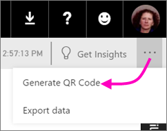

# Create a QR code for a tile in Power BI to use in the mobile apps
QR codes in Power BI can connect anything in the real world directly to related BI information &#151; no navigation or search needed.

You can create a QR code in the Power BI service for tiles in any dashboard, even in dashboards you can't edit. Then place the QR code in a key location. For example, you could paste it in an email, or print it out and paste it in a specific location. 

Colleagues you've shared the dashboard with can [scan the QR code for access to the tile, right from their mobile device](consumer/mobile/mobile-apps-qr-code.md). They can use either the QR code scanner located in the Power BI app, or any other QR scanner installed on their device.

## Create a QR code for a tile
1. Open a dashboard in the Power BI service.
2. Select **More options** (...) in the top-right corner of the tile and select **Focus mode** .
3. Select **More options** (...) in the top-right corner and select **Generate QR code**. 
   
    
4. A dialog box with the QR code appears. 
   
    
5. From here you can scan the QR code or download and save it so you can: 
   
   * Add it to an email or other document, or 
   * Print it and place it in a specific location. 

## Print the QR code
Power BI generates the QR code as a JPG file, ready to print. 

1. Select **Download**, then open the JPG file on a computer connected to a printer.  
   
   > [!TIP]
   > The JPG file has the same name as the tile. For example, "Opportunity Count - by Month, Sales Stage.jpg".
   > 
   > 
2. Print the file at 100% or “actual size”.  
3. Cut out the QR code and glue it to a place relevant to the tile. 

## Next steps
* [Connect to Power BI data from the real world](consumer/mobile/mobile-apps-data-in-real-world-context.md) with the mobile apps
* [Scan a Power BI QR code from your mobile device](consumer/mobile/mobile-apps-qr-code.md)
* [Create a QR code for a report](service-create-qr-code-for-report.md)
* Questions? [Try asking the Power BI Community](http://community.powerbi.com/)

