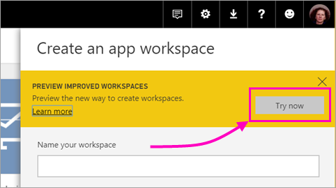
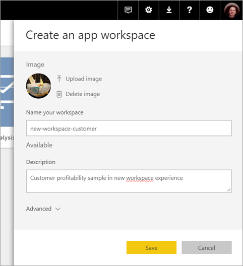
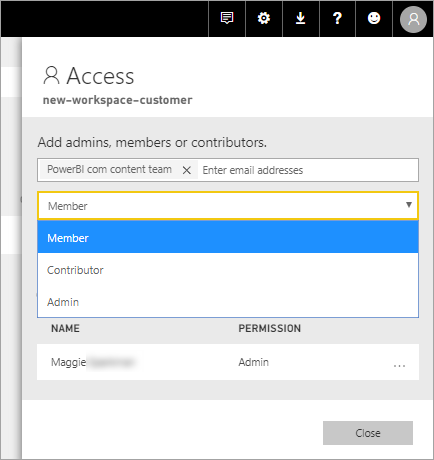
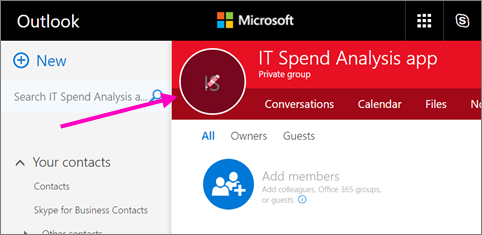
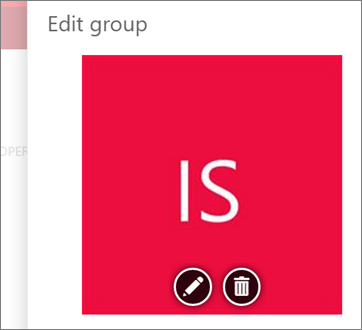
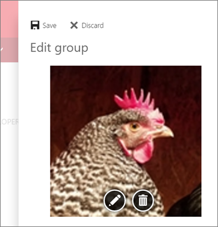
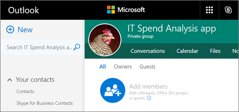

# Create the new workspaces (preview) in Power BI

In Power BI, you can create *workspaces*, places to collaborate with colleagues to create and refine collections of dashboards and reports. Then you bundle those together into *apps* which you can distribute to your whole organization or to specific people or groups. 

Now Power BI is introducing a new workspace experience. When you create one of the new workspaces, you're not creating an underlying, associated Office 365 group. All the group administration is in Power BI, not in Office 365. 

You can still add an Office 365 group to the workspace if you want, along with security groups, distribution lists, and individuals. You add them to the new workspaces as members, contributors, or admins. Everyone you add to an app workspace needs a Power BI Pro license. In the workspace you can all collaborate on dashboards and reports that you plan to publish to a wider audience, or even to your entire organization. See [Roles in the new workspaces](#roles-in-the-new-workspaces) later in this article for an explanation of the different roles.

## Video: Apps and app workspaces
<iframe width="640" height="360" src="https://www.youtube.com/embed/Ey5pyrr7Lk8?showinfo=0" frameborder="0" allowfullscreen></iframe>

## Roll out new app workspaces

During the preview period, old and new workspaces can coexist side by side, and you can create either. When the preview for new workspaces ends and they're generally available, old workspaces can still exist for a time. You won't be able to create them, and you'll need to prepare to convert the ones you want to keep.

## Convert old app workspaces to new app workspaces

During the preview period, you can convert your old app workspaces to new ones manually. When the new workspaces are generally available, you can opt in to migrate the old ones automatically. At some point after GA, you'll have to migrate them.

## Create one of the new app workspaces

1. Start by creating the app workspace. Select **Workspaces** > **Create app workspace**.
   
     

2. In **Preview improved workspaces**, select **Try now**.
   
     

2. Give the workspace a name. If the name isn't available, edit it to come up with a unique ID.
   
     The app will have the same name as the workspace.
   
1. Add an image, if you want. The file size has to be less than 45 KB.
 
    

1. Select **Save**.

    Here in the **Welcome** screen for your new workspace, you can add data. 

    

1. For example, select **Samples** > **Customer Profitability Sample**.

    Now in the workspace content list, you see **New workspaces preview**. Because you're an admin, you also see a new action, **Access**.

    

1. Select **Access**.

1. Add security groups, distribution lists, Office 365 groups, or individuals to these workspaces as members, contributors, or admins. See [Roles in the new workspaces](#roles-in-the-new-workspaces) later in this article for an explanation of the different roles.

    

9. Select **Add** > **Close**.

1. Power BI creates the workspace and opens it. It appears in the list of workspaces you’re a member of. Because you’re an admin, you can select the ellipsis (…) to go back and make changes to workspace settings, adding new members, or changing their permissions.

     

## Create an app workspace based on an Office 365 group

For now, you can still create an app workspace built on an Office 365 group.

[!INCLUDE [powerbi-service-create-app-workspace](./includes/powerbi-service-create-app-workspace.md)]

When you first create it, you may need to wait an hour or so for the workspace to propagate to Office 365. 

### Add an image to your Office 365 app workspace (optional)
By default, Power BI creates a little colored circle for your app, with the app's initials. But maybe you want to customize it with an image. To add an image, you need an Exchange Online license.

1. Select **Workspaces**, select the ellipsis (...) next to the name of the workspace, then **Members**. 
   
     
   
    The Office 365 Outlook account for the workspace opens in a new browser window.
2. When you hover over the colored circle in the upper left, it turns into a pencil icon. Select it.
   
     
3. Select the pencil icon again, and find the image you want to use.
   
     

4. Select **Save**.
   
     
   
    The image replaces the colored circle in the Office 365 Outlook window. 
   
     
   
    In a few minutes, it will appear in the app in Power BI, too.
   
     

## Add content to your app workspace

After you've created an app workspace of either the new or old style, it's time to add content to it. Adding content is similar in the two workspaces, with one exception. While in either app workspace, you can upload or connect to files, just as you would in your own My Workspace. In the old workspaces you can also connect to organizational  content packs, and third-party content packs such as Microsoft Dynamics CRM, Salesforce, or Google Analytics. In the new workspaces, you can't connect to content packs.

When you view content in the content list of an app workspace, the app workspace name is listed as the owner.

## Roles in the new workspaces

The new workspaces offer more roles than the old workspaces had: admins, members, and contributors.

**Admins can:**

- Update and delete the workspace. 
- Add/remove people, including other admins.
- Delete the workspace.
- Change metadata.

**Members can:** 

- Add members or others with lower permissons.
- Publish and update apps.
- Share items and share apps.

**Contributors can:** 

- Create, edit, and delete content in the workspace. 
- Publish reports to the workspace, delete content.
- Can’t give new people access to content; can’t share new content, but can share with someone with whom the app is already shared. 
- Can’t modify the members of the group.

## Distribute an app

When the content is ready, you choose which dashboards and reports you want to publish, and then you publish it as an *app*. You can send a direct link to that wider audience, or they can find your app from the Apps tab by going to **Download and explore more apps from AppSource**. 

Your coworkers can get your apps in a few different ways. You can install them automatically in your coworkers' Power BI accounts if your Power BI administrator gives you permission. Otherwise, they can find and install your apps from Microsoft AppSource, or you can send them a direct link. They get updates automatically and you can control how frequently the data refreshes. See [Publish apps with dashboards and reports in Power BI](service-create-distribute-apps.md) for details.

## Power BI apps FAQ
### How are the new app workspaces different from existing app workspaces?
* Creating app workspaces won't create corresponding entities in Office 365 like group workspaces do. You can create any number of app workspaces without worrying about different Office 365 groups being created behind the scenes (you can still add an Office 365 group to your workspace). 
* In existing app workspaces, you can add only individuals to the members and admin lists. In the new app workspaces, you can add multiple AD security groups, distribution lists, or Office 365 groups to these lists to allow for easier management. 
- You can create an organizational content pack from an existing app workspace. You can't create one from the new app workspaces. 

### How are apps different from organizational content packs?
Apps are the evolution of organizational content packs. If you have organizational content packs already, they'll continue to work side by side with apps. Apps and content packs have a few major differences. 

* After business users install a content pack, it loses its grouped identity: it's just a list of dashboards and reports interspersed with other dashboards and reports. Apps, on the other hand, maintain their grouping and identity even after installation. This makes it easy for business users to continue to navigate to them over time.
* You can create multiple content packs from any workspace, but an app has a 1:1 relationship with its workspace. 
* Over time we plan to deprecate organizational content packs, so we recommend you create apps from now on.  

## Other planned new app workspace features

 Some other new app workspace features are planned, but not there yet, during preview:
- No **Leave workspace** button
- Usage metrics are hidden
- B2B
- How Premium works – you can assign and create them in Prem capacity, but an esoteric workflow doesn’t work.

## Next steps
* [Install and use apps in Power BI](service-install-use-apps.md)
* [Power BI apps for external services](service-connect-to-services.md)
* [Power BI Admin Portal](https://docs.microsoft.com/en-us/power-bi/service-admin-portal)
* Questions? [Try asking the Power BI Community](http://community.powerbi.com/)
