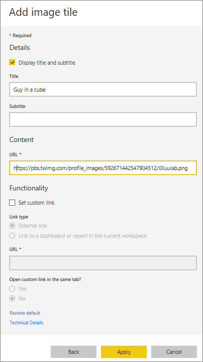
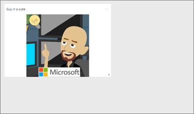
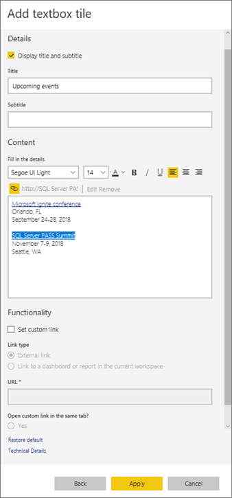
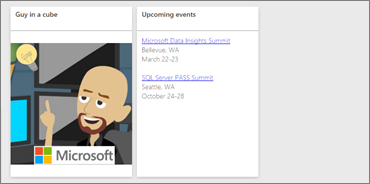
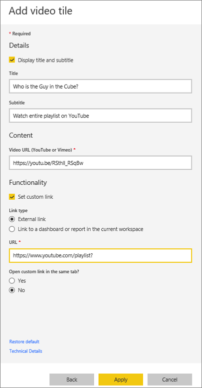
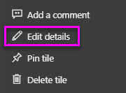

# Add images, text, videos, and more to your dashboard
<iframe width="560" height="315" src="https://www.youtube.com/embed/e2PD8m1Q0vU" frameborder="0" allowfullscreen></iframe>


## Add a tile
The **Add tile** control lets you directly add an image, text box, video, streaming data, or web code to your dashboard.

1. Select **Add tile** from the top menu bar of your dashboard. Depending on space limitations, you may see only the plus  sign.
   
    
2. Select which type of tile to add: **Web content**, **Image**, **Text box**, **Video**, or **Custom streaming data**.
   
    

## Add an image
If you want to add your company logo or some other image to your dashboard, you can do so by saving the image file online and linking to it. Make sure security credentials aren't required to access the image file. For example, because OneDrive and SharePoint require authentication, images stored there can't be added to a dashboard this way.  

1. From the **Add tile** window, select **Image** > **Next**.

2. From the **Add image tile** window, add the image information:   
   
   a. To display a title above the image, select **Display title and subtitle** and enter a **Title** and an optional **Subtitle**.

   b. Enter the image **URL**.

   c. To make the tile a hyperlink, select **Set custom link** and enter the **URL**. 

      When colleagues click this image or title, they'll be taken to this URL.

   d. Select **Apply**. 

    

3. On the dashboard, resize and move the image as needed.
     
     

## Add a text box or dashboard heading
1. From the **Add tile** window, select **Text box** > **Next**.

   > [!NOTE]
   > To add a dashboard heading, type your heading in the text box and increase the font.
   > 

2. Format the text box:
   
   a. To display a title above the text box, select **Display title and subtitle** and enter a **Title** and an optional **Subtitle**.

   b. Enter and format **Content** for the text box.  

   c. Optionally, set a custom link for the title. A custom link can be an external site or a dashboard or report in your workspace. However, in this example we've added hyperlinks within the text box itself, so we'll leave **Set custom link** unchecked.

   d. Select **Apply**. 

     
   
3. On the dashboard, resize and move the text box as needed.
   
   

## Add a video
When you add a YouTube or Vimeo video tile to your dashboard, the video plays right on your dashboard.

1. From the **Add tile** window, select **Video** > **Next**.
2. Add video information in the **Add video tile** window:   
   
   a. To display a title and subtitle at the top of the video tile, select **Display title and subtitle** and enter a **Title** and an optional **Subtitle**. In this example, we'll add a **Subtitle**, and then convert it to a hyperlink to the entire YouTube playlist.

   b. Enter the **Video URL** for the video.

   c. Add a hyperlink for the **Title** and **Subtitle**, so that your colleagues can view the entire playlist on YouTube after they watch the embedded video. To do so, under **Functionality**, select **Set custom link**, and then enter the **URL** for the playlist.

   d. Select **Apply**.  

   

3. On the dashboard, resize and move the video tile as needed.
     
   
4. Select the video tile to play the video.
5. Select the subtitle to visit the playlist on YouTube.

## Add streaming data
<iframe width="560" height="315" src="https://www.youtube.com/embed/kOuINwgkEkQ" frameborder="0" allowfullscreen></iframe>

## Add web content
Paste or type in any HTML content. Power BI adds it, as a tile, to your dashboard. Enter the embed code manually or copy/paste from sites such as Twitter, YouTube, embed.ly, and so on.

1. From the **Add tile** window, select **Web content** > **Next**.

2. Add information to the **Add web content tile** window:
   
   a. To display a title above the tile, select **Display title and subtitle** and enter a **Title** and an optional **Subtitle**.

   b. Enter the embed code. In this example, we're copying and pasting a Twitter feed.

   c. Select **Apply**.

   
   

3. On the dashboard, resize and move the web content tile as needed.
     
   

## Tips for embedding web content
* For iframes, use a secure source. If you enter your iframe embed code and get a blank tile, check to see if you're using *http* for the iframe source. If so, change it to *https*.
  
  ```html
  <iframe src="https://xyz.com">
  ```
* Edit width and height information. The embed code embeds a video and sets the video player to 560 x 315 pixels. This size will not change as you resize the tile.
  
  ```html
  <iframe width="560" height="315"
  src="https://www.youtube.com/embed/Cle_rKBpZ28" frameborder="0"
   allowfullscreen></iframe>
  ```
  
  If you'd like the player to resize to fit the tile size, set the width and height to 100%.
  
  ```html
  <iframe width="100%" height="100%"
  src="https://www.youtube.com/embed/Cle_rKBpZ28" frameborder="0"
   allowfullscreen></iframe>
  ```
* This code embeds a tweet and retains, as separate links on the dashboard, links for the **AFK** podcast, **\@GuyInACube's Twitter page**, **Follow**, **#analytics**, **reply**, **retweet**, and **like**.  Selecting the tile itself takes you to the podcast on Twitter.
  
  ```html
  <blockquote class="twitter-tweet" data-partner="tweetdeck">
  <p lang="en" dir="ltr">Listen to
  <a href="https://twitter.com/GuyInACube">@GuyInACube</a> talk to
  us about making videos about Microsoft Business Intelligence
  platform
  <a href="https://t.co/TmRgalz7tv">https://t.co/TmRgalz7tv </a>
  <a href="https://twitter.com/hashtag/analytics?src=hash">
  #analytics</a></p>&mdash; AFTK Podcast (@aftkpodcast) <a
  href="https://twitter.com/aftkpodcast/status/693465456531771392">
  January 30, 2016</a></blockquote> <script async src="//platform.twitter.com/widgets.js" charset="utf-8"></script>
  ```

## Edit a tile
To make changes to an existing tile:

1. Hover over the top-right corner of the tile and select the ellipsis (...).
   
    
2. Select **Edit details** to display the **Tile details** window and make changes.
   
    

## Considerations and troubleshooting
* To make it easier to move the tile on your dashboard, add a title and an optional subtitle.
* If you'd like to embed content from a website, but the website doesn't provide embed code to copy-and-paste, see embed.ly for help with generating the embed code.

## Next steps
[Dashboard tiles in Power BI](consumer/end-user-tiles.md)

More questions? [Try the Power BI Community](http://community.powerbi.com/).

