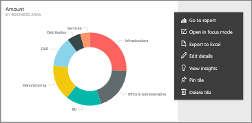
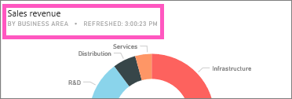
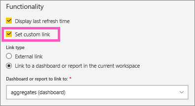

# Edit or remove a dashboard tile
You can change the look and default behavior of a tile in a dashboard.

<iframe width="560" height="315" src="https://www.youtube.com/embed/lJKgWnvl6bQ" frameborder="0" allowfullscreen></iframe>

This article covers the following.

* [Pin a tile to a different dashboard](#different)
* [Rename a tile](#rename)
* [Move a tile](#move)
* [Resize a tile](#resize)
* [Add a hyperlink to a tile](#hyperlink)
* [Delete a tile](#delete)
  
  > [!TIP]
  > To change the visualization shown on the tile itself, delete the tile and add a new [dashboard tile](powerbi-service-dashboard-tiles.md).
  > 
  > 

## How to begin
1. Open a [dashboard](powerbi-service-dashboards.md) that has at least one tile. 
   
   
2. Hover over a dashboard tile and select the ellipses to display the options.
   
   

## Pin the tile to a dashboard
1. Select the **Pin tile** icon  .
2. Decide whether to pin to an existing dashboard or to a new dashboard. 
   
   
3. Select **Pin**.

- - -

## Rename the tile and edit tile details
Select the Tile details icon     to edit the title and display last refresh time.

- - -

## Move the tile
Select and hold the tile to drag it to a new location on the dashboard canvas.

- - -

## Resize the tile
You can make tiles many different sizes -- from 1x1 tile units up to 5x5. Select and drag the handle  (in the bottom right corner) to resize the tile.
    

- - -

## Change the default hyperlink
By default, selecting a tile takes you to the report where the tile was created or to Q&A (if the tile was created in Q&A). To link to a webpage, another dashboard or report (in the same workspace), an SSRS report, or other online content - add a custom link:

1. Select the **Edit details** icon   to edit the tile.
2. Place a checkmark next to **Set custom link** and select the link type.    
   
   * For an external link, enter the URL.     
   * To link to a dashboard or report in the current workspace, select it from the dropdown menu.
   
   

- - -

## Delete the tile
* Select the **Delete tile** icon  to delete the tile. Deleting a tile does not delete the underlying report or visualization.

- - -
## Next steps
[Dashboard tiles in Power BI](powerbi-service-dashboard-tiles.md)

[Dashboards in Power BI](powerbi-service-dashboards.md)

[Power BI - Basic Concepts](service-basic-concepts.md)

More questions? [Try the Power BI Community](http://community.powerbi.com/)

