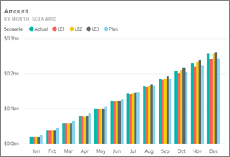
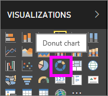
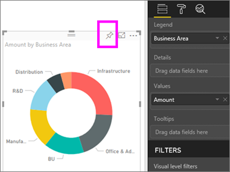
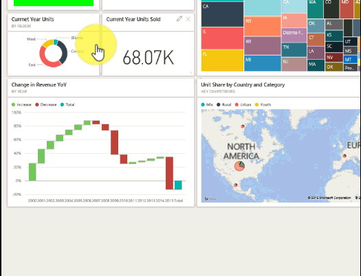
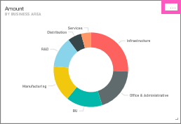
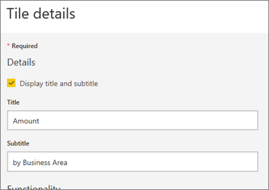
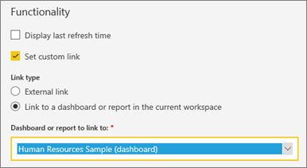
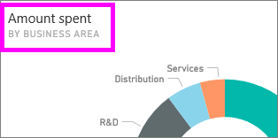

# Edit or remove a dashboard tile

## Dashboard *owners* versus dashboard *consumers*
When you create or own a dashboard, you have many options for changing the look and default behavior of the tiles on that dashboard. Use the settings and strategies below to design the dashboard *consuming* experience for your colleagues.  Will selecting a tile open the underlying report, a custom URL, or a different dashboard? Maybe you'll [add a tile that displays a video or streaming data](service-dashboard-add-widget.md)? And you might even want to [create a tile that has interactive slicers](service-dashboard-pin-live-tile-from-report.md). As a *creator* you have many options. 

<iframe width="560" height="315" src="https://www.youtube.com/embed/lJKgWnvl6bQ" frameborder="0" allowfullscreen></iframe>

This article covers the following.

* [Create a visualization and pin it to a dashboard](#create)
* [Move a tile](#move)
* [Resize a tile](#resize)
* [Rename a tile](#rename)
* [Add a hyperlink to a tile](#hyperlink)
* [Pin a tile to a different dashboard](#different)
* [Delete a tile](#delete)
  
 > [!TIP]
 > To change the visualization shown on the tile itself, delete the tile and add a new [dashboard tile](service-dashboard-tiles.md).
 > 

 ### Prerequisites
 1. To follow along, open Power BI service (not Power BI Desktop) and [download the IT Spend Analysis sample](sample-it-spend.md). When the "Success" message appears, select **Go to dashboard**

- - -

## Create a new visualization and pin it to the dashboard
1. From the IT Spend Analysis dashboard, select the "Amount" tile to open the report.

    

2. Open the report in Editing view by selecting **Edit report** from the top menubar.

3. Add a new report page by selecting the plus sign (+) at the bottom of the report.

    

4. From the FIELDS pane, select **Fact > Amount** and **Business Area > Business Area**.
 
5. From the VISUALIZATIONS pane, select the Donut chart icon to convert the visualization to a Donut chart.

    

5. Select the pin icon and pin the Donut chart to the IT Spend Analysis sample dashboard.

   

6. When the "Success"message appears, select **Go to dashboard**. You will be prompted to save your changes. Select **Save**.

- - -

## Move the tile
On the dashboard, locate the new tile. Select and hold the tile to drag it to a new location on the dashboard canvas.

- - -

## Resize the tile
You can make tiles many different sizes -- from 1x1 tile units up to 5x5. Select and drag the handle (in the bottom right corner) to resize the tile.

- - -
## The ellipses (...) menu

1. Select the ellipses (...) in the upper-right corner of the tile. 
   
   

2. Hover over the "Account" tile and select the ellipses to display the options. The options available will vary by tile type.  For example, the options available for a live tile are different from options available for a standard visualization tile. Also, if a dashboard has been shared with you (you are not the owner), you will have fewer options.

   

3. Select **Edit details** to open the "Tile details" window. 

    Change the title and default behavior of the tile.  For example, you may decide that when a *consumer* selects a tile, instead of opening the report that was used to create that tile, a new dashboard displays instead.  
   

### Rename the tile
At the top of the "Tile details" window, change **Title** to **Amount spent**.

### Change the default hyperlink
By default, selecting a tile usually takes you to the report where the tile was created or to Q&A (if the tile was created in Q&A). To link to a webpage, another dashboard or report (in the same workspace), an SSRS report, or other online content - add a custom link.

1. Under the Functionality heading, select **Set custom link**.

2. Select **Link to a dashboard or report in the current workspace** and then select from the dropdown.  In this example I've selected the Human Resources sample dashboard. If you don't have this sample already in your workspace, you can add it and come back to this step, or you can select a different dashboard. 

    

3. Select **Apply**.

4. The new title displays on the tile.  And, when you select the tile, Power BI opens the Human Resources dashboard. 

    

### Pin the tile to a different dashboard
1. From the ellipses dropdown menu, select **Pin tile**  .
2. Decide whether to pin a duplicate of this tile to an existing dashboard or to a new dashboard. 
   
   
3. Select **Pin**.

### Delete the tile
1. To permanently remove a tile from a dashboard, select  **Delete tile**  from the ellipses dropdown menu. 

2. Deleting a tile does not delete the underlying visualization. Open the underlying report by selecting the "Amount" tile. Open the last page in your report to see that the original visualization has not been deleted from the report. 

- - -
## Next steps
[Dashboard tiles in Power BI](service-dashboard-tiles.md)

[Dashboards in Power BI](service-dashboards.md)

[Power BI - Basic Concepts](service-basic-concepts.md)

More questions? [Try the Power BI Community](http://community.powerbi.com/)

