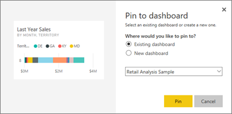
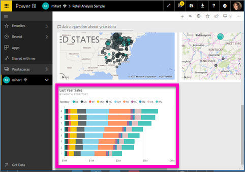

# Pin a tile to a dashboard from Q&A
## How to pin a tile from Q&A
Q&A is the Power BI ad hoc reporting tool. Need to find a particular insight? Ask a question about your data, and receive an answer in the form of a visualization.

In this How-to, we'll use Power BI service (app.powerbi.com) to open a dashboard, ask a question using natural language to create a visualization, and pin that visualization to a dashboard. Dashboards are not available in Power BI Desktop. For information on using Q&A with other Power BI tools and content, see the [Power BI Q&A overview](consumer/end-user-q-and-a.md). 

To follow along, open the [Retail Analysis sample dashboard](sample-retail-analysis.md).

1. Open a [dashboard](consumer/end-user-dashboards.md) that has at least one tile pinned from a report. When you ask a question, Power BI looks for the answer in any dataset that has a tile pinned to that dashboard.  To learn more, see [get data](service-get-data.md).
2. In the question box at the top of your dashboard, start typing what you want to know about your data.  
   
3. For example, as you type "last year sales by month and territory"...  
   

   the question box gives you suggestions.
4. To add the chart to your dashboard as a tile, select the pin  on the top-right side of the canvas. If the dashboard has been shared with you, you won't be able to pin any visualizations.

5. Pin the tile to an existing dashboard or to a new dashboard.

   

   * Existing dashboard: select the name of the dashboard from the dropdown. Your choices will be limited to only those dashboards within the current workspace.
   * New dashboard: type the name of the new dashboard and it will be added to your current workspace.

6. Select **Pin**.

   A success message (near the top-right corner) lets you know the visualization was added, as a tile, to your dashboard.  

   
7. Select **Go to dashboard** to see the new tile. There, you can [rename, resize, add a hyperlink, reposition the tile, and more](service-dashboard-edit-tile.md) on your dashboard.

   

## Considerations and troubleshooting
* When you start typing a question, Q&A immediately begins searching for the best answer from all datasets associated with the current dashboard.  The "current dashboard" is the dashboard listed in the top navigation bar. For example, this question is being asked in the **Retail Analysis Sample** dashboard that is part of the **mihart** app workspace.

  
* **How does Q&A know which datasets to use**?  Q&A has access to all datasets that have at least one visualization pinned to that dashboard.

* **Don't see the question box**? Check with your Power BI administrator. The administrator has the ability to disable Q&A.

## Next steps
[Rename, resize, add a hyperlink, reposition the tile, and more](service-dashboard-edit-tile.md)    
[Display your dashboard tile in Focus mode](consumer/end-user-focus.md)     
[Back to Q&A in Power BI](consumer/end-user-q-and-a.md)  
More questions? [Try the Power BI Community](http://community.powerbi.com/)
