# Use Dashboard Themes in Power BI service
With **Dashboard Themes** you can apply a color theme to your entire dashboard, such as corporate colors, seasonal coloring, or any other color theme you might want to apply. When you apply a **Dashboard Theme**, all visuals on your dashboard use the colors from your selected theme (a few exceptions apply, described later in this article).

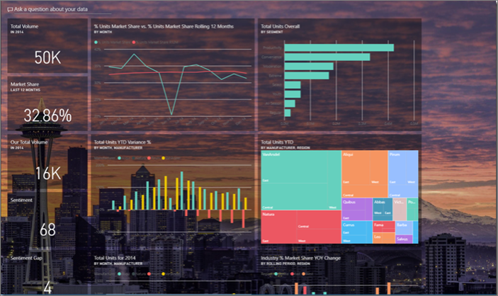

Changing the colors of the report visuals on the dashboard will not affect the visuals in the report. Also, when you pin tiles from a report that already has a [report theme applied](/desktop-report-themes.md), you'll have the choice to keep the current theme or use the dashboard theme.

## Prerequisites
* To follow along, open the [Sales and Marketing sample dashboard](sample-datasets.md).

## How Dashboard Themes work
To get started, open a dashboard that you created (or have edit permission) and want to customize. Select the ellipsis (...), and choose **Dashboard theme**. 

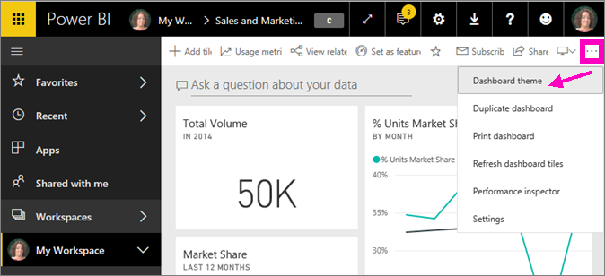

In the dashboard pane that appears, select one of the pre-built themes.  In the example below, we've selected **Dark**.

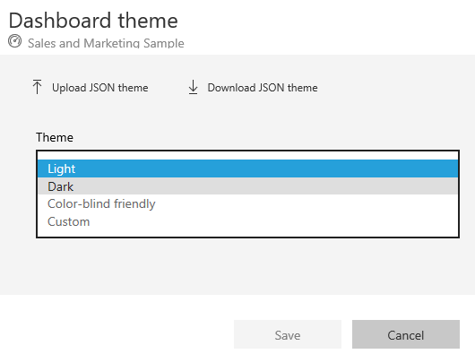

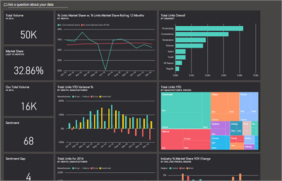

## Create a custom theme

The default theme for Power BI dashboards is **Light**. If you want to customize the colors or create your own theme, select **Custom** in the drop-down. 

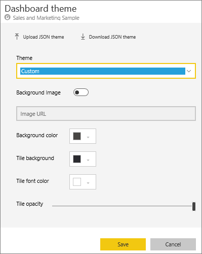

Use the custom options to create your own dashboard theme. If adding a background image, we recommend that your image be at least 1920x1080 resolution.  

### Using JSON themes
Another way to create a custom theme is to upload a JSON file that has settings for all the colors you'd like to use for your dashboard. In Power BI Desktop, report creators use JSON files to [create themes for reports](desktop-report-themes.md). These same JSON files can be uploaded for dashboards or you can find and upload JSON files from the [Theme gallery page](https://community.powerbi.com/t5/Themes-Gallery/bd-p/ThemesGallery) in the Power BI Community 

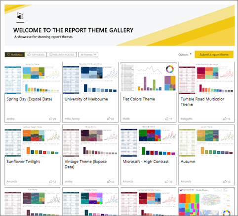

You can also save your custom theme as a JSON file and then share it with other dashboard creators. 

### Use a theme from the Theme Gallery

Like the built-in and custom options, when the theme is uploaded, the colors will automatically be applied to all tiles on the dashboard. 

1. Hover over a theme and choose **View report**.

    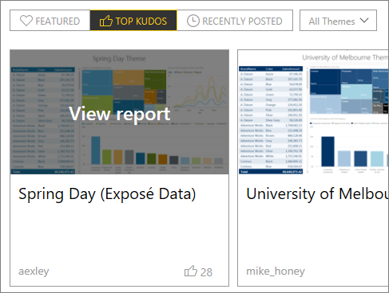

2. Scroll down and find the link to the JSON file.  Select the download icon and save the file.

    

3. Back in Power BI service, in the Custom Dashboard theme window, select **Upload JSON theme**.

    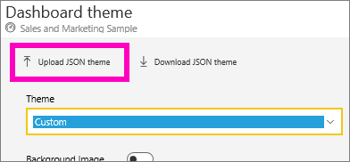

4. Navigate to the location where you saved the JSON theme file and select **Open**.

5. On the Dashboard theme page, select **Save**. The new theme is applied to your dashboard.

    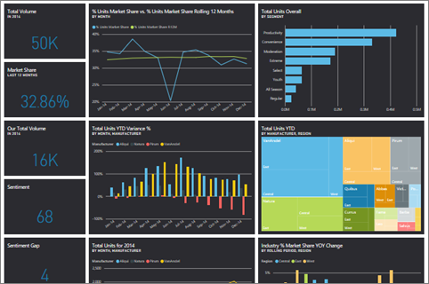

## Considerations and limitations

* If your report is using a different theme from the dashboard theme, you can control whether the visual retains current theme, or uses the dashboard theme to achieve consistency across visuals from various sources. When pinning a tile to a dashboard, to keep the report theme, select **Keep current theme**. The visual, on the dashboard, will retain the report theme, including transparency settings. 

    The only time you'll see **Tile Theming** options is if you created the report in Power BI Desktop, [added a report theme](desktop-report-themes.md), and then published the report to Power BI service. 

    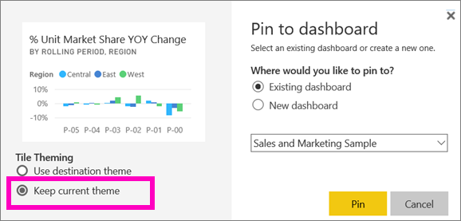

    Try re-pinning the tile and selecting **Use dashboard theme**.

    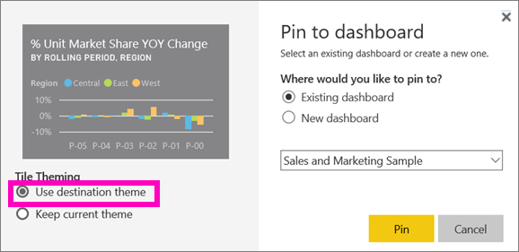

* Dashboard themes are currently not supported when viewing the dashboard embedded using the REST API, on mobile devices, or by external users.    
* Dashboard themes cannot be applied to pinned live report pages, iframe tiles, SSRS tiles, workbook tiles, or images.
* Dashboard themes can be viewed on mobile devices but creating a dashboard theme can only be done in Power BI service. 
* Dashboard custom themes only work with tiles pinned from reports. 

