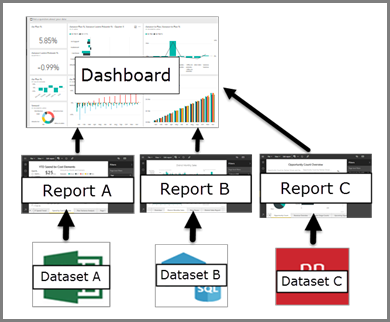

# Dashboards in Power BI service

A Power BI ***dashboard*** is a single page, often called a canvas, that uses visualizations to tell a story. Because it is limited to one page, a well-designed dashboard contains only the most-important elements of that story.

Dashboards are a feature of Power BI service and are not available in Power BI Desktop. Dashboards can't be created on mobile devices but they can be [viewed and shared](mobile-apps-view-dashboard.md).

## Dashboard creators and dashboard consumers
Depending on your role, you may be someone who creates dashboards for your own use or to share with colleagues. Information for you can be found in **Dashboards for creators**. If you're someone who receives dashboards from others. You want to learn how to understand and interact with the dashboard. This article is for you!

### If you will be receiving and consuming dashboards

The visualizations you see on the dashboard are called *tiles* and are *pinned* to the dashboard, from reports, by dashboard *creators*. If you're new to Power BI, you can get a good foundation by reading [Power BI basic concepts](service-basic-concepts.md).

> [!IMPORTANT]
> [Power BI Pro](service-free-vs-pro.md) is required for viewing a shared dashboard.

The visualizations on a dashboard come from reports and each report is based on one dataset. In fact, one way to think of a dashboard is as an entryway into the underlying reports and datasets. Selecting a visualization takes you to the report (and dataset) that was used to create it.

## Advantages of dashboards
Dashboards are a wonderful way to monitor your business, to look for answers, and to see all of your most-important metrics at a glance. The visualizations on a dashboard may come from one underlying dataset or many, and from one underlying report or many. A dashboard combines on-premises and cloud-born data, providing a consolidated view regardless of where the data lives.

A dashboard isn't just a pretty picture; it's highly interactive and the tiles update as the underlying data changes.

## Dashboards versus reports
[Reports](service-reports.md) are often confused with dashboards since they too are canvases filled with visualizations. But there are some major differences for Power BI consumers.

| **Capability** | **Dashboards** | **Reports** |
| --- | --- | --- |
| Pages |One page |One or more pages |
| Data sources |One or more reports and one or more datasets per dashboard |A single dataset per report |
| Available in Power BI Desktop |No |Yes, ***creators*** can build and view reports in Desktop |
| Subscribe |Can subscribe to a dashboard |Can subscribe to report pages |
| Filtering |Can't filter or slice |Many different ways to filter, highlight, and slice |
| Featured |Can set one dashboard as your "featured" dashboard |Cannot create a featured report |
| Favorite | Can set dashboards as *favorites* | Can set reports as *favorites*
| Set alerts |Available for dashboard tiles in certain circumstances |Not available from reports |
| Natural language queries |Available from dashboard |Not available from reports |
| Can see underlying dataset tables and fields |No. Can export data but can't see tables and fields in the dashboard itself. |Yes. Can see dataset tables and fields and values. |
| Customization |No |In Reading view you can publish, embed, filter, export, download as .pbix, view related content, generate QR codes, analyze in Excel, and more.  |

## Next steps
* Get comfortable with dashboards by taking a tour of one of our [sample dashboards](sample-tutorial-connect-to-the-samples.md).
* Learn about [dashboard tiles](service-dashboard-tiles.md) and what will happen when you select one.
* Want to track an individual dashboard tile and receive an email when it reaches a certain threshold? [Create alerts on tiles](service-set-data-alerts.md).
* Have fun asking your dashboard questions. Learn how to use [Power BI Q&A](power-bi-tutorial-q-and-a.md) to ask a question about your data and get the answer in the form of a visualization.
