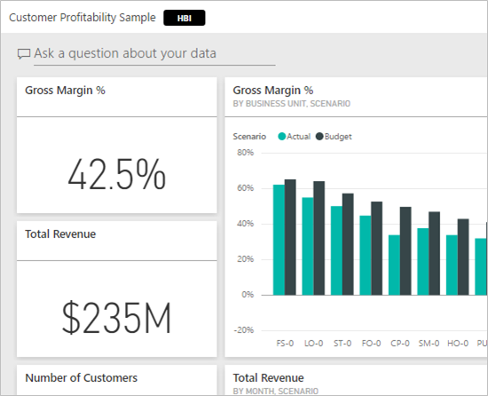
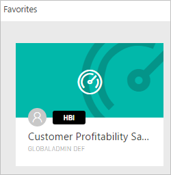
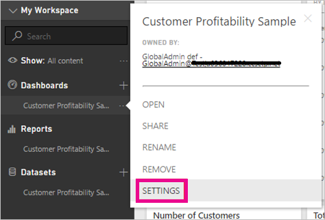
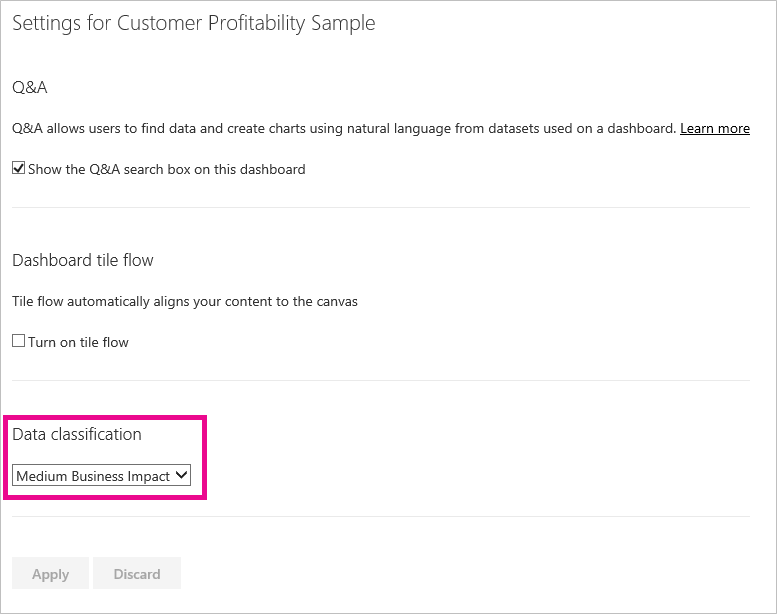
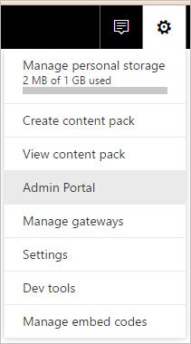
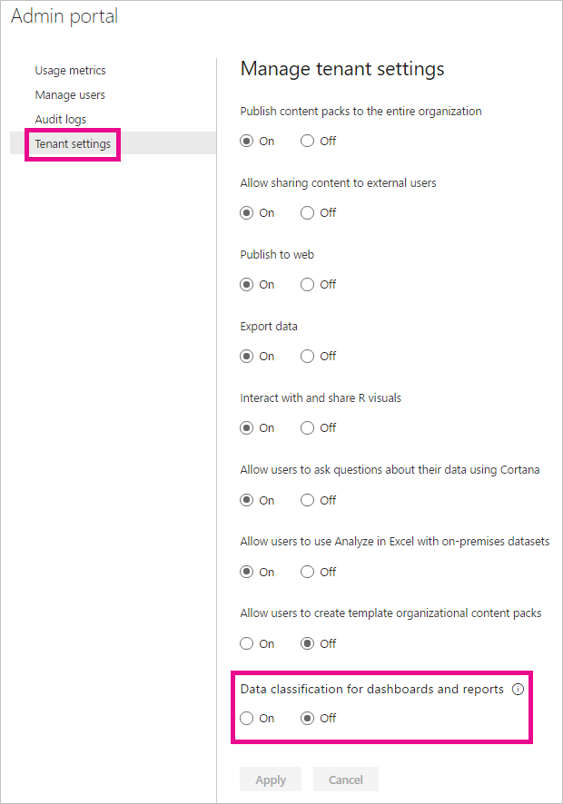
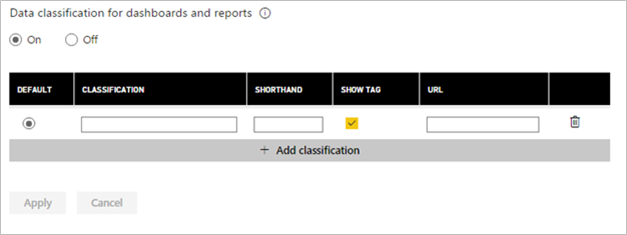
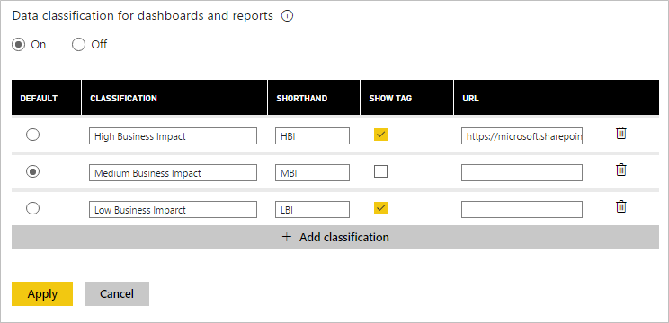

# Dashboard data classification
Every dashboard is different, and depending on the data source you are connecting to, you will likely find that you and the colleagues you share with will need to take different precautions depending on the sensitivity of the data. Some dashboards should never be shared with those outside your company or printed out, while others can be shared freely. By using dashboard data classification, you will be able to raise awareness with those viewing your dashboards about what level of security should be used. You can tag your dashboards with classifications defined by your company’s IT department, so everyone viewing the content will have the same level of understanding around the sensitivity of the data.

## Data classification tags
Data classification tags show up next to the dashboard name, letting anyone viewing it know the level of security that should be applied to the dashboard and the data it contains.

It will also show up next to the dashboard tile in your Favorites list.

When you hover over the tag, you will see the full name of the classification.

Admins can also set an URL for a tag to provide additional information.

> [!NOTE]
> Depending the classification settings set by your admin, some classification types may not show as a tag on the dashboard. If you are a dashboard owner, you can always check your dashboard classification type under the dashboard settings.
> 
> 

## Setting a dashboard’s classification
If data classification is turned on for your company, all dashboards start out with a default classification type, but as a dashboard owner, you can change the classification to match your dashboards security level.

To change the classification type, do the following.

1. Go to the dashboard settings by selecting the **ellipsis** next to the dashboard name and select **Settings**.
   
    
2. Under Dashboard settings, you will be able to see the current classification for your dashboard and use the drop down to change the classification type.
   
    
3. Select **Apply** when finished.

After you apply the change, anyone you shared with will see the update the next time they reload the dashboard.

## Working with data classification tags as an admin
Data classification is set up by the global admin for your organization. To turn data classification on, do the following.

1. Select the Settings gear and select **Admin Portal**.
   
    
2. Switch **Data classification for dashboards and reports** to *on* within the **Tenant settings** tab.
   
    

Once turned on, you will be presented with a form to create the various classifications in your organization.

Each classification has a **name** and a **shorthand** which will appear on the dashboard. For each classification, you can decide if the shorthand tag will appear on the dashboard or not by selecting **Show tag**. If you decide not to show the classification type on the dashboard, the owner will still be able to see the type by checking the dashboard settings. Additionally, you can optionally add a **URL** that contains more information about your organization’s classification guidelines and usage requirements.  

The last thing you need to decide is which classification type will be the default.  

Once you fill in the form with your classification types, select **Apply** to save the changes.

At this point, all dashboards will be assigned the default classification, and dashboard owners will now be able to update the classification type to the one appropriate for her content. You can return here in the future to add or remove classification types or change the default.  

> [!NOTE]
> There are a few important things to remember when you come back to make changes:
> 
> * If you turn data classification off, none of the tags are remembered. You will need to start over if you decide to turn it back on later.  
> * If you remove a classification type, any dashboards assigned the removed classification type will be assigned back to the default until the owner goes and sets it again.  
> * If you change the default, all dashboards that weren’t already assigned a classification type by the owner will change to the new default.
> 
> 

