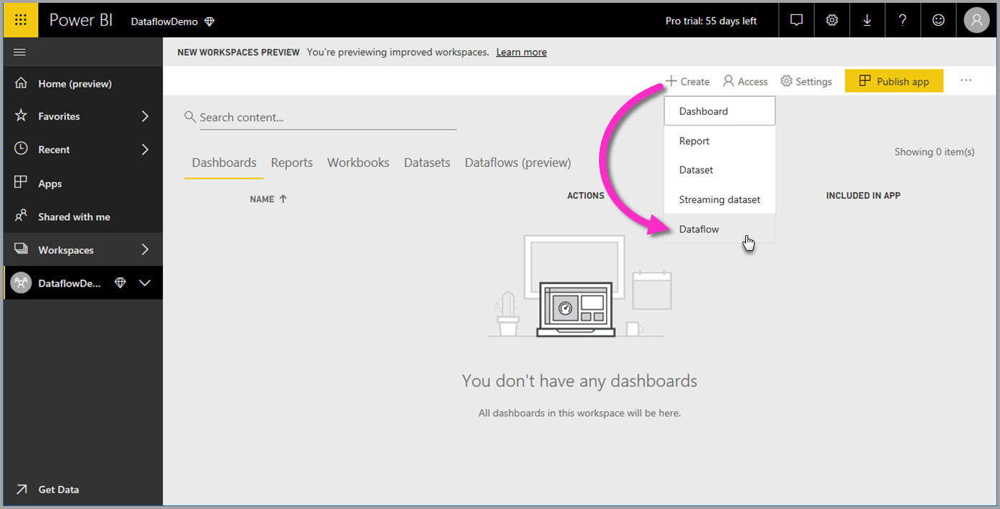
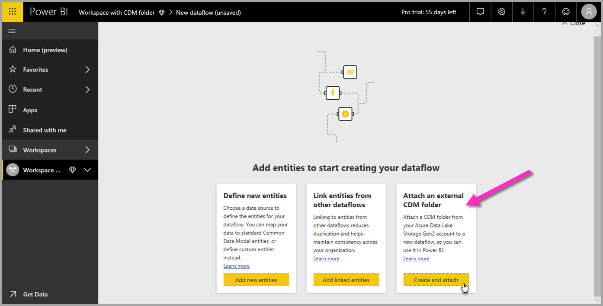

# Add a CDM folder to Power BI as a dataflow (Preview)

In Power BI, you can add Common Data Model (CDM) folders stored in your organization's Azure Data Lake Store Gen2 as dataflows. And once you create a dataflow from a CDM folder, you can use **Power BI Desktop** and the **Power BI service** to create datasets, reports, dashboards, and apps that are based on the data you put into CDM folders.

There are a few requirements for creating dataflows from CDM folders, as the following list describes:

* Creating dataflows from CDM folders is *only* available in the [new workspace experience](service-create-the-new-workspaces.md). 
* Adding a CDM folder to Power BI requires the user adding the folder to have [authorization for the CDM folder and its files](https://go.microsoft.com/fwlink/?linkid=2029121).
* You must be granted read and execute permissions, on all files and folders in the CDM folder, to add them to Power BI.

The following sections describe how to create a dataflow from a CDM folder.

## Create a dataflow from a CDM folder

To get started creating a dataflow from a CDM folder, launch the **Power BI service** and select an **app workspace** from the left navigation pane. You can also create a new workspace, in which you can create your new dataflow.

In the screen that appears, select to **Create and attach** as shown in the following image.

The screen that appears next lets you name your dataflow, provide a description of the dataflow, and provide the path to the CDM folder in your organization's Azure Data Lake Gen2 account. Read the section in the article that describes [how to get your CDM folder path](service-dataflows-configure-workspace-storage-settings.md#get-the-uri-of-stored-dataflow-files). 

Once you've provided the information, select **Create and attach** to create the dataflow.

Dataflows from CDM folders are marked with *external* icon when displayed in Power BI. In the next section, we describe differences between standard dataflows, and dataflows created from CDM folders.

Once permissions are properly set, as described previously in this article, you can connect to your dataflow in **Power BI Desktop**.

## Considerations and limitations

When working with permissions to a dataflow created from a CDM folder, the process is similar to external datasources in Power BI. Permissions are managed at the data source, and not from within Power BI. Permissions must be set appropriately on the data source itself, such as a dataflow created from a CDM folder, in order to work properly with Power BI.

The following lists help clarify how dataflows from CDM folders operate with Power BI.

Power BI Pro, Premium and Embedded workspaces:
* Dataflows from CDM folders cannot be edited
* Permissions to read a dataflow created from a CDM folder is managed by the owner of the CDM folder, and not by Power BI

Power BI Desktop:
* Only users who are authorized to both the workspace in which the dataflow was created, and the CDM folder, can access its data from the Power BI Dataflows connector

There are some additional considerations as well, described in the following list:

* Creating dataflows from CDM folders is *only* available in the [new workspace experience](service-create-the-new-workspaces.md)
* Linked entities is not available for dataflows created from CDM folders

**Power BI Desktop** customers cannot access dataflows stored in Azure Data Lake Storage Gen2 account, unless they are the owner of the dataflow, or they have been explicitly authorized to the dataflow’s CDM folder. Consider the following situation:

1.	Anna creates a new app workspace and configures it to store dataflows from a CDM folder.
2.	Ben, who is also a member of the workspace Anna created, wants to use Power BI Desktop and the dataflow connector to get data from the dataflow Anna created.
3.	Ben receives an error because he was not added as an authorized user to the dataflow’s CDM folder in the data lake.

    

To resolve this issue, Ben must be granted reader permissions to the CDM Folder and its files. You can learn more about how to grant access to the CDM Folder in [this article](https://go.microsoft.com/fwlink/?linkid=2029121).

## Next Steps

This article provided guidance on how to configure workspace storage for dataflows. For additional information, take a look at the following articles:

For more information about dataflows, CDM, and Azure Data Lake Storage Gen2, take a look at the following articles:

* [Dataflows and Azure Data Lake integration (Preview)](service-dataflows-azure-data-lake-integration.md)
* [Configure workspace dataflow settings (Preview)](service-dataflows-configure-workspace-storage-settings.md)
* [Connect Azure Data Lake Storage Gen2 for dataflow storage (Preview)](service-dataflows-connect-azure-data-lake-storage-gen2.md)

For information about dataflows overall, check out these articles:

* [Create and use dataflows in Power BI](service-dataflows-create-use.md)
* [Using computed entities on Power BI Premium](service-dataflows-computed-entities-premium.md)
* [Using dataflows with on-premises data sources](service-dataflows-on-premises-gateways.md)
* [Developer resources for Power BI dataflows](service-dataflows-developer-resources.md)

For more information about Azure storage, you can read these articles:
* [Azure Storage security guide](https://docs.microsoft.com/azure/storage/common/storage-security-guide)
* [Configuring scheduled refresh](refresh-scheduled-refresh.md)
* [Get started with github samples from Azure Data Services](https://aka.ms/cdmadstutorial)

For more information about the Common Data Model, you can read its overview article:
* [Common Data Model - overview ](https://docs.microsoft.com/powerapps/common-data-model/overview)
* [CDM folders](https://go.microsoft.com/fwlink/?linkid=2045304)
* [CDM model file definition](https://go.microsoft.com/fwlink/?linkid=2045521)

And you can always try [asking questions of the Power BI Community](http://community.powerbi.com/).

