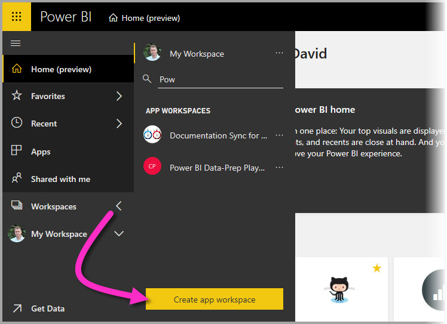
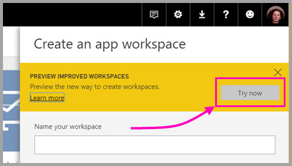
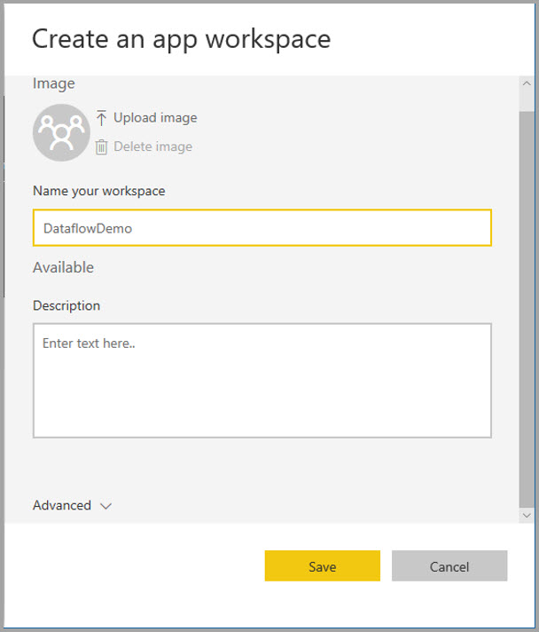
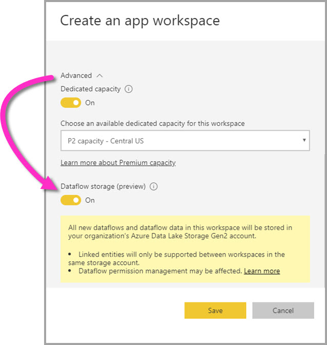
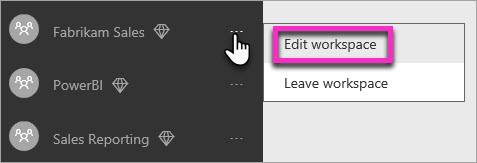
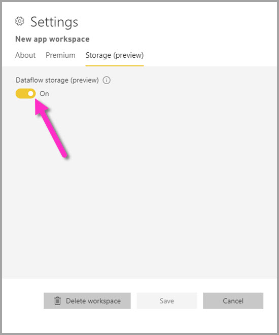
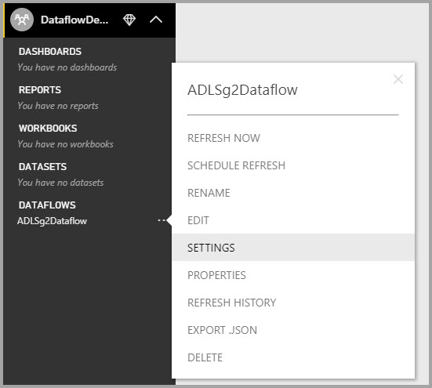

# Configure workspace dataflow settings (Preview)

With Power BI and dataflows, you can store a workspace's dataflow definition file and data files in your Azure Data Lake Store Gen2 account. Your administrator must configure Power BI to do so, and this article walks through the steps necessary to get there. 

To configure a workspace’s dataflow storage location, you must connect your organization’s storage account to Power BI, and enable storage assignment permissions to that storage account. 
These settings require admin permissions for the workspace. 

There are two ways to configure the workspace dataflow storage settings: 

* During creation of the workspace
* By editing an existing workspace

We'll take a look at each in the following sections. 

> [!IMPORTANT]
> The workspace dataflow storage setting can only be changed if the workspace doesn't contain any dataflows. Also, this feature is only available in the new workspace experience. You can learn more about new workspace in the [Create the new workspaces (preview) in Power BI](service-create-the-new-workspaces.md) article.

## Create a new workspace, configure its dataflow storage

To create a new app workspace in the Power BI service, select **Worksapces > Create app workspace**.

In the Create an app workspace dialog, a yellow box may appear that's titled **Preview improved workspaces**. In that area select **Try now**.

In the dialog that appears, you can give your new workspace a unique name. Don't select **Save** yet, since you need to make advanced settings.

Next, expand the **Advanced** area of the **Create an app workspace** dialog, where you can turn on the **Dataflow storage (preview)** setting.)

Select **Save** to create your new workspace. Any new dataflow created in this workspace now stores its definition file (its Model.json file) and data in your organization's Azure Data Lake Store Gen2 account. 

> [!NOTE]
> the dataflows functionality is in preview, and is subject to change and updates prior to general availability.

## Update dataflow storage for an existing workspace

Alternatively to creating a new workspace, you can update an existing workspace to store the definition file and data in your organization's Azure Data Lake Store Gen2 account. Remember that the dataflow sotrage setting can only be changed if the workspace doesn't already contain a dataflow.

To edit an app workspace, select the elipsis **(...)** then select **Edit workspace**. 

In the **Edit workspace** window that appears, expand **Advanced**, then turn the **Dataflow storage (preview)** setting to **On**. 

Then select **Save**, and any new dataflow created in that workspace stores its definition file and data in your organization's Azure Data Lake Store Gen2 account.

## Get the URI of stored dataflow files

Once you create a dataflow in a workspace that's assigned to your organization’s Azure Data Lake account, you can access its definition and data files directly. Their location is available in the **Dataflow settings** page. To get there, follow these steps:

Select the ellipsis **(...)** next to a dataflow listed under **Dataflows** in the workspace. In the menu that appears, select **Settings**.

In the information that's displayed, the dataflow's CDM foloder location appears under **Dataflow Storage location**, as shown in the following image.

> [!NOTE]
> Power BI configures the dataflow owner with reader permissions to the CDM folder where dataflow files are stored. Granting access to other people or services to the dataflow storage location requires the owner of the storage account to grant access in Azure.

## Considerations and limitations

Certain dataflow features aren't supported when dataflow storage is in Azure Data Lake Store Gen2: 

Power BI Pro, Premium and Embedded workspaces:
* The **linked entities** feature is only supported among workspaces in the same storage account
* Workspace permissions do not apply to dataflows stored in Azure Data Lake Store Gen2; only the owner of the dataflow can access it.
* Otherwise, all data prep features are the same as for dataflows stored in Power BI storage

There are some additional considerations as well, described in the following list:

* Once a dataflow storage location is configured, it cannot be changed.
* By default, only owners of a dataflow stored in Azure Data Lake Storage Gen2 can access its data. To authorize additional users, you must add them to the dataflow’s CDM folder 
* Creating dataflows with linked entities is only possible when the workspaces are stored in the same storage account
* On-premises data sources, in Power BI Shared capacities, are not supported in dataflows stored in your organization’s Azure Data Lake Storage Gen2

**Power BI Desktop** customers cannot access dataflows stored in Azure Data Lake Storage Gen2 account, unless they are the owner of the dataflow, or they have been explicitly authorized to the dataflow’s CDM folder. Consider the following situation:

1.	Anna creates a new app workspace and configures it to store dataflows in the organization’s data lake.
2.	Ben, who is also a member of the workspace Anna created, wants to use Power BI Desktop and the dataflow connector to get data from the dataflow Anna created.
3.	Ben receives an error because he was not added as an authorized user to the dataflow’s CDM folder in the data lake.

    

To resolve this issue, Ben must be granted reader permissions to the CDM Folder and its files. You can learn more about how to grant access to the CDM Folder in [this article](https://go.microsoft.com/fwlink/?linkid=2029121).

## Next Steps

This article provided guidance on how to configure workspace storage for dataflows. For additional information, take a look at the following articles:

For more information about dataflows, CDM, and Azure Data Lake Storage Gen2, take a look at the following articles:

* [Dataflows and Azure Data Lake integration (Preview)](service-dataflows-azure-data-lake-integration.md)
* [Add a CDM folder to Power BI as a dataflow (Preview)](service-dataflows-add-cdm-folder.md)
* [Connect Azure Data Lake Storage Gen2 for dataflow storage (Preview)](service-dataflows-connect-azure-data-lake-storage-gen2.md)

For information about dataflows overall, check out these articles:

* [Create and use dataflows in Power BI](service-dataflows-create-use.md)
* [Using computed entities on Power BI Premium (Preview)](service-dataflows-computed-entities-premium.md)
* [Using dataflows with on-premises data sources (Preview)](service-dataflows-on-premises-gateways.md)
* [Developer resources for Power BI dataflows (Preview)](service-dataflows-developer-resources.md)

For more information about Azure storage, you can read these articles:
* [Azure Storage security guide](https://docs.microsoft.com/azure/storage/common/storage-security-guide)
* [Configuring scheduled refresh](refresh-scheduled-refresh.md)
* [Get started with github samples from Azure Data Services](https://aka.ms/cdmadstutorial)

For more information about the Common Data Model, you can read its overview article:
* [Common Data Model - overview ](https://docs.microsoft.com/powerapps/common-data-model/overview)
* [CDM folders](https://go.microsoft.com/fwlink/?linkid=2045304)
* [CDM model file definition](https://go.microsoft.com/fwlink/?linkid=2045521)

And you can always try [asking questions of the Power BI Community](http://community.powerbi.com/).