# Creating and using dataflows in Power BI

With advanced data preparation available in **Power BI**, you can create a collection of data called a dataflow, which you can then use to connect with business data from various sources, clean the data, transform it, and then load it to Power BI storage.

A **dataflow** is a collection of *entities* (entities are similar to tables) that are created and managed in workspaces in the Power BI service. You can add and edit entities in your dataflow, as well as manage data refresh schedules, directly from the workspace in which your dataflow was created.

Once you create a dataflow, you can use **Power BI Desktop** and the **Power BI service** to create datasets, reports, dashboards, and apps that are based on the data you put into Power BI dataflows, and thereby gain insights into your business activities.

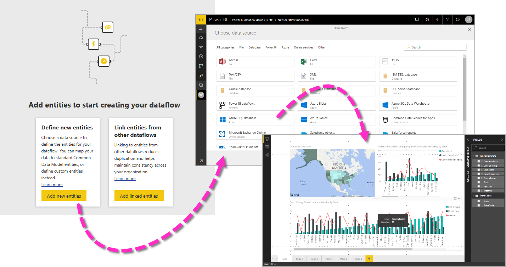

There are three primary steps to using a dataflow:

1. Author the dataflow, using Microsoft tools that are designed to make doing so straightforward
2. Schedule the refresh frequency of the data you want to bring into your dataflow
3. Build the dataset using your dataflow, using Power BI Desktop 

In the following sections, we look at each of these steps and become familiar with the tools provided to complete each step. Let’s get started.

## Creating a dataflow
To create a dataflow, launch the Power BI service in a browser then select a **workspace** (dataflows are not available in *my-workspace* in the Power BI service) from the navigation pane on the left, as shown in the following screen. You can also create a new workspace in which to create your new dataflow. 

Once you’re in an **workspace** area where you can create a dataflow, the **+ Create** button appears in the upper-right corner of the canvas. Select the **+ Create** button, then select **Dataflow** from the drop-down list. 

It's important to know that there is only *one owner* of any dataflow, which is the person who creates it. Only the owner can edit the dataflow. All members of the **workspace** who have read or write permissions to the workspace where the dataflow is created can connect to the dataflow from within **Power BI Desktop**, as described later in this article.

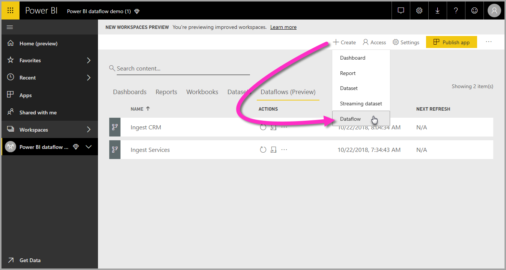

From there, you add **Entities**, which we describe more in the next section.

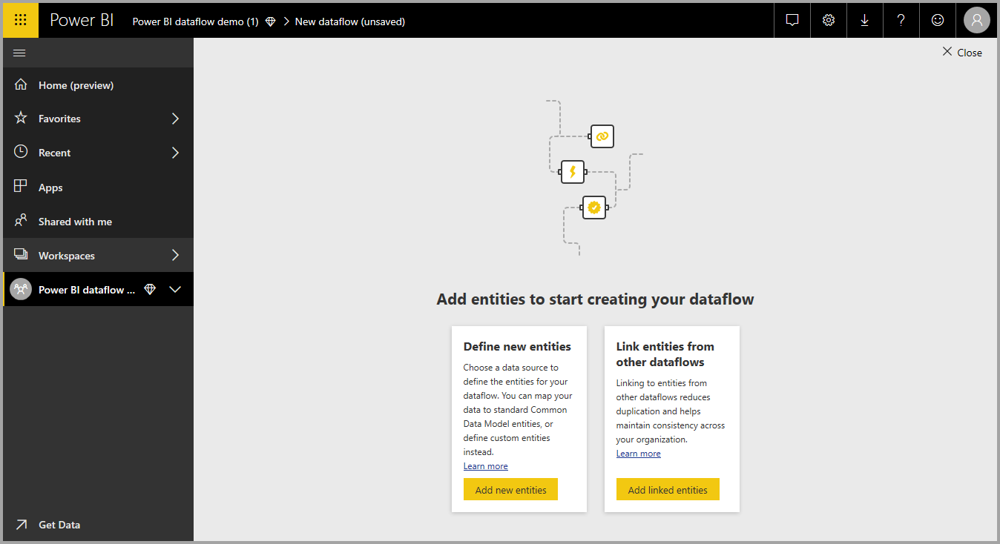

### Add Entities

An **entity** is a set of fields that are used to store data, much like a table within a database. 
In the following image, you see the selection of data sources from which you can ingest data to Power BI.

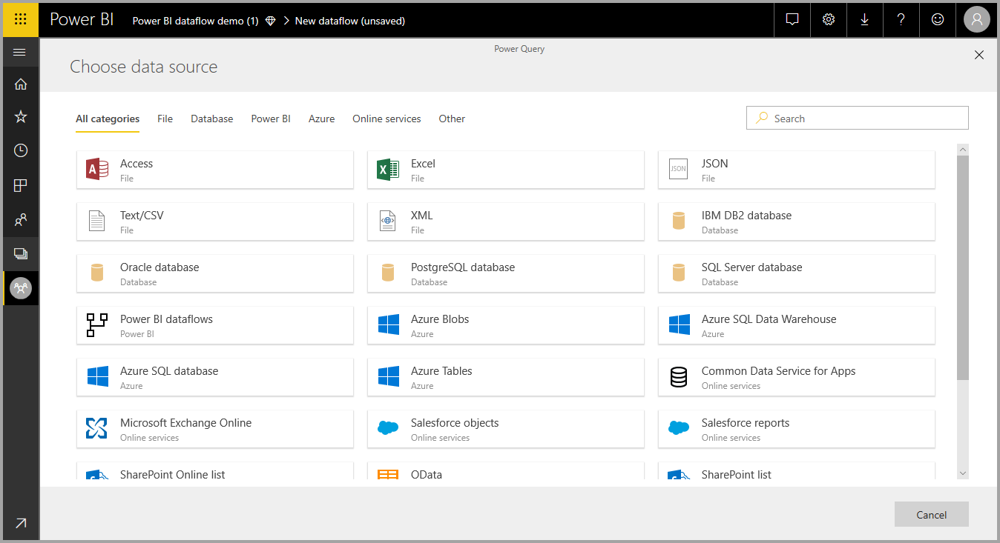

When you select a data source, you’re prompted to provide the connection settings, including the account to use when connecting to the data source, as shown in the following image.

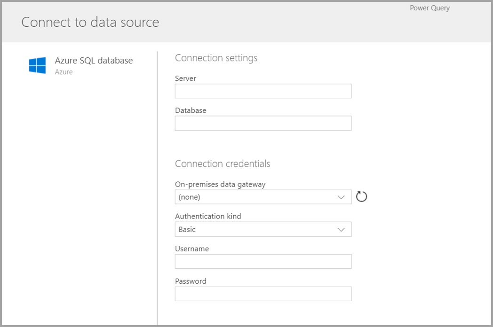

Once connected, you can select which data to use for your entity. When you choose data and a source, Power BI will subsequently reconnect to the data source in order to keep the data in your dataflow refreshed, at the frequency you select later in the setup process.

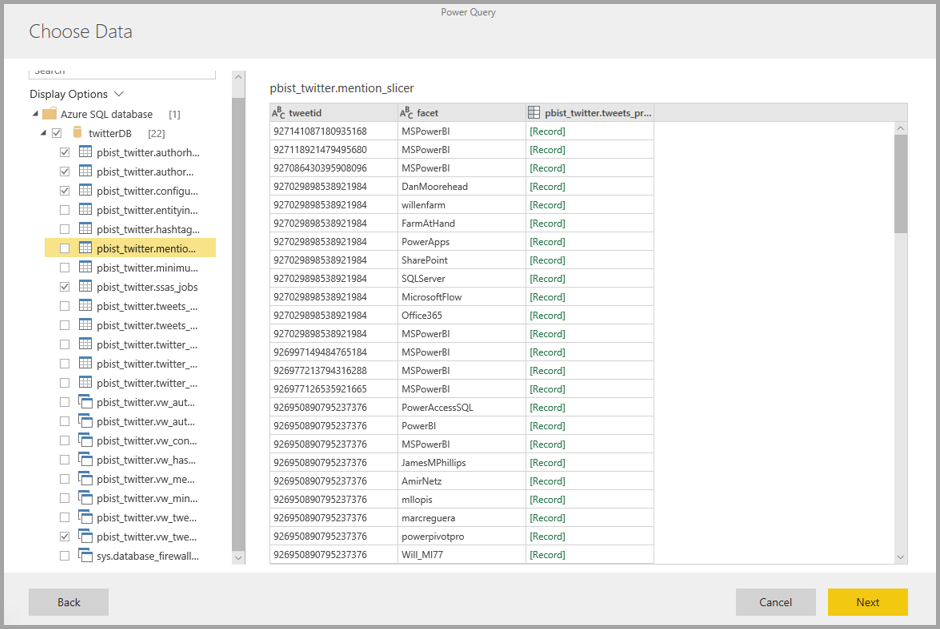

Once you select the data for use in the entity, you can use dataflow editor to shape or transform that data into the format necessary for use in your dataflow.

### Using the dataflow editor

Once you select which data from your source to use for your entity, you can shape your data selection into a form that works best for your entity, using a Power Query editing experience, similar to the **Power Query Editor** in **Power BI Desktop**. You can learn more about Power Query (Power Query is incorporated into Power BI Desktop as the Power Query Editor) in the [Query overview article](desktop-query-overview.md) for Power BI Desktop. 

If you want to see the code that Query Editor is creating with each step, or want to create your own shaping code, you can use the **Advanced Editor**. 

### Dataflows and the Common Data Model (CDM)

Dataflows entities include new tools to easily map your business data to the Common Data Model (Microsoft’s standardized schema), enrich it with Microsoft and third-party data, and gain simplified access to machine learning. These new capabilities can be leveraged to provide intelligent and actionable insights into your business data. Once you’ve completed any transformations in the Edit Queries step, you can map columns from your data source tables to standard entity fields as defined by the Common Data Model. Standard entities have a known schema defined by the common data model.

Get more information about this approach, and about the Common Data Model, from the [what is the Common Data Model](https://docs.microsoft.com/powerapps/common-data-model/overview) article.

To leverage the Common Data Model with your dataflow, click on the **Map to Standard** transformation in the **Edit Queries** dialog. In the **Map Entities** screen that appears, you can select the standard entity to which you want to map.

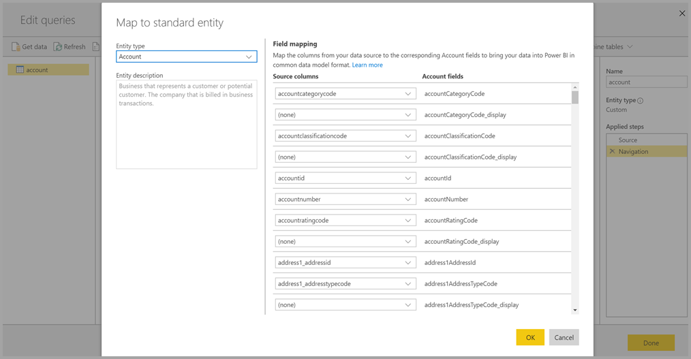

When you map a source column to standard field, the following occurs:

1. The source column takes on the standard field name (the column is renamed if the names are different)
2. The sources column gets the standard field data type

To keep the Common Data Model standard entity, all standard fields that are not mapped get *Null* values.

All source columns that are not mapped remain as-is, to ensure that the result of the mapping is a standard entity with custom fields.

Once you’ve completed your selections and your entity and its data settings are ready to save, you can select **Save** from the menu. Note that you can create multiple entities by selecting the **Add entities** button, and that you can Edit entities to refine the queries and entities you’ve created.

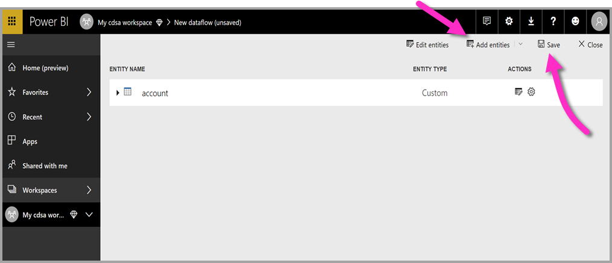

When you select **Save**, you're prompted to name your dataflow and provide a description.

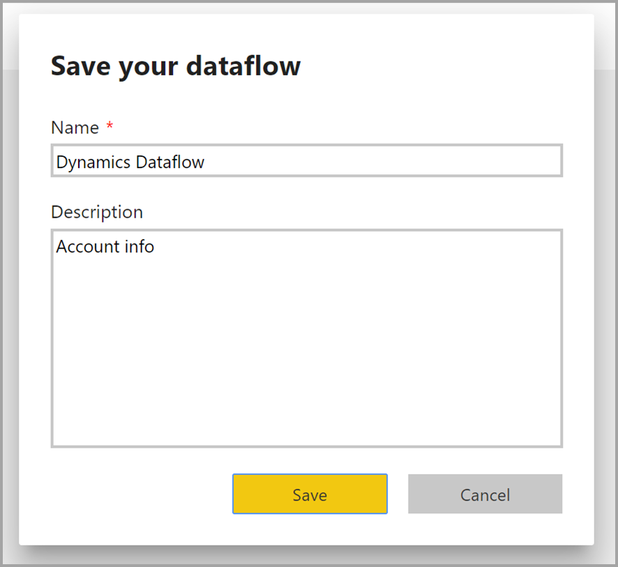

When you’re ready and select the **Save** button, a window appears that lets you know your **dataflow** has been created. 

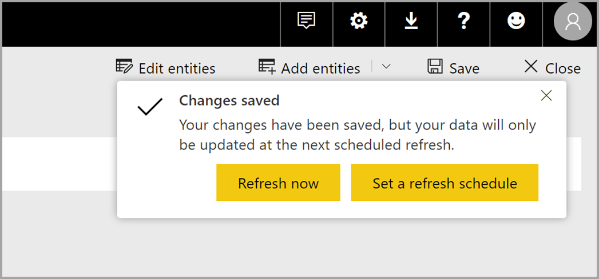

Great – now you’re ready for the next step, which is scheduling the refresh frequency of your data sources.

## Schedule the refresh frequency

Once your dataflow has been saved, you’ll want to schedule the refresh frequency for each of your connected data sources.

Power BI dataflows use the Power BI data refresh process to keep your data up to date. In the **Power BI service**, in the **workspace** section, there's a collection of areas where your information can be listed, including dataflows, as shown in the following image.

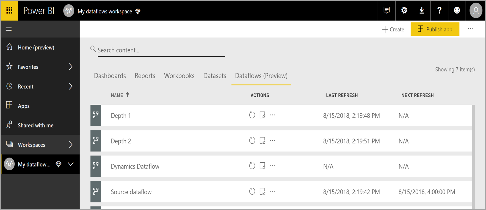

The *Dynamics dataflow* entry in the previous image is the dataflow we created in the previous section. To schedule refresh, select the **Schedule refresh** icon, under the **Actions** section, as shown in the following image. 

When you select the **Schedule refresh** icon you’re taken to the **Schedule refresh** pane, which lets you set the dataflow refresh frequency and time.

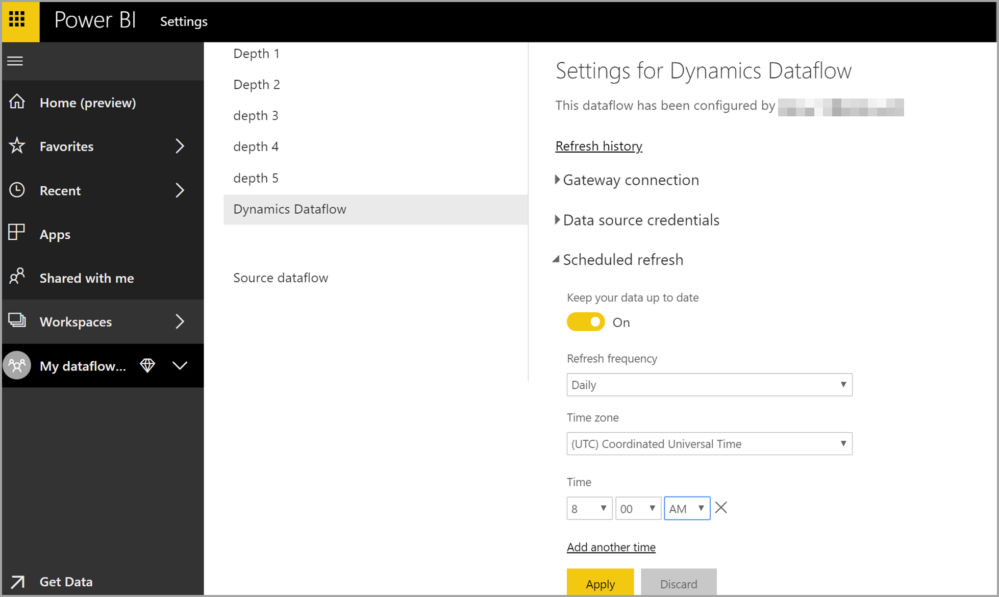

For more information about scheduling refresh, see the article about [configuring scheduled refresh](refresh-scheduled-refresh.md), which describes the refresh behavior of Power BI datasets. Dataflows behave the same behavior as Power BI datasets in terms of refresh settings. 

## Connect to your dataflow in Power BI Desktop

Once you’ve created your dataflow and you have scheduled the refresh frequency for each data source that will populate the model, you’re ready for the third and final step, which is connecting to your dataflow from within **Power BI Desktop**. 

To connect to the dataflow, in Power BI Desktop select **Get Data > Power BI > Power BI dataflows (Beta)** as shown in the following image.

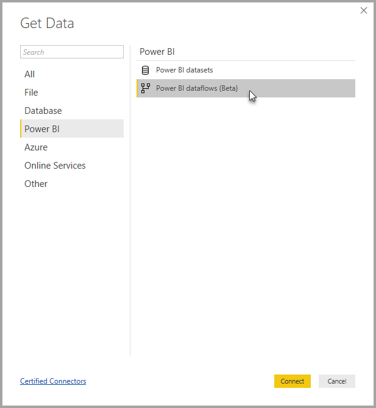

From there, navigate to the **workspace** where you saved your dataflow, select the dataflow and then select the entities that you created from the list.

You can also use the **search bar**, near the top of the window, to quickly find the name of your dataflow or entities from among many dataflow entities.

When you select the entity and then select the **Load** button, the entities appear in the **Fields** pane in **Power BI Desktop**, and appear and behave just like **tables** from any other dataset.

## Using dataflows stored in Azure Data Lake Storage Gen2

Some organizations may want to use their own storage for creation and management of dataflows. You can integrate dataflows with Azure Data Lake Storage Gen2, if you follow the requirements and manage permissions properly. Documentation of all the requirements for this approach can be found beginning with the overview document, [dataflows and Azure Data Lake integration (Preview)](service-dataflows-azure-data-lake-integration.md).

## Troubleshooting data connections

There may be occasions when connecting to data sources for dataflows run into issues. This section provides troubleshooting tips when such issues arise. 

* **Salesforce connector** - Using a trial account for Salesforce with dataflows results in a connection failure with no information provided. To resolve this, use a production Salesforce account or a developer account for testing.

* **SharePoint connector** - Make sure you supply the root address of the SharePoint site, without any subfolders or documents. For example, use link similar to the following: https://microsoft.sharepoint.com/teams/ObjectModel/ 

* **JSON File connector** - Currently you can connect to a JSON file using basic authentication only.  Connecting to a JSON file by providing the credentials within the URL (for example, https://XXXXX.blob.core.windows.net/path/file.json?sv=2019-01-01&si=something&sr=c&sig=123456abcdefg... ) is **not** currently supported.  

* **Azure SQL Data Warehouse** - Dataflows do not currently support Azure Active Directory (AAD) authentication for Azure SQL Data Warehouse. Use Basic authentication for this scenario.

## Next Steps

This article described how you can create your own **dataflow** and create a dataset and report in **Power BI Desktop** to take advantage of it. The following articles are useful for further information and scenarios when using dataflows:

* [Self-service data prep with dataflows](service-dataflows-overview.md)
* [Using computed entities on Power BI Premium](service-dataflows-computed-entities-premium.md)
* [Using dataflows with on-premises data sources](service-dataflows-on-premises-gateways.md)
* [Developer resources for Power BI dataflows](service-dataflows-developer-resources.md)
* [Dataflows and Azure Data Lake integration (Preview)](service-dataflows-azure-data-lake-integration.md)

For more information about the Common Data Model, you can read its overview article:
* [Common Data Model - overview ](https://docs.microsoft.com/powerapps/common-data-model/overview)
* [Learn more about the Common Data Model schema and entities on GitHub](https://github.com/Microsoft/CDM)

Related Power BI Desktop articles:

* [Connect to datasets in the Power BI service from Power BI Desktop](desktop-report-lifecycle-datasets.md)
* [Query overview in Power BI Desktop](desktop-query-overview.md)

Related Power BI service articles:
* [Configuring scheduled refresh](refresh-scheduled-refresh.md)
