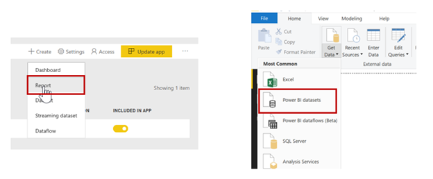

# Use datasets across workspaces

Learn how you can share a dataset with users across your organization. Then they can build reports based on your dataset in their own workspaces.

Business intelligence is a collaborative activity. It is important to establish standardized datasets that can be the 'one source of truth.' Discovering and reusing existing datasets is a key part of this. When report creators start with the official datasets to build reports, the organization has consistent data for decisions and a healthy data culture.

Power BI makes it easy for report authors to find quality, official datasets they can use wherever they are in Power BI. As a dataset owner, you can certify or promote your datasets so others can discover them easily. You can keep control of who has access to the data by using the [Build permission](#build-permission-for-datasets). You can also make it easier to discover your dataset by [endorsing your dataset](service-datasets-certify-promote.md). Tenant administrators have a new tenant setting to [govern the use of datasets across workspaces](service-datasets-admin-across-workspaces.md).

## Discover datasets (Preview)

When building a report on top of an existing dataset, the first step is to connect to the dataset, either in the Power service or Power BI Desktop. 

- In the Power BI service: **Get data** > **Published datasets**.
- In Power BI Desktop: **Get data** > **Power BI datasets**.

    
   
In either case, the dataset discovery experience starts in this dialog box, **Select a dataset to create a report**. You see all the datasets you have access to, regardless of the workspace you are in currently:

The datasets you see in this list meet at least one of the following conditions:

- The dataset is in one of the new workspace experience workspaces, and you're a member of that workspace (see [Considerations and limitations](#considerations-and-limitations)).
- You have Build permission for the dataset, which is in a new workspace experience workspace.
- The dataset is in your My Workspace.

> [!NOTE]
> Free users only see datasets in their My Workspace, or datasets for which they have Build permission that are in Premium-capacity workspaces.

When you click **Create**, you create a Live Connection to the dataset, and the report creation experience opens with the full dataset available. You can use all tables and measures in the dataset to build your own reports. Row-level security (RLS) restrictions on the dataset are in effect, so you only see data you have permissions to see based on your RLS role.

You can save the report to the current workspace in the Power BI service, or publish the report to a workspace from Power BI Desktop. Power BI automatically creates an entry in the list of datasets if the report is based on a dataset outside of the workspace. The icon for this entry is different from the icon for datasets in the workspace. That way, members of the workspace can tell which reports and dashboards use datasets that are outside the workspace. The entry shows meta-information about the dataset, and a few select actions.

## Build permission for datasets

The Build permission type is only relevant for datasets. With it, users can build new content on a dataset, such as reports, dashboards, pinned tiles from Q&A, and Insights Discovery. They can also build new content on the dataset outside Power BI, such as Excel sheets via Analyze in Excel, XMLA, and export.

Users can get the permission in different ways:

- A member of the workspace where the dataset resides can assign the permission to specific users or security groups in the Permission Center. Click the ellipsis (…) next to a dataset > **Manage Permissions**.
- An admin or member of the workspace where the dataset resides can decide during app publishing that all users with permission for the app also get Build permission for the underlying datasets.
- Say you have Reshare and Build permissions on a dataset. When you share a report or dashboard built on top of that dataset you can specify that the recipients also get Build permission for the underlying dataset.

Power BI introduced this permission in April 2019 as a complement to the existing permissions Read and Reshare. All users who already had Read permission for datasets via app permissions, sharing, or workspace access at that time also get Build permissions for those same datasets. They get Build permission automatically because Read permission already granted them the right to build new content on top of the dataset, by using Analyze in Excel, or Export. 

With this more granular Build permission, you can choose who can only view the content in the existing report or dashboard and who can create content connected to the underlying datasets.

## Considerations and limitations

- Building a report on top of a dataset in a different workspace requires the new workspace experience at both ends: the report needs to be in the new workspace experience and the dataset needs to be in the new workspace experience.
- In a classic workspace, the dataset discovery experience only shows the datasets in that workspace.
- You can't add reports to apps if they're based on datasets in a different workspace.
- Free users in Desktop only see datasets from My Workspace and from Premium-based workspaces.
- If a dataset is being used by a report outside of the dataset workspace, you can't delete that dataset. Instead, you see an error message.

## Next steps

- [Certify and promote datasets](service-datasets-certify-promote.md)
- [Govern the use of datasets across workspaces](service-datasets-admin-across-workspaces.md)
- Questions? [Try asking the Power BI Community](http://community.powerbi.com/)
